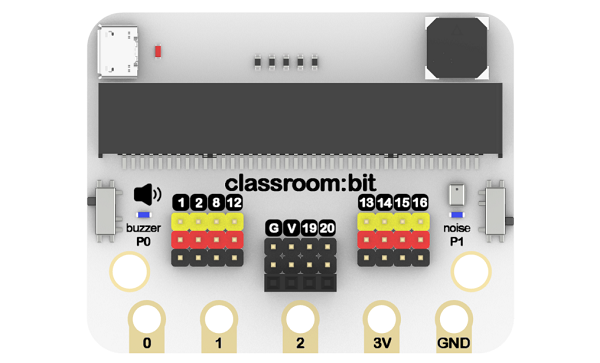
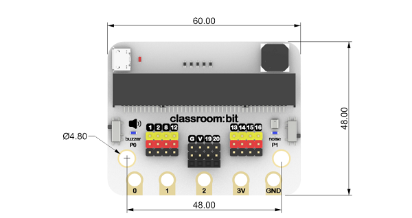
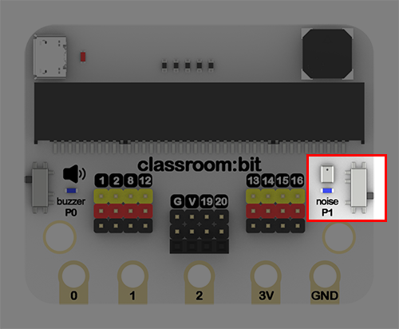
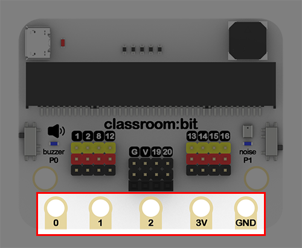
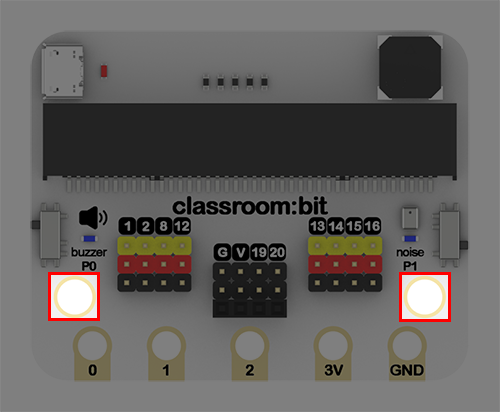
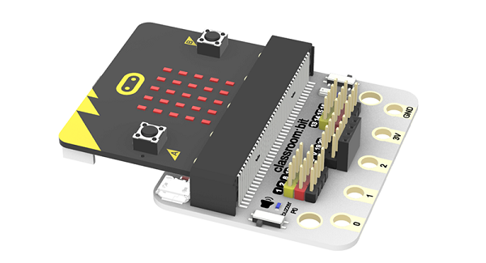
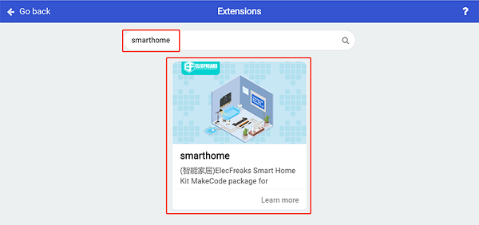
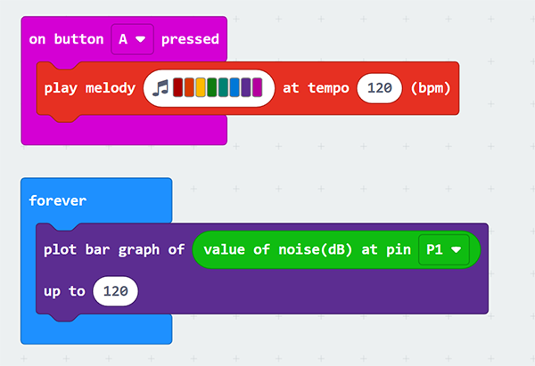

# Classroom:bit 
## Introduction
---
Classroom:bit is a breakout board for micro:bit, it has extended the IO ports on micro:bit in the form of GVS, through which they are availble to connect with all octopus sensors in 3v, such as the LED light, the light sensor, the servos and etc., the buzzer and noise sensor are also loaded on it. The classroom:bit and micro:bit v1.5 has all functions that you can find in micro:bit v2.0.

## Characteristics
---
- Extend all the I0 ports in the form of GVS. 
- With the onboard buzzer and noise sensor, the classroom:bit and micro:bit v1.5 has all functions that you can find in micro:bit v2.0.
- Lead out the IIC connections seperately, it's able to connect with OLED, BME280 and the other IIC products. 
- Support Lego connections. 

## Parameter 
---

|**Parameter**|Item|
|:--:|:--:|
|Name|classroom:bit|
|Version number|V1.0|
|Working Voltage|2.7~3.3v|
|Buzzer|Support|
|Noise Sensor|AVailable|
|Lego connections|Support|
|Size|60mm x 48mm|

## Dimensions
---

## Main parts
---
### USB Power Cable

Powering through the USB cable is fine(or through a micro:bit), if connecting to servos or other similar devices that need high currency, it's recommended to power through the USB. 

### GVS

Connect to Octopus sensors in 3V with these bricks, the IIC pins in the middle could connect with OLED display, 8*16 matrix display and the others. 

### Buzzer and Switch

The buzzer is controlled via P0, please slide the switch to the upper position if you are going to use the buzzer. 

### Noise sensor and the Switch    

The noise sensor is controlled via P1, please slide the switch to the upper position if you are going to use the noise sensor. 

### The Alligator Clips Ports  

Available to connect with the Alligator clips. 

### Lego compatible connections

These two ports are Lego bticks compatible. 

## Quick Start
---
Connect the micro:bit with this breakout board. 

### Program
The noisr sensor on this board requires to be drived with the extensions seach with "smarthome" in the makecode and add it.   

***Note:*** If you met a notice saying the codebase will be deleted due to incompatibility, you can go forward as the tips say or to create a new project. 

Program  

Press button A to play the music, the volume displays on the micro:bit in the form of bar graph. 

Link:
[https://makecode.microbit.org/_AgT0axchq1R5 ](https://makecode.microbit.org/_AgT0axchq1R5 )

You may also download it directly: 
[https://makecode.microbit.org/#](https://makecode.microbit.org/#)

## FAQ
---
