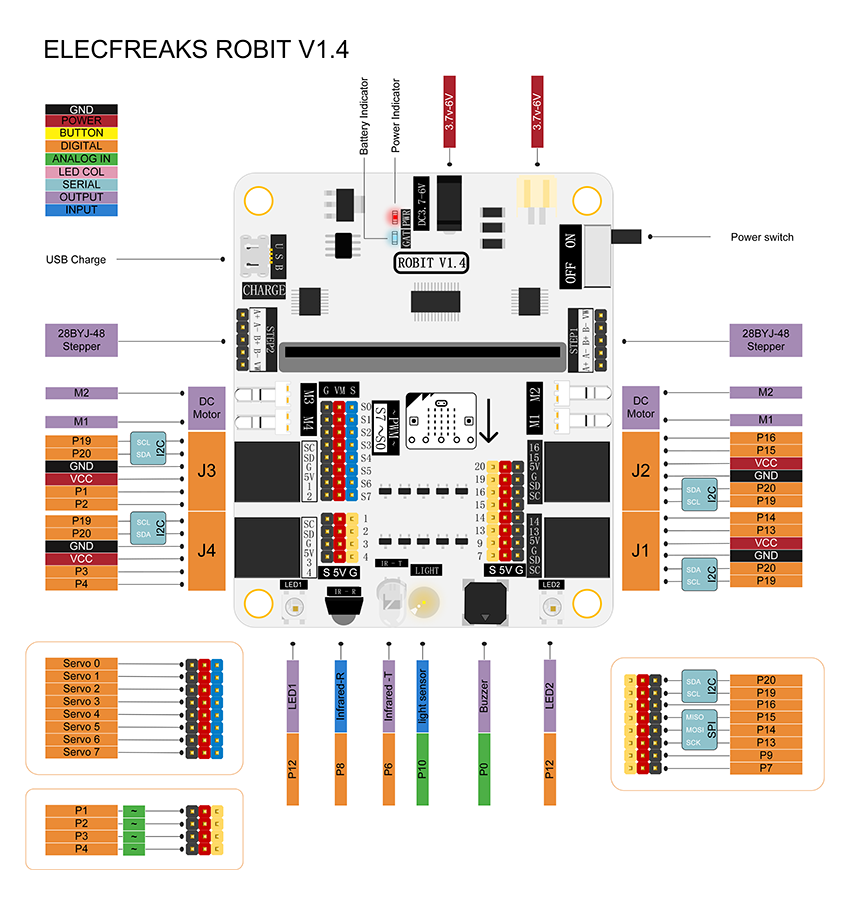
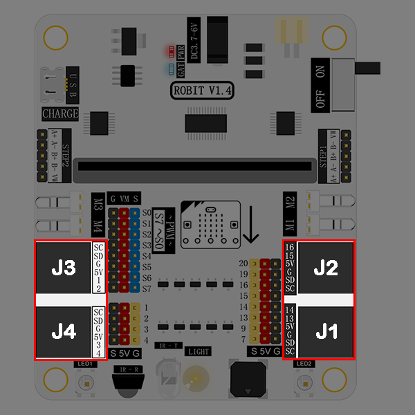
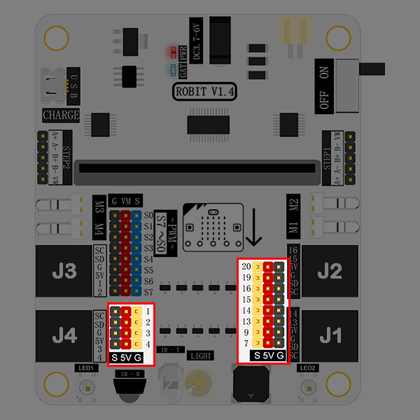
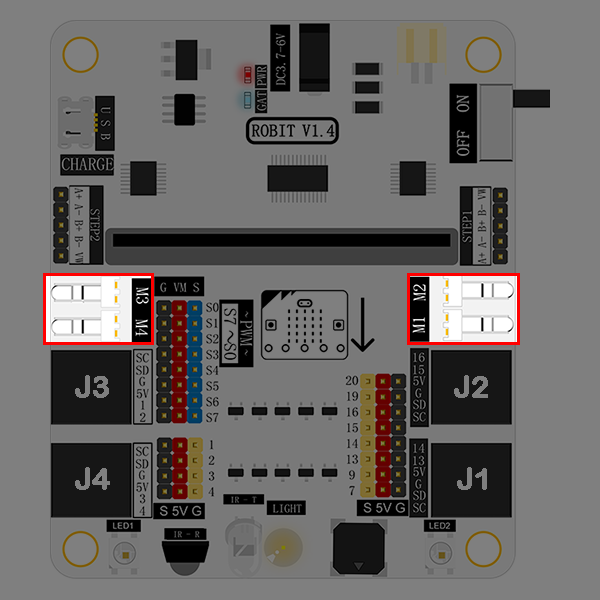
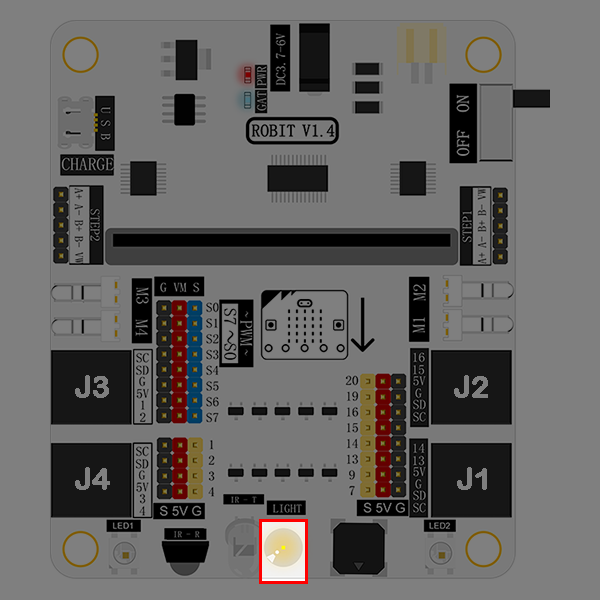
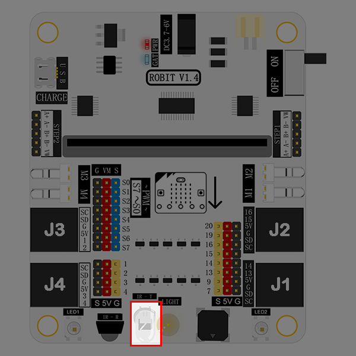
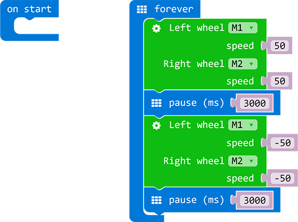

# mbot Introduction(robit) 

## Introduction
---

Robit is a motherboard of smart car based on micro:bit. It is compatible with MBOT. Except for the integration of the simple and convinient RJ25 connector，motor connector and sensor on MBOT, we have extended 4 DC motor connectors, 2 stepping motor connectors(same with 4 DC motor connectors), 8 PWM signal output connectors on this board. You can use it to drive PWM signal driving devices like servo. It has 8 G-5V-S digital signal connectors(for connecting with OCTOPUS electric bricks). Robit can realize all current basic functions of MBOT. Besides, you can extend its usage with more sensors, motors, servos, stepping motors and so on. 

## Features  
---

- Compatible with MBOT chassis and sensors. 
- Support 4 channels of DC motor and 2 channels of stepping motors.
- With 8 PWM signal output connectors.
- With 8 G-5V-S digital signal connectors(for OCTOPUS electric brick). 
- With 4 G-5V-S analog signal connectors(for OCTOPUS electric brick).
- Integrate frequently used modules like buzzer, light sensor, rainbow LED, infrared send and receive.

## Parameter  
---

Project | Parameter 
:-: | :-: 
DC Power Input Voltage | DC 3.7-6V
Li-battery Input Voltage | DC 3.7-4.2V
USB Recharging Current | 500mA
Extendable Analog IO Ports | 4
Extendable Digital IO Ports | 10
Max Stepping Motor Driven Quantity | 8
DC Motor | 4 Channels
Stepping Motor | 2 Channels
Programmable LED Beads | 2 
Passive Buzzer | Support
Photocell Sensor | Support
Infrared Receive | Support
Infrared Send | Support
Dimension | 90mm X 74mm
Net Weight | 46g

### Dimension

## Pins & Connectors
---

## Introduction of Major Components   
---

### RJ25 Connector

Robit has 4 RJ25 connectors. Each RJ25 connector has 6 touch points. These points respond to power, 2 IO ports and IIC ports separately. It is compatible with some sensors on MBOT.  

RJ25 Connector | Match Pins on micro:bit
:-: | :-:
J1 | SCL(P19)/SDA(P20)/GND/5V/P13/P14   
J2 | SCL(P19)/SDA(P20)/GND/5V/P15/P16  
J3 | SCL(P19)/SDA(P20)/GND/5V/P1/P2 (It supports 5V analog input sensor. )  
J4 | SCL(P19)/SDA(P20)/GND/5V/P3/P4 (It supports 5V analog input sensor.)   

### GVS Standard Electric Brick Connector  

Except leading out to RJ25 connector, the IO port on micro:bit also lead out with the format of GVS. It is support 5V components. Besides, P1/P2/P3/P4 support 5V analog input sensors.   

### GVS Standard Servo Connector: S0~S7  

You can connect 8 servos at most. This connector leads out from the chip PCA9685 and extends from the IIC connector on micro:bit instead of normal I/O ports. 

### DC Motor Connector: M1~M4

It allows you to connect 4 DC motors (max) at the same time. This connector leads out from the chip PCA9685 and extends from the IIC connector on micro:bit instead of normal I/O ports.  

### Stepping Motor Connector: STEP1 & STEP2 

It enables you to connect 2 stepping motors(28BYJ-48-5V) at most. 

### Buzzer

The buzzer is connected to the P0 port on micro:bit.

### Light Sensor 
  
  

The light sensor onboard is connected to the P10 port on micro:bit.  

### Infrared Emitting Diode

  

This infrared emitting diode is connected to the P6 port on micro:bit.  

### Infrared Receiving Diode

  

This infrared receiving diode is connected to the P8 port on micro:bit.

### Rainbow LED

Two rainbow LED beads are connected to the P12 port on micro:bit.

### DC Power Connector  

  

DC power connector supports 3.7V~4.2V DC power. It is usually connected to a battery holder with 4 AAA batteries.  

### Li-battery Connector  

  

Li-battery connector supports 3.7V~4.2V li-battery.  

### Li-battery Indicator  

  

This indicator tells you battery power information. It is in blinking status. Blink once means 1 grid of power. And the full power has 4 grids. That means it will blink 4 times when the battery power is full. 

### USB Connector  

  

This connector is only used to charge li-battery. It doesn't support data transmit and its charging current is 500mA.  

## Quick Start   
---

### Hardware Connection  

Fix robit onto mbot car.  
Connect left motor to M1 port, and right motor to M2 port. 
Once completed, it looks like the following picture showed.
  

### Programming  

Click to open [makecode](https://makecode.microbit.org/), search the key word `robit` and add robit package.

Write your code to make the car forever move forth and back for 3 seconds respectively. Here's the code:

You can see the whole program from the link here: [https://makecode.microbit.org/_aXVAyx3dm585](https://makecode.microbit.org/_aXVAyx3dm585)

Also, you can download the code directly from the page below: 

<iframe style="position:absolute;top:0;left:0;width:100%;height:100%;" src="https://makecode.microbit.org/#pub:_aXVAyx3dm585" frameborder="0" sandbox="allow-popups allow-forms allow-scripts allow-same-origin"></iframe>

### Result  

We can see our robit car moves forward for 3 seconds, and then backward 3 seconds. This round trip movement is repeated forever.  

## FAQ
---

