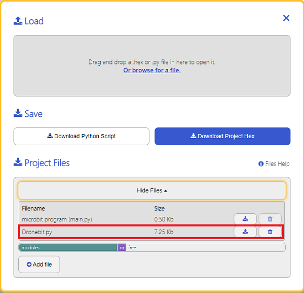

# Drone:bit-Python Sample

## Add Python File

For programming the Drone:bit with Python, we can use the existed extension[EF_Produce_MicroPython-master](https://github.com/elecfreaks/EF_Produce_MicroPython/archive/refs/heads/master.zip), we only need to use the function and revise the parameters to achive the goals. 

Download the package and upzip it: [EF_Produce_MicroPython-master](https://github.com/elecfreaks/EF_Produce_MicroPython/archive/refs/heads/master.zip)

Go to [Python editor](https://python.microbit.org/v/2.0)


For programming the Drone:bit, we nned add the Dronebit.py. Click Load/Save and click Show Files(1) to see more choices. 


Click Add file to find the folder of EF_Produce_MicroPython-master, add the Dronebit.py . 


Dronebit.py is added successfully. 



## API

`DRONE(object)`

Create the object. 

`heartbeat(self)`

The heartbeat function, maintain the connection between the micro:bit and the Drones while running the program, send the heartbeat command every second and the program needs to be included in the main loops.

`Drone_sleep(self,time_ms)`

The delay function, for the replacement of sleep(), it contains the command of heartbeat. 

`initModule(self,mode)`

Initialize the Drone:bit, inspect the power status and select the mode, the device shall alert after initialization. 


        `mode`Select the drone mode:

                `DRONE.master`Master mode,

                `DRONE.remote`Remote mode.

`UAV_speed(self,power)`

The motivation settings, which means to set the speed of the drones. 

`Basic_action(self,basicstate)`

Execute the basic actions, such as taking off and landing. 

        `basicstate`Actions commands
        
                `DRONE.take_off`Taking off,
                
                `DRONE.take_off`Landing.

`Move_action(self,Directionstate,distance)`

Execute the move commands.

        `Directionstate`Movement commands:
        
                `DRONE.Up`Up,
                
                `DRONE.Down`Down,
                
                `DRONE.Forward`Forward,
                
                `DRONE.Backward`Backward,
                
                `DRONE.Left`Fly left,
                
                `DRONE.Right`Fly right;
                
        `distance`Distances of movement:
        
                Unit: CM,
                
                Up: 0~200,
                
                Down: 0~200,
                
                Other movements: 0~500

`Rotation_action(self,rotationstate,angle)`Execute the rotating commands.

        `rotationstate`Actions commands:
        
                `DRONE.turn_left` Turn left,
                
                `DRONE.turn_right`Turn right;
                
        `angle`Rotation angels:
        
                Ranges: 0~360.

`Hovering(self,time)`Time of hovering

        `time`Time of hovering:
        
                Range: 0~200.

`Get_voltage(self)`Get the voltage of the drone,

`Get_height(self)`Get the height of the drone.


## Samples Code
```
from microbit import *
from Dronebit import *

Drone = DRONE()
Drone.initModule(Drone.master)
Drone.Basic_action(Drone.take_off)
Drone.Move_action(DRONE.Up,300)
Drone.Drone_sleep(1000)
Drone.Move_action(DRONE.Down,300) 
Drone.Drone_sleep(1000)
Drone.Basic_action(Drone.landing)

while True:
    Drone.heartbeat()
    if button_a.was_pressed():
        Drone.Basic_action(Drone.take_off)
        Drone.Move_action(Drone.Forward,300)
        Drone.Drone_sleep(1000)
        Drone.Move_action(Drone.Left,300)
        Drone.Drone_sleep(1000)
        Drone.Move_action(Drone.Backward,300)
        Drone.Drone_sleep(1000)
        Drone.Move_action(Drone.Right,300)
        Drone.Drone_sleep(1000)
        Drone.Hovering(10)
        Drone.Basic_action(Drone.landing)

```
### Reult
After powering on, the drone starts taking off, then going upward and downward, finally landing on the ground. Then press button A on the micro:bit and the drone would take off again and fly at a square routine, then it lands on the ground. 
