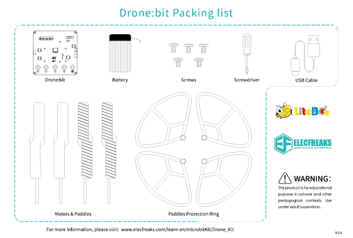
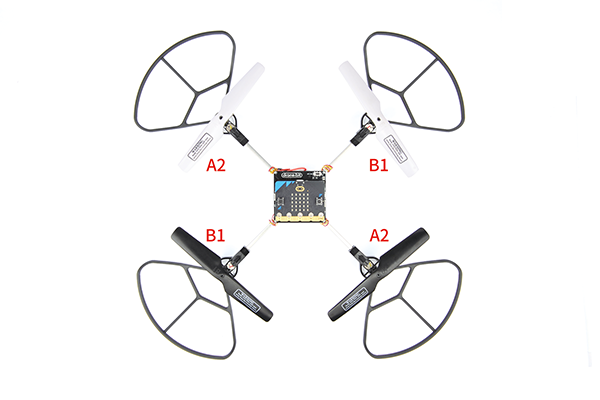
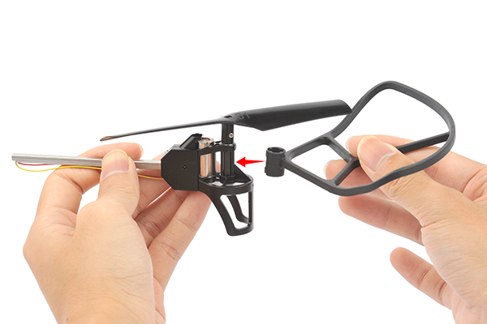
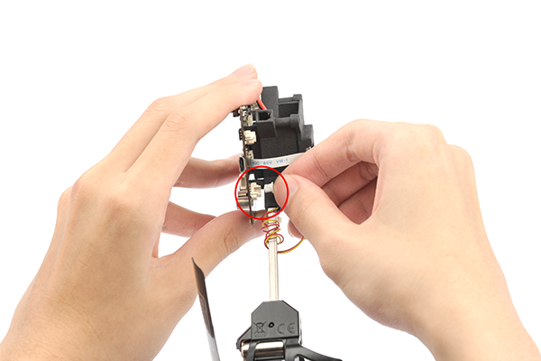
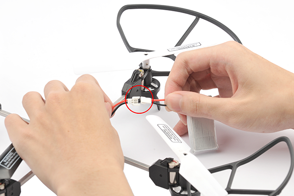
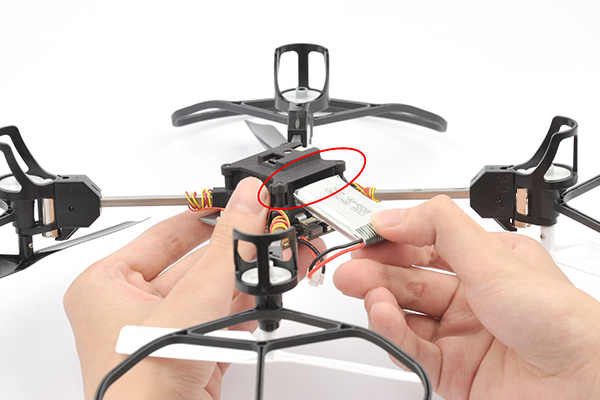
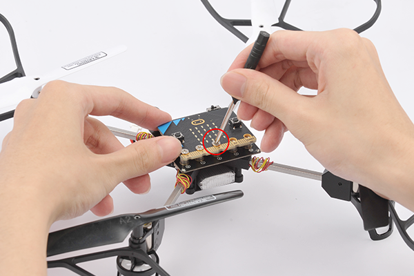
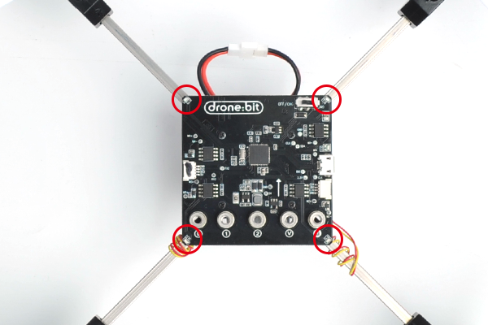

# micro:bit Drone:bit Kit

## Introduction 
---

The micro:bit Drone:bit Kit has successfully combined micro:bit with drones, which has provided another possibility for students to create and explore in the sky.

Through your operation, you can give it commands of hovering at a fixed altitude , flying from a waypoint, curvilinear flight, and rolling in the sky etc. even in the classrooms, get your first professional micro:bit Drone:bit Kit now!

Drone:bit, take you to a new height!

## Picture
---

## Drone:bit Breakthrough
---
- **Optical flow locating, TOF fixing altitude**
    It is a kind of drone in professional grade which is able to hover indoors in a waypoint , with build-in optical flow sensors in high sensitivity and TOF sensors, they help to hover and locate in a more precise way.

- **DIY fun**
    Assemble by yourself, enjoy the fun from DIY.

- **Create your infinite artworks through coding**
    Simple graphical and Python programming, available for complicated flying routines, flying gestures and rolling etc., there are more possibilities waiting to be explored.

- **Safe flying**
    The sealed propeller guards give you a safe flying experience.

## Parameter
---

|Item|micro:bit drone:bit kit |
|:-:|:-:|
|Rated Voltage|3.7V |
|Battery Capacity|800mAh|
|Charging Voltage|5V|
|Charging Current|0.8A|
|Power Protection|Over Charge/Discharge Protection|
|Propeller Guards|Support|
|LED|5 PCS (one for power indicator, four for status indicator)|
|Waypoints|Optical Flow|
|Fixing Altitude|Barometer + TOF|
|micro:bit Programming|Support|
|2.4G Remote Control Mode|Support|
|Flying Time|6min|

##  Products Link
---

- 1 x [Drone:bit]()

##  Components Details
---

## Installation 
---
***Note:*** the directions of the propellers and positions before installation. 

Connect the propeller guards.

Insert the arms to the connectors. 

Connect with the motors sockets. 

Connect the power cable. 

Get the battery in place. 

Connect the micro:bit.

##  Self Checking
---
After powering on, the Drone goes to self checking mode, the two blue LEDs would flash first and then two red LEDs flash, then they light up accorading to the checking feedback. 

Four lights flashing in turn: Fail to connect with the micro:bit or the remote controller.   
Four lights always on: Normal working  
The front and back two lights flash quickly: Low battery  
Only red lights flash: Self-checking failed

## FAQ
---
***Notice:*** For better locating of the drones, a complicated groud is prefered. If the groud is in single color, the drones might not locate them well. 

## Relevant Files
---

