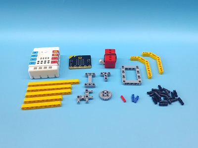
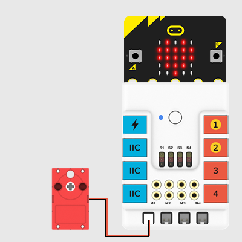
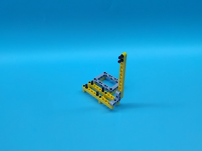
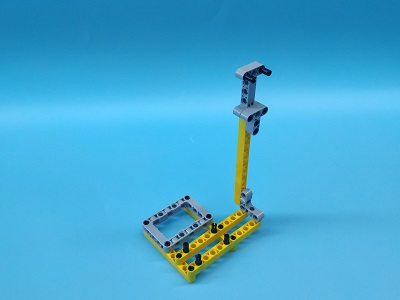
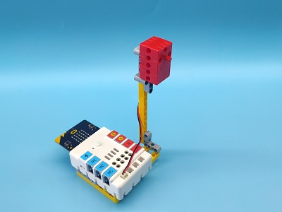
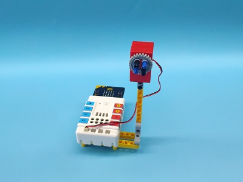
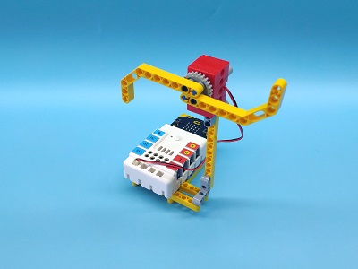
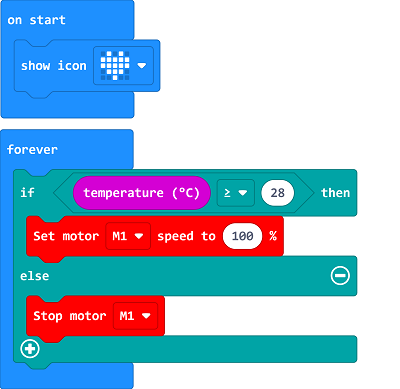

# Case 06: Temperature-controlled Fan

## Introduction
To make a fan that can be controlled by the temperature with a micro:bit. 

## Quick Start

---

### Materials Required

---
Nezha expansion board × 1

micro:bit × 1

Motor × 1

Bricks × n

### Connection Diagram 
---
- Connect the motor to M1 on the Nezha expansion board as the picture shows.

### Assembly

- Build a device as the picture shows:

Video reference: [https://youtu.be/shI_D7j6M7o](https://youtu.be/shI_D7j6M7o)

<iframe width="560" height="315" src="https://www.youtube.com/embed/shI_D7j6M7o" frameborder="0" allow="accelerometer; autoplay; clipboard-write; encrypted-media; gyroscope; picture-in-picture" allowfullscreen></iframe>

## MakeCode Programming

---

### Step 1

Click "Advanced" in the MakeCode to see more choices.

For programming, we need to add a package: click "Extensions" at the bottom of the MakeCode drawer and search with "nezha" in the dialogue box to download it. 

Notice: If you met a tip indicating that some codebases would be deleted due to incompatibility, you may continue as the tips say or create a new project in the menu. 

### Step 2

### Code as below:

### Reference
Link：[https://makecode.microbit.org/_3gkW8U8Vk55v](https://makecode.microbit.org/_3gkW8U8Vk55v)

You may also download it directly below:

<iframe style="position:absolute;top:0;left:0;width:100%;height:100%;" src="https://makecode.microbit.org/#pub:_3gkW8U8Vk55v" frameborder="0" sandbox="allow-popups allow-forms allow-scripts allow-same-origin"></iframe>
  
---

### Result
- The fan turns on/off automatically according to the temperature. 

