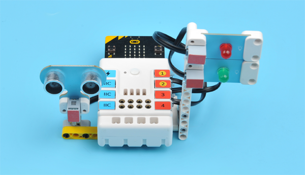
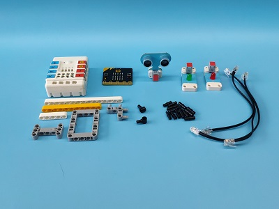
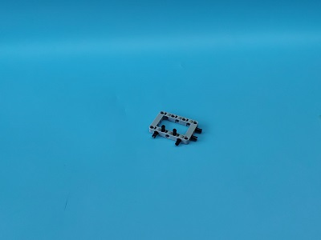
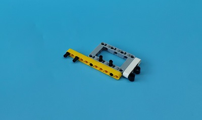
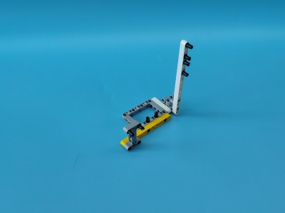
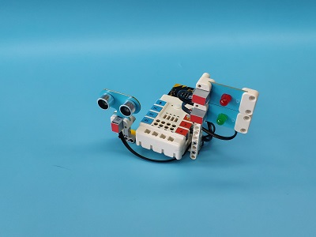

# Case 09: Invading Detection Device

## Introduction
To make an invading detection device with the micro:bit.

## Quick Start

---

### Materials Required

---
Nezha expansion board × 1
micro:bit × 1
LED-green × 1
LED-red × 1
Sonar:bit × 1
RJ11 wires × 3
Bricks × n

### Connection Diagram 
---
- Connect the sonar:bit to J1, red LED to J2 and green LED to J3 on the Nezha expansion board as the picture shows.

### Assembly

- Build a device as the picture shows:

Video Reference: [https://youtu.be/jw9_wlNIiHw](https://youtu.be/jw9_wlNIiHw)

## MakeCode Programming

---

### Step 1

Click "Advanced" in the MakeCode to see more choices.

For programming, we need to add a package: click "Extensions" at the bottom of the MakeCode drawer and search with "PlanetX" in the dialogue box to download it. 

Notice: If you met a tip indicating that some codebases would be deleted due to incompatibility, you may continue as the tips say or create a new project in the menu. 

### Step 2

### Code as below:

### Reference
Link：[https://makecode.microbit.org/_2zrE6AKRHbqW](https://makecode.microbit.org/_2zrE6AKRHbqW)

You may also download it directly below:

<iframe style="position:absolute;top:0;left:0;width:100%;height:100%;" src="https://makecode.microbit.org/#pub:_2zrE6AKRHbqW" frameborder="0" sandbox="allow-popups allow-forms allow-scripts allow-same-origin"></iframe>
  
---

### Result
- While the sonar:bit detects the object, the red LED lights up and the buzzer alarms. 
