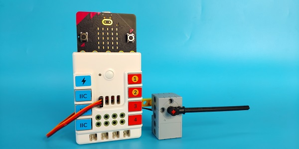
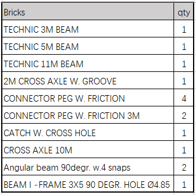
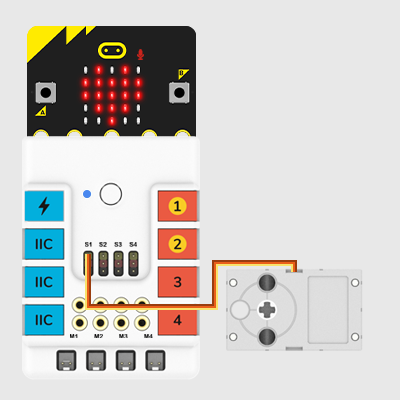
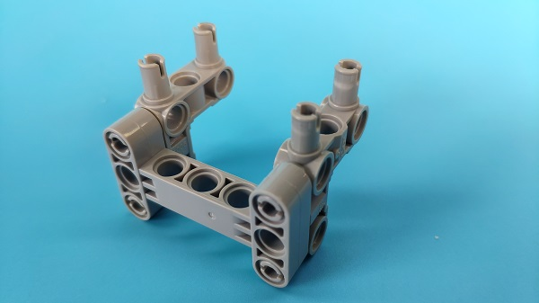
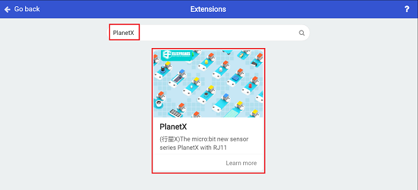

#Volume Reminder 

## Introduction 
Make a volume reminder with micro:bit. 

## Quick to Start
---

### Materials 
---
Nezha expansion board × 1

micro:bit × 1

servo  × 1

RJ11 wires × 1

Bricks × n

### Bricks Details
---

### Connection Diagram 
---
- Connect the 360 degrees servo to S1 port on the Nezha expansion board. 

### Bricks Build-up 
---
- Build a device as the pictures indicate: 

Video link:[https://youtu.be/G0hycQ2rxCk](https://youtu.be/G0hycQ2rxCk)

<iframe width="560" height="315" src="https://www.youtube.com/embed/G0hycQ2rxCk" frameborder="0" allow="accelerometer; autoplay; clipboard-write; encrypted-media; gyroscope; picture-in-picture" allowfullscreen></iframe>

## MakeCode Programming 
---

### Step 1
---

Click "Advanced" in the MakeCode drawer to see more choices. 

We need to add a package for programming. Click "Extensions" in the bottom of the drawer and search with "PlanetX" to download it. 

We need to add a package for programming. Click "Extensions" in the bottom of the drawer and search with "Nezha" to download it. 

Note: If you met a tip indicating the codebase might be deleted due to incompatibility, you may continue as the tips say or create a new project in the menu. 

### Step 2
---

### Programme as the pictures indicate

### Link
Link: [https://makecode.microbit.org/_JfDgxzJkc72X](https://makecode.microbit.org/_JfDgxzJkc72X)

You may download it directly below: 

<iframe style="position:absolute;top:0;left:0;width:100%;height:100%;" src="https://makecode.microbit.org/#pub:_JfDgxzJkc72X" frameborder="0" sandbox="allow-popups allow-forms allow-scripts allow-same-origin"></iframe>
  
---

### Result
- The servos drive in accordance with the change of the volume. 

