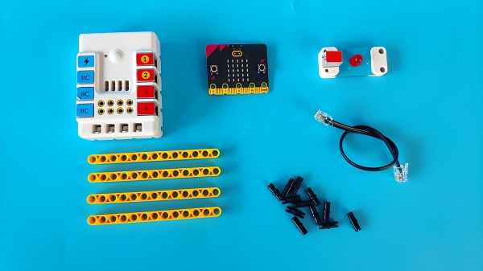

#Alarm Device

## Introduction 
Build an alarm device with the micro:bit. 

## Quick to Start 
---

### Materials
---
Nezha expansion board × 1

micro:bit × 1

LED-red  × 1

RJ11 wires × 1

Bricks × n

### Bricks details
---

### Connection Diagram
---
- Connect the red LED to the J1 port on Nezha expansion board. 

### Bricks Build-up 
---
- Build a device as the pictures indicate: 

Video link:[https://youtu.be/G0hycQ2rxCk](https://youtu.be/G0hycQ2rxCk)

<iframe width="560" height="315" src="https://www.youtube.com/embed/G0hycQ2rxCk" frameborder="0" allow="accelerometer; autoplay; clipboard-write; encrypted-media; gyroscope; picture-in-picture" allowfullscreen></iframe>

## MakeCode Programming
---

### Step 1
---

Click "Advanced" in the MakeCode drawer to see more choices. 

We need to add a package for programming. Click "Extensions" in the bottom of the drawer and search with "PlanetX" in the dialogue box to download it. 

Note: If you met a tip indicating that the codebase will be deleted due to incompatibility, you may continue as the tips say or build a new project in the menu. 

### Step 2
---

### Programme as the picture shows: 

### Link
Link: [https://makecode.microbit.org/_A4CaHvTuJ7br](https://makecode.microbit.org/_A4CaHvTuJ7br)

You may also downoad it directly below: 

<iframe style="position:absolute;top:0;left:0;width:100%;height:100%;" src="https://makecode.microbit.org/#pub:_A4CaHvTuJ7br" frameborder="0" sandbox="allow-popups allow-forms allow-scripts allow-same-origin"></iframe>
  
---

### Result
- Press button A to alarm and the red LED flashes; press it again to stop the alarming and the LED turns off. 

