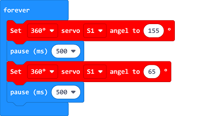

#micro:bit Crawlers

## Introduction
Make a mechanical crawler.

## Quick Start

---

### Materials Required

---
Nezha expansion board × 1

micro:bit V2 × 1

360°servo × 1

Bricks × n

### Bricks details

### Connection Diagram
---
- Connect the servo to S1 and the micro:bit to Nezha expansion board. 

### Bricks Build-up

- Build it as below

Link: [https://youtu.be/t2mYccra8Vw](https://youtu.be/t2mYccra8Vw)

<iframe width="560" height="315" src="https://www.youtube.com/embed/t2mYccra8Vw" frameborder="0" allow="accelerometer; autoplay; clipboard-write; encrypted-media; gyroscope; picture-in-picture" allowfullscreen></iframe>

## MakeCode Programming
---

### Step 1

Click “Advanced” in the MakeCode drawer to see more choices.

We need to add a package for programming. Click “Extensions” in the bottom of the drawer and search with “nezha” in the dialogue box to download it.

*Note: If you met a tip indicating that the codebase will be deleted due to incompatibility, you may continue as the tips say or build a new project in the menu.

### Programme as the picture shows:

### Link
Link：[https://makecode.microbit.org/_HwoEvqEku9jX](https://makecode.microbit.org/_HwoEvqEku9jX)

You may also downoad it directly below:

<iframe style="position:absolute;top:0;left:0;width:100%;height:100%;" src="https://makecode.microbit.org/#pub:_HwoEvqEku9jX" frameborder="0" sandbox="allow-popups allow-forms allow-scripts allow-same-origin"></iframe>
  
---

### Result
- The crawlers move forward after powering on. 

