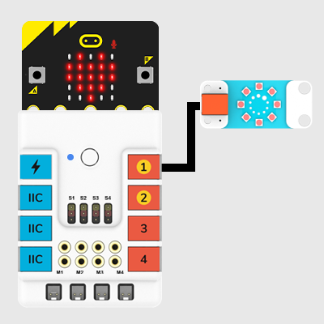
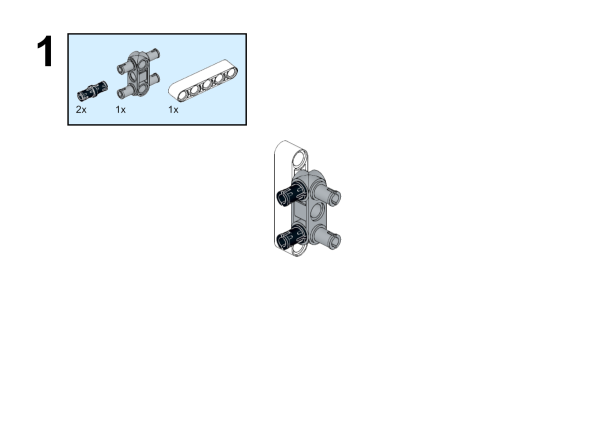
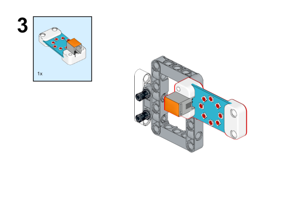
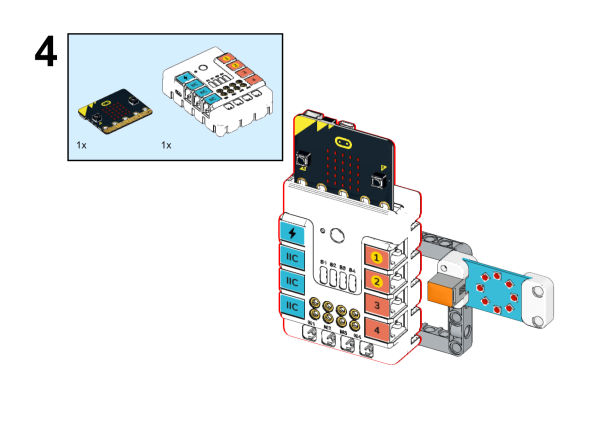

# Case 26: The Volume Indicator

## Introduction
To make a color-changing device that is reflected with its ambient sound level. 

## Quick Start 

### Materials Required

Nezha expansion board × 1

micro:bit V2 × 1

Rainbow LED ring  × 1

Bricks × n

Tips:[Purchase Interactive coding accessories pack here.](https://www.elecfreaks.com/interactive-coding-accessories-pack.html)

### Connection Diagram 

Inset the micro:bit, and connect the rainbow LED ring to IIC port on Nezha expansion board. 

### Assembly Video

Video link: [https://youtu.be/4tFv6rWx8uM](https://youtu.be/4tFv6rWx8uM)

<iframe width="560" height="315" src="https://www.youtube.com/embed/4tFv6rWx8uM" title="YouTube video player" frameborder="0" allow="accelerometer; autoplay; clipboard-write; encrypted-media; gyroscope; picture-in-picture" allowfullscreen></iframe>

### Assembly Steps

## MakeCode Programming 

### Step 1

Click "Advanced" in the MakeCode drawer to see more choices. 

We need to add a package for programming. Click "Extensions" in the bottom of the drawer and search with "nezha" to download it. 

Note: If you met a tip indicating the codebase might be deleted due to incompatibility, you may continue as the tips say or create a new project in the menu. 

### Step 2

### Programme as the pictures indicate

### Reference

Link: [https://makecode.microbit.org/_5cCW2APhK263](https://makecode.microbit.org/_5cCW2APhK263)

You may download it directly below: 

<iframe style="position:absolute;top:0;left:0;width:100%;height:100%;" src="https://makecode.microbit.org/#pub:_5cCW2APhK263" frameborder="0" sandbox="allow-popups allow-forms allow-scripts allow-same-origin"></iframe>
  
---

### Result
After powering on, the rainbow LED ring lights up in different colors reflecting with the ambient sound level. 

