# case 35 Color Recognition Car

## Introduction
---
A color recognition sensor is installed on the car. We can use the color recognition sensor to identify the color blocks that the car passes along the way and display it through the rainbow LED on the car.

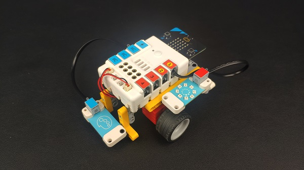

## Quick Start
---

### Materials Required 

Nezha expansion board × 1

micro:bit V2 × 1

motors × 2

Color sensor  × 1

Rainbow LED ring  × 1

Bricks × N

***Tips:*** [Purchase Interactive coding accessories pack here.](https://www.elecfreaks.com/interactive-coding-accessories-pack.html)

### Connection Diagram

Insert the micro:bit, connect the motors to M1and M4 , the color sensor to IIC port and the rainbow led ring to J1 on the Nezha expansion board as the picture shows.

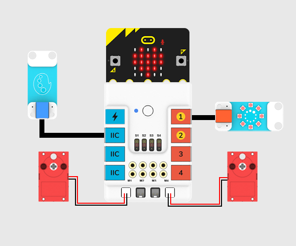

### Assembly Video

Link: [https://youtu.be/2VBr3sEPMIg](https://youtu.be/2VBr3sEPMIg)

<iframe width="560" height="315" src="https://www.youtube.com/embed/2VBr3sEPMIg" title="YouTube video player" frameborder="0" allow="accelerometer; autoplay; clipboard-write; encrypted-media; gyroscope; picture-in-picture" allowfullscreen></iframe>

### Assembly Steps

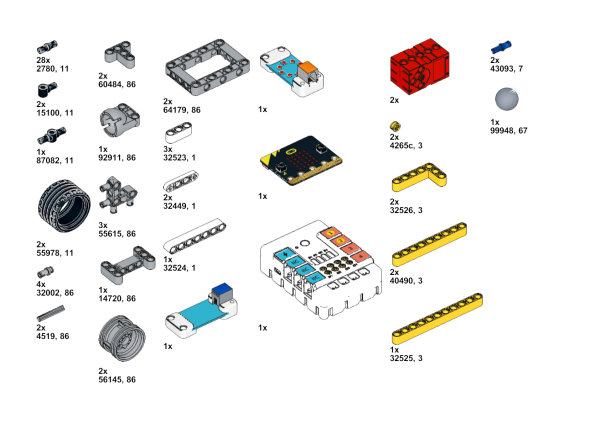

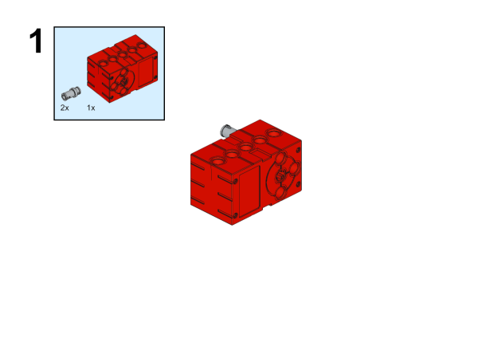

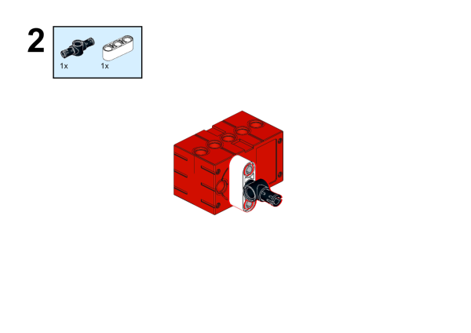

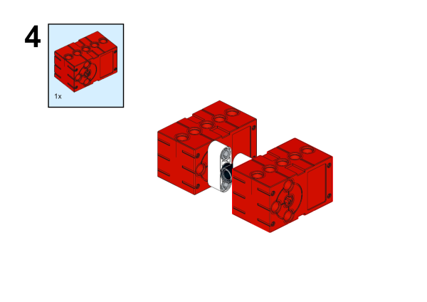

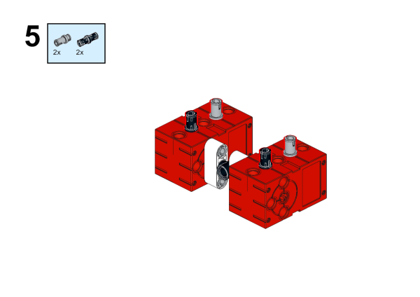

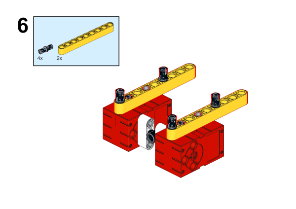

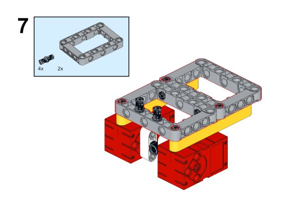

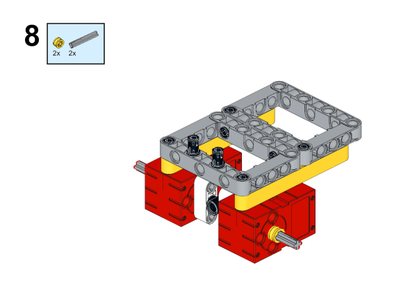

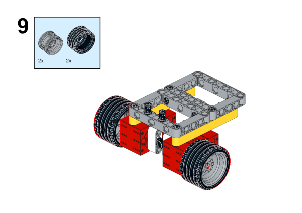

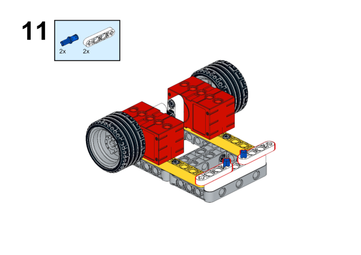

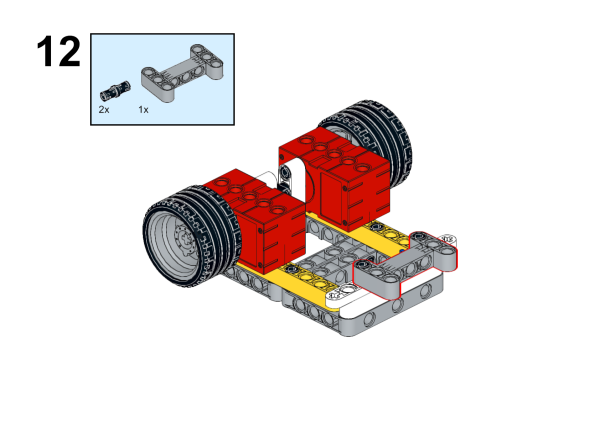

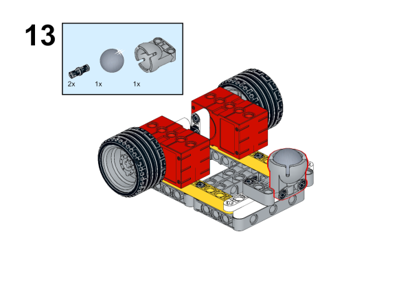

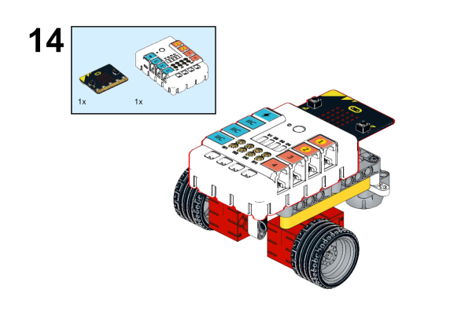

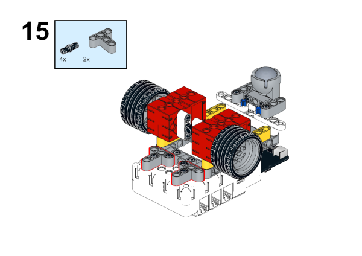

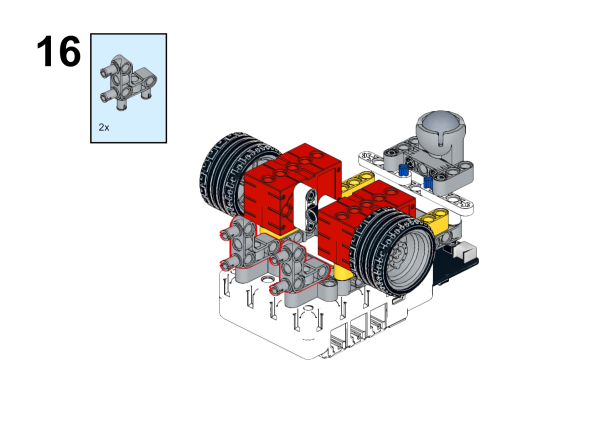

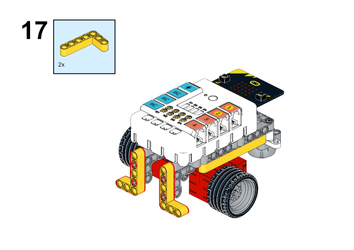

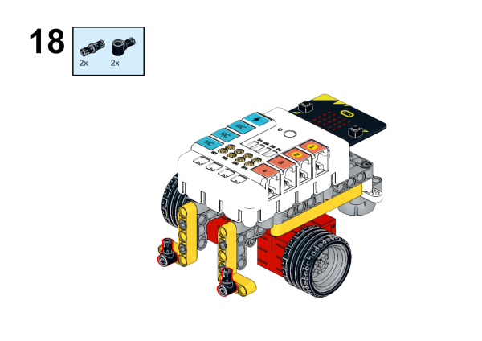

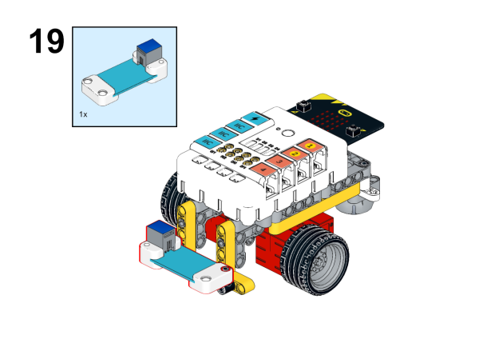

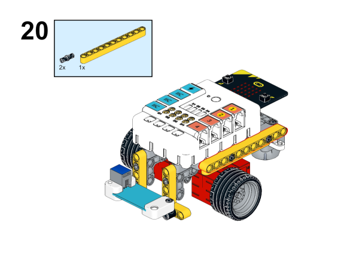

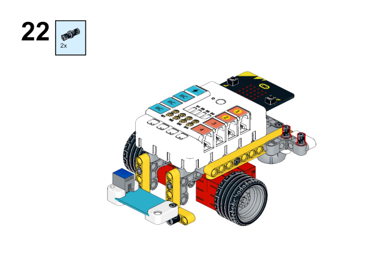

## MakeCode Programming
---

### Step 1

Click "Advanced" in the MakeCode to see more choices.

For programming, we need to add a package: click "Extensions" at the bottom of the MakeCode drawer and search with "nezha" in the dialogue box to download it. 

***Notice:*** If you met a tip indicating that some codebases would be deleted due to incompatibility, you may continue as the tips say or create a new project in the menu. 

### Step 2

### Code as below:

### Reference
Link: [https://makecode.microbit.org/_fzaisgJfKKKj](https://makecode.microbit.org/_fzaisgJfKKKj)

You may also download it directly below:

<iframe style="position:absolute;top:0;left:0;width:100%;height:100%;" src="https://makecode.microbit.org/#pub:_fzaisgJfKKKj" frameborder="0" sandbox="allow-popups allow-forms allow-scripts allow-same-origin"></iframe>
  

### Result
After powering on, the lights on the car turn on with the color detected from the color sensor. 

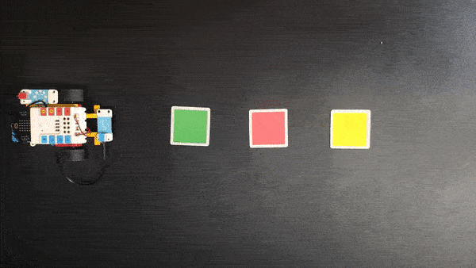
