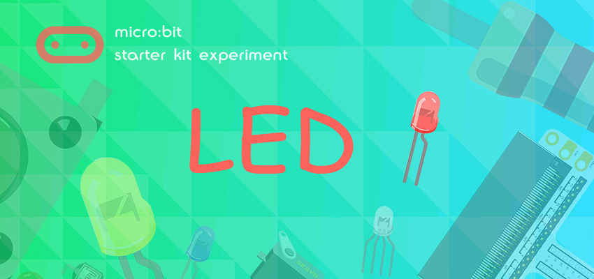
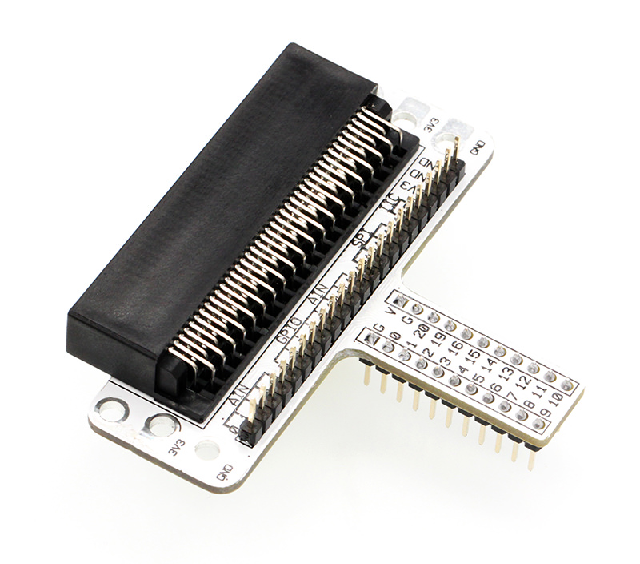
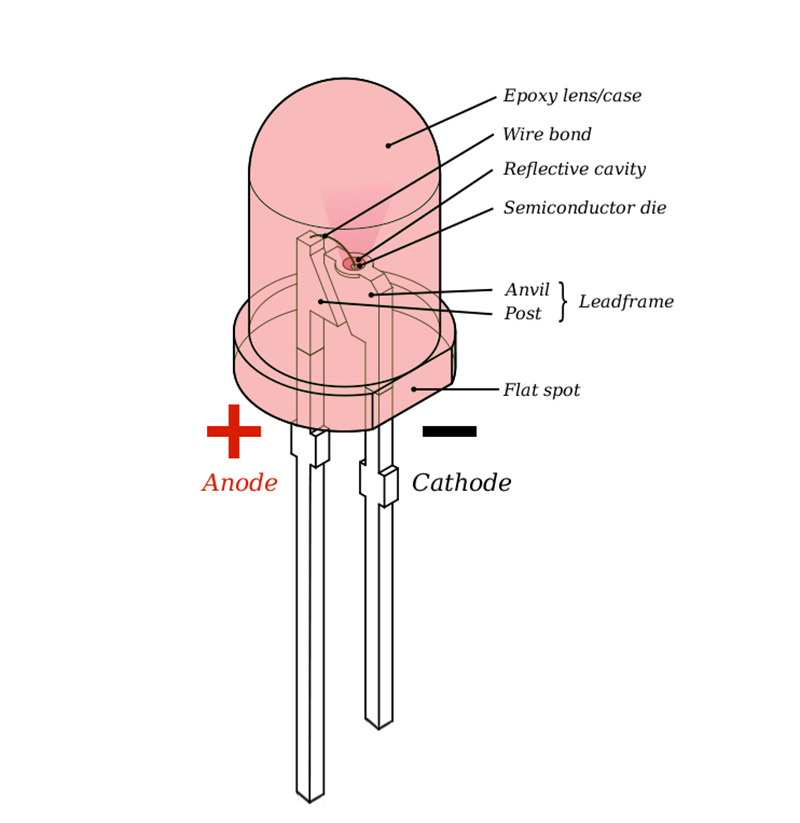
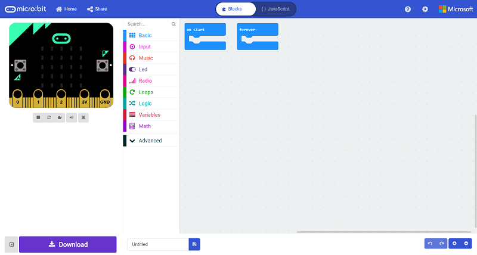
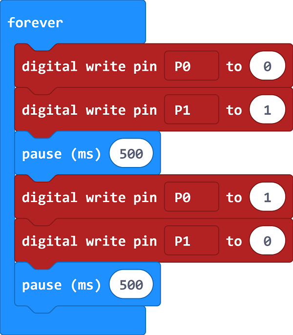
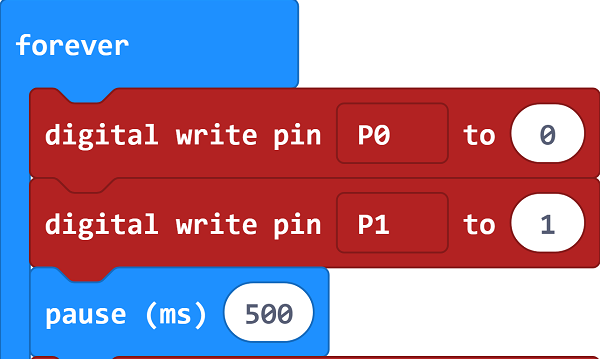
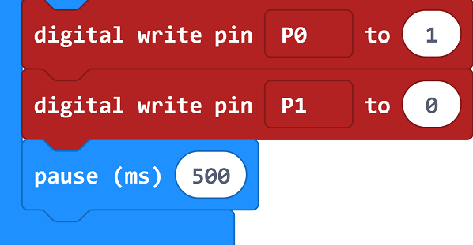

# Lesson 01 LED 

 

## Introduction:

---
LED has wide applications. Most signal lights we saw in our daily life use LED as its major light source. In today’s experiment, we are going to use Micro:bit to make 2 LED beads twinkle alternatively.

## Components List:

---
### Hardware:

- 1 x Micro:bit Board
- 1 x MicroB USB Cable
- 1 x Microbit Breadboard Adapter
- 1 x Transparent Breadboard - 83 * 55 mm
- 2 x LED
- 2 x 100 Ohm Resistors
- n x Breadborad jumper wire 65pcs pack

Tips: If you want all components above, you may need Elecfreaks Micro:bit Starter Kit.

## Major Components Introduction
---
### Micro:bit Breadboard Adapter

Micro: bit Breadboard Adapter can extend all pins of Micro: bit , so that we can create simple circuit on breadboard.

This picture shows how Micro: bit Breadboard Adapter is plugged into breadboard. It is suitable to all kinds of breadboards.

### LED
LED is the abbreviation of Light Emitting Diode. It is a kind of semi-conductor diode and can convert electricity into light(When the current passes, it will light on)

If you check the LED with care you would notice the two features: one is that the legs are in different lengths , another is that on one side of the LED, instead of it being cylindrical, it is flattened. These are indicators to show which leg is the Anode (Positive) and which is the Cathode (Negative). The longer leg gets connected to the Positive Supply (3.3v) and the leg with the flattened side goes to Ground.

### Resistor
Resistor is a component for current control. It can limit the current of the circuit connected. And in our experiment, we use 100Ω resistance, if there is no current limit, the LED might be damaged.

Want to know resistor value by color circles? You can read this article: 
[How to Identify Color Circle Resistance Value](https://www.elecfreaks.com/9158.html).

## Experimental Procedure
---

### Hardware Connection

Connect your components according to the picture below: 

- 1. Connect the shorter leg with the GND.
- 2. Connector the longer leg with the P0 and P1 ports through the Resistor.

You would see as  below after you finish the connection: 

### Software Programming

Click to open [Microsoft Makecode](https://makecode.microbit.org/), write the following code in the editor.

### Program as the picture shows:

###  Details for the code:
- 1. Digital write signal 0 to P0 port to turn off the LED; digital write signal 1 to P1 port to turn on the LED,  then set the pause in 500ms.

- 2. Digital write signal 1 to P0 port to turn on the LED; digital write signal 0 to P1 port to turn off the LED,  then set the pause in 500ms.

### Reference
Links: [https://makecode.microbit.org/_LybdqfauX3TR](https://makecode.microbit.org/_LybdqfauX3TR)

You can also download the links directly:

<iframe style="position:absolute;top:0;left:0;width:100%;height:100%;" src="https://makecode.microbit.org/#pub:_LybdqfauX3TR" frameborder="0" sandbox="allow-popups allow-forms allow-scripts allow-same-origin"></iframe>
  

## Result
---
You can see the  2 LEDs flashing alternatively. If not, you need to go back and check your operations.

## Exploration
---
If we want to control 4 LEDs and make them illuminated in turns, how can we design the circuit and code?  Welcome to have a further discussion with us!

## FAQ
---
     

