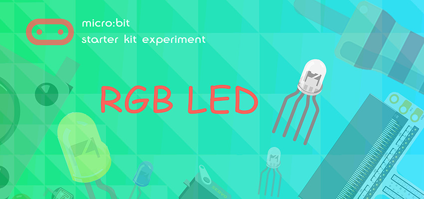
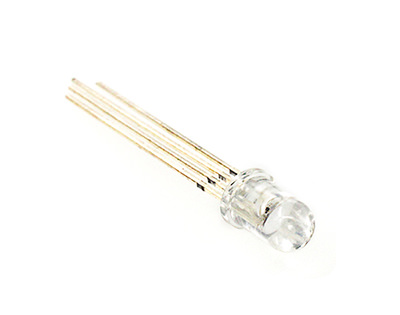
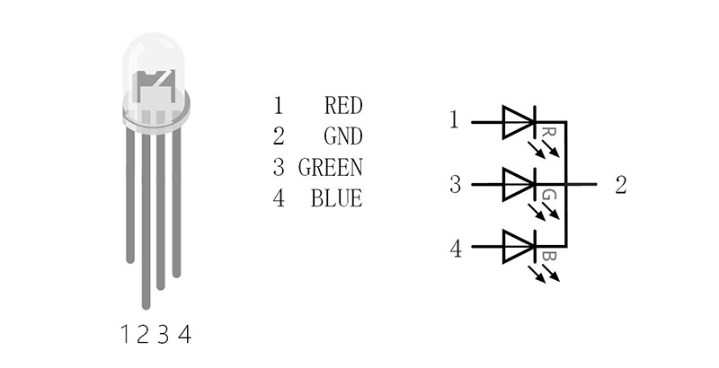
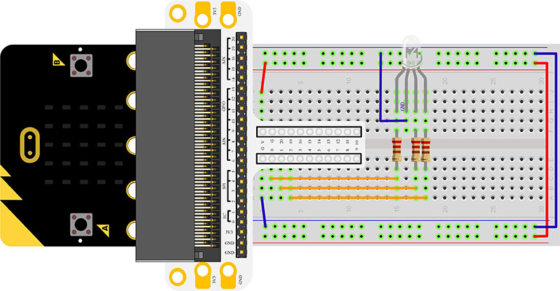
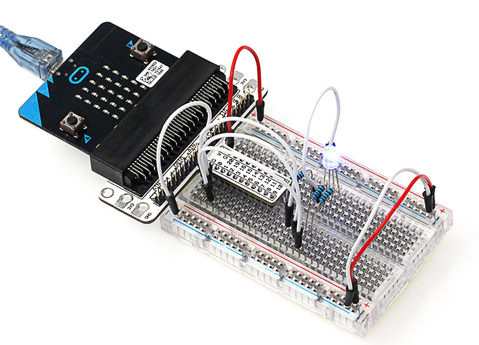
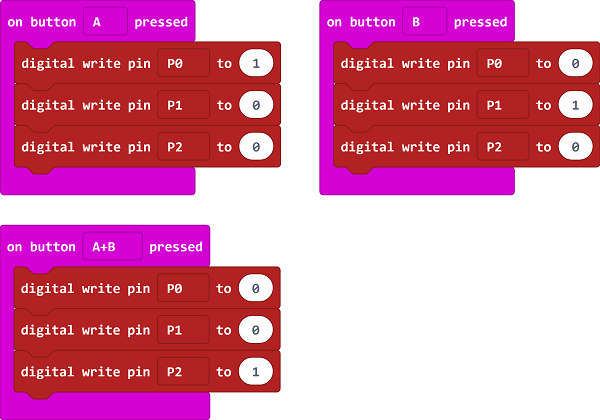
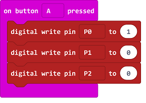

# Lesson 05 RGB LED 

   

## Introduction:
---
RGB LED is a kind of LED that can emit light in three different colors: red, green and blue. In this experiment, we are going to make RGB LED  shifts its light among the three different colors gradually.

## Components List:
---
### Hardware:
- 1 x micro:bit Board
- 1 x Micro-B USB Cable
- 1 x microbit Breadboard Adapter
- 1 x Transparent Breadboard - 83 * 55 mm
- 1 x RGB LED
- 3 x 100 Ohm Resistors
- n x Breadborad jumper wire 65pcs pack

**Tips: If you want to buy all components above, you may need Elecfreaks Micro:bit Starter Kit.**

## Major Components Introduction
---
### RGB LED

RGB LED is a kind of LED that has integrated red LED, green LED, and blue LED into a component. We all knows that the three primary colors of light are red, green, and blue. With different groups of the three color lights, we can create all colors of the world. Similarly, if we use RGB LED to group lights with different brightness, then it can form various colors.  

RGB LED can be divided into 2 types: common anode and common cathode. In common-cathode RGB LED, its common port usually connects GND, while in common-anode RGB LED, its common port connects VCC. In this experiment, we choose common-cathode RGB LED.

## Experimental Procedure
---
### Hardware Connection

Connect your components according to the picture below: 

- 1.Connect the three pins of the RGB led to the P0, P1 and P2 accordingly, then connect with a 100Ω resistor.
- 2.Connect the GND of the RGB led with the GND of the breadboard adapter through the breadboard.

You would see as  below after you finish the connection: 

### Software Programming

Click to open [Microsoft Makecode](https://makecode.microbit.org/), write the following code in the editor.

### Program as the picture shows:

### Details for the code:
- When press the button A, set the R to 1, G， B to 0. When press the button B, and press the button A+B, set it in a similar way.

### Reference
Links:[https://makecode.microbit.org/_Th3Vum76F4Tr](https://makecode.microbit.org/_Th3Vum76F4Tr)

You can also download the links directly:

<iframe style="position:absolute;top:0;left:0;width:100%;height:100%;" src="https://makecode.microbit.org/#pub:_Th3Vum76F4Tr" frameborder="0" sandbox="allow-popups allow-forms allow-scripts allow-same-origin"></iframe>
  

## Result
---
Press button A, LED turns red. 
Press button B, LED turns green. 
Press button A+B, LED turns blue.

## Exploration
---
If we want to use RGB LED to emit cyan light, magenta light, yellow light, then how to design circuit and program? 

## FAQ
---
