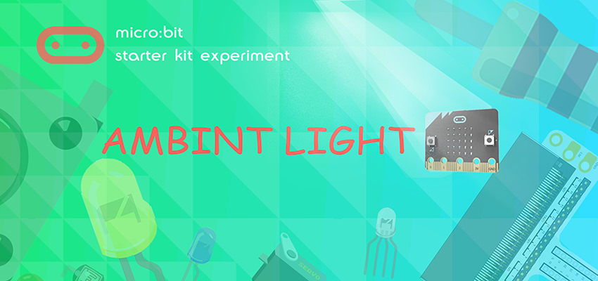
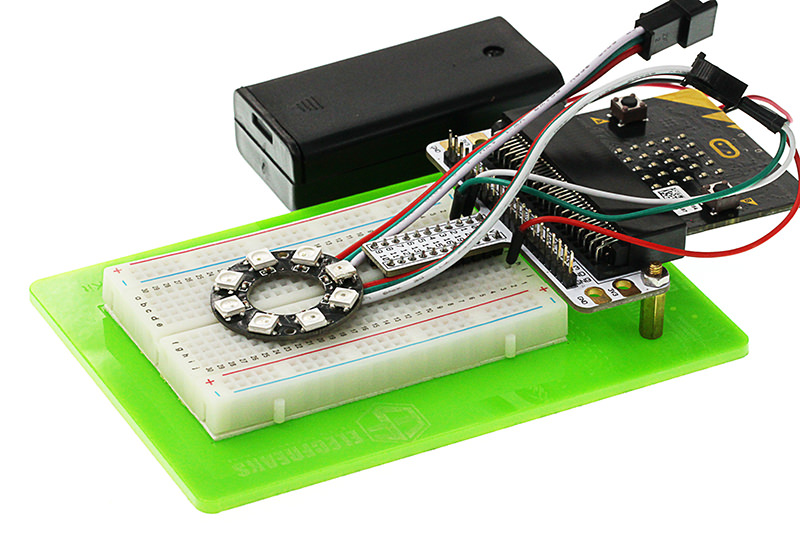
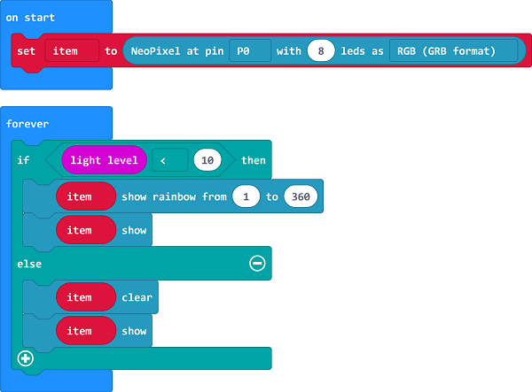
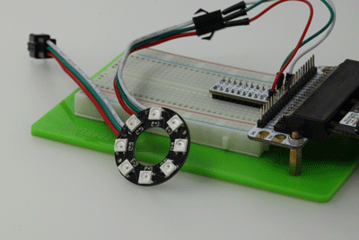

# Lesson 14 Ambient Light

  

## Introduction

---
In our blog micro:bit Experiment 04: Photocell — Elecfreaks mirco: bit Starter Kit Course”, we had connected a photocell externally to sense the light. Actually, micro:bit has integrated a light detection device internally. Today we are going to use the internal light sensor to do an experiment. We will light a rainbow LED ring when the light in the outer environment is comparatively dark.

## Component List

---
### Hardware:

- 1 x micro:bit Board
- 1 x Micro-B USB Cable
- 1 x micro:bit Breadboard Adapter
- 1 x Transparent Breadboard - 83 * 55 mm
- 1 x 8 RGB LED RainbowLED Ring
- n x Breadborad Jumper Wire 65pcs Pack

****Tips: If you want all components above, you may need Elecfreaks micro:bit Starter Kit.****

## Major Component Introduction
---
You might be curious about how micro:bit senses light without any light sensor. Let’s see a paragraph about display on micro:bit website:

The display is a 5x5 array of LEDs. It is connected to the micro:bit as a 3x9 matrix. Runtime software repeatedly refreshes this matrix at a high speed, such that it is within the user persistence of vision range, and no flicker is detected. This LED matrix is also used to sense ambient light, by repeatedly switching some of the LED drive pins into inputs and sampling the voltage decay time, which is roughly proportional to ambient light levels.

 

That’s really amazing! Except for its light emitting ability, micro:bit can sense light!Because LEDs are so commonly used as light emitters it is easy to forget that they are fundamentally photodiodes, and as such are light detectors as well.The function may be implemented with no additional hardware cost if incorporated in the LED driver circuit.

## Experimental Procedure
---
### Hardware Connection

Connect your components according to the picture below:

- Connect the signal wire of the LED ring to the P0 port of the breadboard adapter.

After connection, we can see:

### Software Programming

Click to open Microsoft Makecode, write the following code in the editor.(https://makecode.microbit.org/)

### Add Package

  Click "Advanced"in the choice of the MakeCode to find more choices.

Click "Extensions", search "neopixel"in the dialog box and then download the "neopixel".

### Program as the picture shows:

### Details for the code:
- 1.Set P0 port as the output of the ring signal and set the color mode to RGB.

- 2.When the light level received by micro:bit is lower than 10, the ring lights on in many colors.

### Reference
Links:[https://makecode.microbit.org/_Cxo28oDKjLyY](https://makecode.microbit.org/_Cxo28oDKjLyY)

You can also download the links directly:

<iframe style="position:absolute;top:0;left:0;width:100%;height:100%;" src="https://makecode.microbit.org/#pub:_Cxo28oDKjLyY" frameborder="0" sandbox="allow-popups allow-forms allow-scripts allow-same-origin"></iframe>
  
---

## Result
---
When in darkness, the LED ring will be turned on; while in brightness, the LED ring will be turned off.

## Exploration
---
If we want to rotate the rainbow color after the ring is illuminated, then how to design circuit and program? 

## FAQ
---

