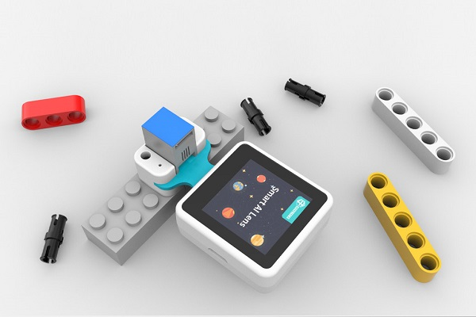
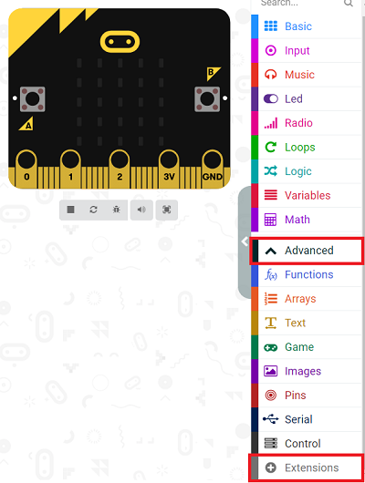
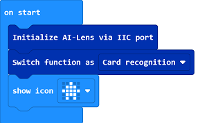
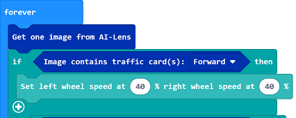
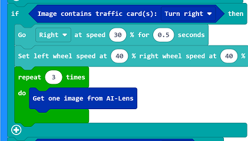

# Case 20: Road Indicator for TPBot with AI Lens

## Purpose
---
- Guide the TPBot via the AI Lens to drive by the road indicators. 

## Materials required
---

- 1 x [TPBot](https://www.elecfreaks.com/tpbot.html)


- 1 x  [AI Lens](https://www.elecfreaks.com/elecfreaks-smart-ai-lens-kit.html)




## Hardware Connections
---
Connect the AI Lens to the IIC port on TPBot. 


## Software 
---

[MicroSoft MakeCode](https://makecode.microbit.org/#)


## MakeCode Programming
---


- Click "Advanced" to see more choices in the MakeCode drawer. 



- We need to add a package for programming. Click "Extensions" in the bottom of the drawer and seach with "tpbot" in the dialogue box to download it.  


- We need to add a package for programming the AI Lens kit. Click "Extensions" in the bottom of the drawer and seach with `https://github.com/elecfreaks/pxt-PlanetX-AI` in the dialogue box to download it.  


### Sample Code

- Initialize the AI lens kit in the On start brick and switch its function to cards recognition. 



- In forever brick, get an image from the AI lens, if the image contains the traffic signals of driving forward, set the TPBot to drive at the speed of 40%. 



- If the image says turn left, set the TPBot to turn left at the speed of 30% for 0.5s and keep driving forward. As the AI Lens has three buffer zones, here we need to repeat collecting image for three times and discard to clear the buffer. 


- If the image says turn right, set the TPBot to turn right at the speed of 30% for 0.5s and keep driving forward. As the AI Lens has three buffer zones, here we need to repeat collecting image for three times and discard to clear the buffer. 



- If the card says stop, stop the TPBot immediately. 


- Complete code:


### Reference
- Link: [https://makecode.microbit.org/_c5tFg4d3RRsF](https://makecode.microbit.org/_c5tFg4d3RRsF)

- You may also download it directly here:

<div style="position:relative;height:0;padding-bottom:70%;overflow:hidden;"><iframe style="position:absolute;top:0;left:0;width:100%;height:100%;" src="https://makecode.microbit.org/#pub:_c5tFg4d3RRsF" frameborder="0" sandbox="allow-popups allow-forms allow-scripts allow-same-origin"></iframe></div>  


## Python Programming
---

Add TPBot extension: [https://www.elecfreaks.com/learn-cn/microbitKit/TPbot_tianpeng/TPbot-python.html](https://www.elecfreaks.com/learn-cn/microbitKit/TPbot_tianpeng/TPbot-python.html)

Add AI Lens extension: [https://www.elecfreaks.com/learn-cn/microbitplanetX/ai/Plant-X-EF05035-python.html](https://www.elecfreaks.com/learn-cn/microbitplanetX/ai/Plant-X-EF05035-python.html)

### Code

```
from microbit import *
from AILens import *
from TPBot import *

tp = TPBOT()
ai = AILENS()
# Set the function of AI Lens in cards recognition
ai.switch_function(Card)
while True:
    # Get an image
    ai.get_image()
    if (ai.get_card_content() == "Forward"):
        tp.set_motors_speed(40,40)
    if (ai.get_card_content() == "Turn left"):
        tp.set_motors_speed(0,30)
        sleep(1000)
        tp.set_motors_speed(40,40)
        # Repeat getting images for three times to clear the buffer zones
        i = 0
        while i < 3:
          ai.get_image()
          i += 1
    if (ai.get_card_content() == "Turn right"):
        tp.set_motors_speed(30,0)        
        sleep(1000)
        tp.set_motors_speed(40,40)
         # Repeat getting images for three times to clear the buffer zones
        i = 0
        while i < 3:
          ai.get_image()
          i += 1
    if (ai.get_card_content() == "Stop"):
        tp.set_motors_speed(0,0)
   
```

## Result
---

The TPBot acts as the cards indicate, if the card contains moving forward signal, it drives forward; if it is turning left signal, the TPBot turns left and goes forward; if it is turning right signal, the TPBot turns right and goes forward; if it is stop signal, the TPBot stops moving. 

## Exporation
---


## FAQ
---

Q: TPBot doesn't work with the sample code. 

A: It is probably due to the lack of battery power, please try adding the speed of the TPBot or replacing with new batteries. 

Q: The AI Lens is not working,  and it does not go to the function page with the sample code. 

A: Please try replacing with new batteries. 

## Relevant File
---

