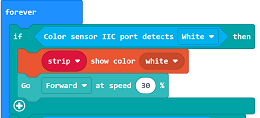
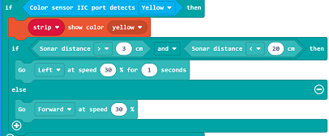
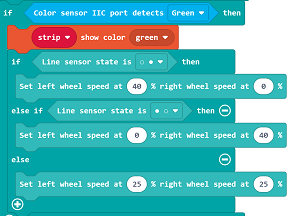
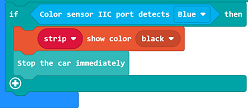
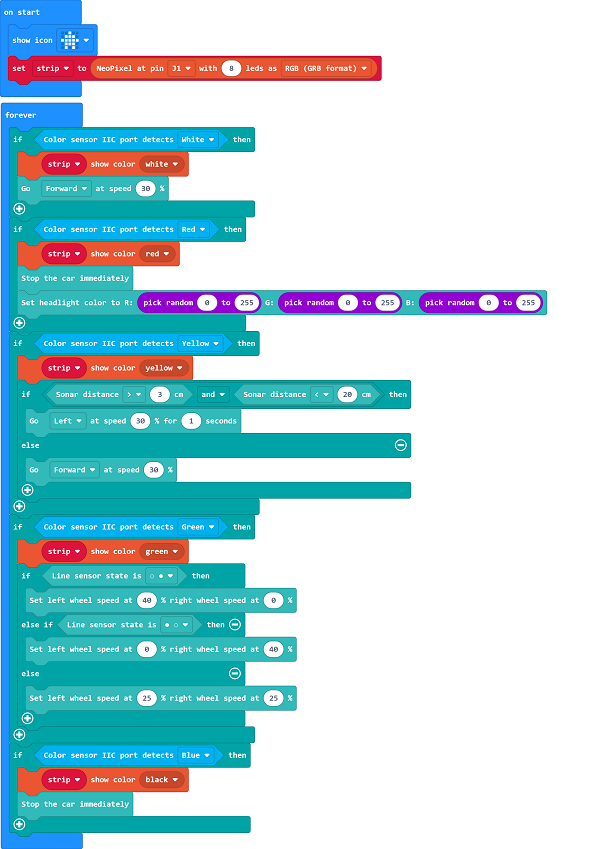

# Case18：Color-controlled TPBot

## Purpose
---
- The rainbow LED changes in accordance with the color of the cards and it executes  the defined functions accordingly(move forward,;change the color of the headlights at random; obstacles avoidance; line-following)

## Material
---
1 x [TPBot](https://item.taobao.com/item.htm?spm=a1z10.5-c-s.w4002-18602834185.41.68d15ccfBFHNPy&id=618758535761)

## Hardware connection
---
Connect rainbow led to port 1 and color sensor to IIC port on TPBot. 

## Software
---

 [MicroSoftmakecode](https://makecode.microbit.org/#)

## Programming
---

Click "Advanced" to see more choices in the MakeCode drawer. 

- We need to add a package for programming. Click "Extensions" in the bottom of the drawer and search with "tpbot" in the dialogue box to download it.  

- We need to add a package for programming. Click "Extensions" in the bottom of the drawer and search with "PlanetX" in the dialogue box to download it.  

### Sample

- In on start brick, drag the show icon brick into it and initialize the led strip and has it connected to J1 port.

- In forever brick, set the rainbow led in white if the color sensor detects white, and set TPBot move forward at the speed of 30%.

- Set the rainbow led in red  if the color sensor detects red, set TPBot stop moving and the RGB value of the headlight a random number among 0~225. 

- Set the rainbow led in yellow if the color sensor detects yellow, and judge if the returned value from the sonar:bit is between 3~20. If yes, set TPBot turn left for 1s at the speed of 30% or move forward at the speed of 30%.

- Set the rainbow led in green if the color sensor detects green, and judge the status of the two-way line-tracking sensor. If black is detected on the left, set the speed of the left wheel as 0 and right as 40; if it is detected on the right, set the speed of the left wheel as 40 and right as 0; if it is detected on both sides, it means the TPBot does not deviate from the black line, and set it move foreward at the speed of 25%. 

- Set the rainbow led in blue if the color sensor detectsblue, set the TPBot stop moving. 

Code：

### Link
- Link：[https://makecode.microbit.org/_YrH0rDiLJEKg](https://makecode.microbit.org/_YrH0rDiLJEKg)

- You may also download it directly below:

<iframe style="position:absolute;top:0;left:0;width:100%;height:100%;" src="https://makecode.microbit.org/#pub:_YrH0rDiLJEKg" frameborder="0" sandbox="allow-popups allow-forms allow-scripts allow-same-origin"></iframe>
  

## Conclusion
---

- Place the cards in different color in the front of the gesture sensor to activate different functions: 
- White card: Rainbow LED lights on in white and TPBot moves forward.  
- Red card: Rainbow LED lights on in red and TPBot stops moving with the headlights changing the colors at random.  
- Yellow card: Rainbow LED lights on in yellow and TPBot goes into the obstacle-avoidance mode. 
- Green card: Rainbow LED lights on in green and TPBot goes into the line-tracking mode. 
- Blue card: Rainbow LED lights on in blue and TPBot stops moving. 

## Exploration
---

## FAQ
---

Q: While operating this case, why the car might not work properly? 
A: It might be the low power of the batteries, please try adding the value of TPBot's speed and test again. 

## Relevant File
---

