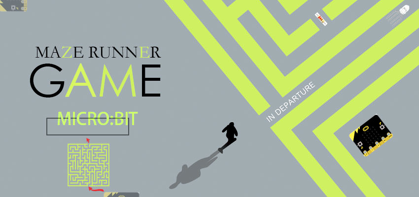
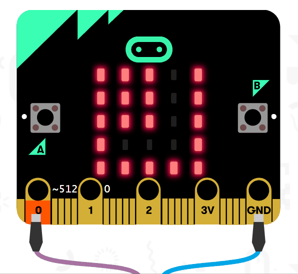
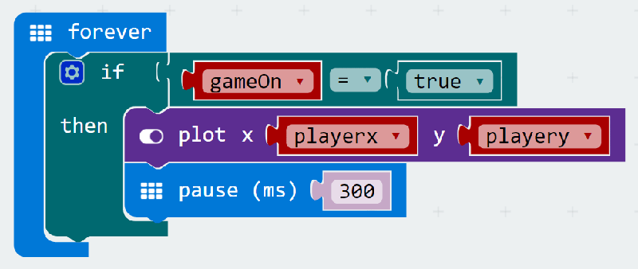
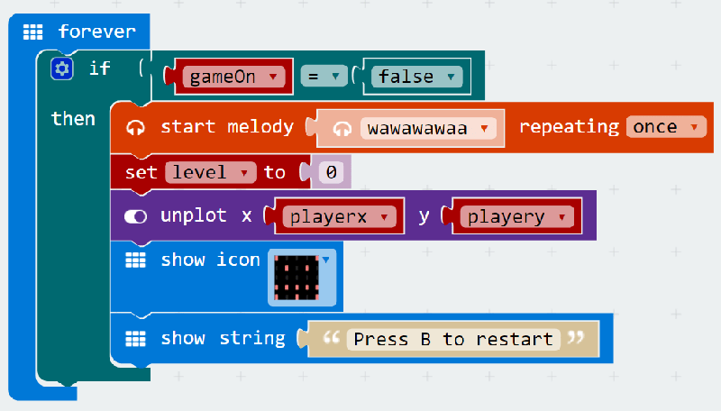
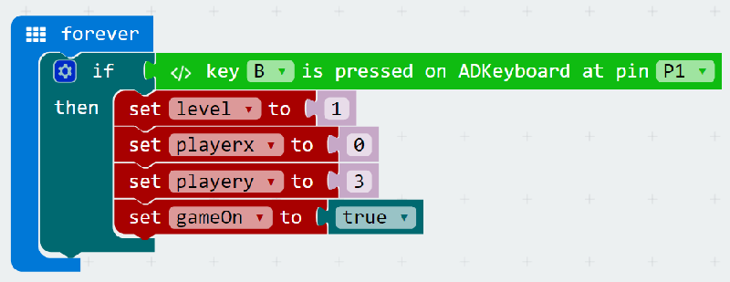
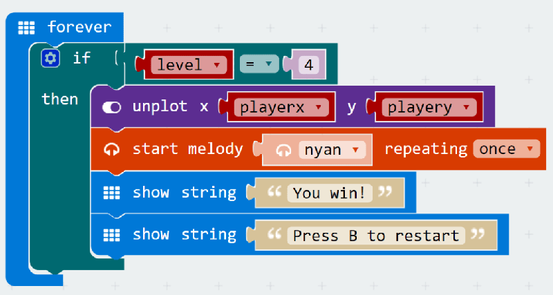

# case 15 Maze Runner 

Can you make it through all levels?  

## Goals  
---

We’re going to create a maze game where you must navigate a series of mazes without running into the walls. You’ll learn how to:  

- Use buzzer, ADKeypad and micro:bit board
- Use if statements to evaluate conditions
- Use variables to track game states such as player location
- Customize your game and add your own levels!

## Materials  
---

- 1 x BBC micro:bit  
- 1 x Micro USB cable  
- 1 x Buzzer  
- 2 x F-F Jumper Wires  
- 1 x ADKeypad  

  

## How to Make
---
### Step 1

Plug in Buzzer to Pin0. Connect the positive lead to the yellow signal pin and the negative lead to the black ground pin on the breakout board.

Plug in the ADKeypad to Pin1. Match wire colors to pin colors on the breakout board!

### Step 2

How to create a maze game on the micro:bit? We are going to display player’s position, LED walls and the maze paths with LEDs on the micro:bit board.

How to keep track of the player’s location on the screen? The 5*5 LED dot matrix on micro:bit can be regarded as a coordinate system. The x coordinate axle starts from 0 on the left to 4 on the right. The y coordinate axle starts from 0 on the top to 4 on the bottom. This means that the upper left LED is x=0, y=0. Likewise, the bottom right LED is x=4, y=4.

To do this, we need to create a few variables. Variables are like buckets that store pieces of information for us. Whenever we want the stored information, we can just look at the variable. We need two variables to keep track of the player’s location. Why two variables? One will keep track of the player’s x position and the other will keep track of the player’s y position. We also need a variable to keep track of the maze level (yes, we can have multiple levels!) and also another variable to keep track of whether the game is active (opposite to game over).

So let’s set these up. Inside ‘on start’ event, we (optionally) play a melody and display the name of the game on the micro:bit (MAZE RUNNER!). We also set up the 4 variables mentioned above, using the names: level, playerx, playery, and gameOn.

What do we set these variables to? We start at level 1 (of course), and we set gameOn to True because when we power on the micro:bit, we want to start the game right away. We can choose any starting point for our player location, but we’ll need to remember this location later on when we set up our maze level (we don’t want the player to start inside a wall!). In this example, I choose to start the player at x=0 and y=3.

  

### Step 3  

Now that we’ve set up our starting variables, let’s get our player to display on the micro:bit screen!

We want the player LED to blink on and off so that it is easy to be identified. To do this, we’ll use the ‘plot x y’ block alternating with the ‘pause’ block inside a forever loop. Remember, we want the player to forever blink on and off! However, this won’t work immediately. In step 6 when we add in the maze walls, the micro:bit will overwrite the player every time it draws the maze walls. By adding a pause block here, we make it so that the player won’t immediately be re-plotted, creating a blinking effect.

We use the playerx and playery variables that we created above. Why? If we typed in numbers here, we wouldn’t be able to easily make our player move! Using variables allows us to change the values of playerx and playery so that the forever loop will plot the new location of the player.

Remember the pause block is in milliseconds (so 300 ms = .3 seconds)! You can customize the speed at which it flashes by modifying the length of the pause.

  

### Step 4  

We’ve displayed the player on the micro:bit, but we can’t move it yet! Let’s add in player movement. We’re going to sense button press on the ADKeypad. But to do so, we need to import a special package into MakeCode.

Expand the ‘Advanced’ section and scroll to the bottom and click on ‘Add Packages’.

In the search box, type in "tinker kit". Click on the box labelled "tinkercademy-tinker-kit".

Now you’ll see something new in MakeCode – a bright green Tinkercademy category has been added!

Inside this category you’ll find blocks to sense button press on the ADKeypad. Note that importing this package only happens in the current project. So if you start a new project and want to use the category, you’ll need to re-import it.

  

### Step 5  

Now that we have added Tinkercademy category, we can use the ADKeypad to move up, down, left, and right. In this example, we’ll set button A to move up, button C to move down, button D to move left, and button E to move right.

To do this, we use if statments. If statements test if a condition is true. If it is true, then they run any blocks inside the if block. When we place an if statement inside a forever loop, we forever test if the condition is true.

To move the player, we simply change the player x or player y variables. Remember, decreasing or increasing playerx will cause the player to move left or right respectively. While decreasing or increasing playery will cause the player to move up or down respectively. We’re constantly plotting the location of the player using these variables. So when we change them, it automatically changes the player’s location!

We need to add a short 300ms pause after each button pressed, otherwise the player would move many spaces every time you pressed a button because the program runs so fast.

  

### Step 6  

Now that we can move the player, let’s start creating our maze levels! Every time we start a level, we need to do a few things. 

First we need to display the maze walls on the micro:bit screen;
Second, we need to forever check if the player runs into a wall (if they do, it’s gameover!). 
And third, we need to forever check if the player makes it to the end of the maze level (if they do, let them know they succeeded and move on to the next level!).

For each level, we’re going to use a forever loop. Inside the loop, we use an ‘if’ statement to check if the level variable equals 1. This means this code will only ever run if the level variable equals 1.

Inside the if statement, we first display the maze walls. We light up LEDs to serve as maze walls, and leave them turned off to represent the maze path. This can be done using the ‘show leds’ block. One thing to be careful about though: remember above we set the starting position of the player? Make sure starting position of your player is not inside a maze wall! In this example, the starting position of the player is x=0, y=3.

Next, we need to check if the player ever runs into a wall. How to do this? Once again we’ll use if statments to check if our playerx and playery variables are ever in the same place as a wall. We do this using the coordinate system of the 5x5 LED grid. In this example, there are two sections of walls.

The first wall exists where both playerx and playeryis less than or equal to 2. We create an if statement with these conditions, inside which we set gameOn to ‘false’ (since if it’s ever ‘true’, it means the player ran into a wall and should get a Game Over).

The second wall exists where playerx or playery equals 4. We create another if statement with these conditions, and inside we set gameOn to ‘false’ (because once again if it’s ever true, it means the player ran into a wall and game over).

Finally, the last test we need to add is to see if the player makes it successfully through the maze! In this example level, the end of the maze is at x=3, y=0. We create another if statment to check if x=3 and y=0, and inside we do a few things: 

First, we play a success melody in the background; 
Second, we set the starting position of the player for the next level (in this example, we use the same starting position, but it can be different!). 
Third, we show a smile face to tell the player they succceeded! 
And fourth, we change the level variable by 1 (this will cause the next level to display).

  

### Step 7  

Setting up a level costs us a lot of work! Now that we have a single level, let’s make something happen when a player gets a game over. This will happen whenever they run into a wall, and it’s tracked by the ‘gameOn’ variable.

Inside a forever loop, we use an if statment to check the value of the ‘gameOn’ variable. If it equals ‘false’, then we want our game over code to run!

In this example, we play a sad melody in the background, reset the ‘level’, unplot the player LED, show an angry face, and finally display a string telling the player they can press B to restart the game.

  

### Step 8  

Speaking of pressing B to restart the game, we haven’t yet created the code to do that!

Inside a forever loop, we test if button B on the ADKeypad is pressed. If it is, we want to set ‘level’ to 1, reset the player’s starting location by setting the ‘playerx’ and ‘playery’ variables to 0 and 3 respectively, and set the ‘gameOn’ variable back to ‘true’.

  

### Step 9  

Now our game should work as intended! The only thing missed is more levels!

It’s quite easy to add more levels by duplicating our level 1 code from above. The only thing that will change is the maze walls and the coordinates for our if statments (for testing if the player moves into a wall or completes the level).

Tips: 
sometimes it can be complicated to create if statements to test for every wall. In these cases, try to break down your walls into separate rectangles and create an if statement for each rectangle.

One thing to watch out: after the player has completed a level, you have to reset its playerx and playery variables, making sure the position matches your next level. Otherwise it would start inside a wall!

  
  

### Step 10  

Once you have done this, you can optionally create a victory section. In this example, once the player have successfully completed the first 3 levels and level equals 4, we unplot the player by playing a victory melody in the background, and showing a victory message!  

  

If you don't want to type these code by yourself, you can download directly from the link below:

[https://makecode.microbit.org/_fCqa4399XUpv](https://makecode.microbit.org/_fCqa4399XUpv)

Or you can download from the page below:

<iframe style="position:absolute;top:0;left:0;width:100%;height:100%;" src="https://makecode.microbit.org/#pub:_fCqa4399XUpv" frameborder="0" sandbox="allow-popups allow-forms allow-scripts allow-same-origin"></iframe>

### Cool stuff!

Now that you’ve learned how to use the ADKeypad, you can try to control LEDs, servos, and other components! You’ve also learned about if statements which are useful in many micro:bit projects! Try to customize your maze runner game by adding more levels!
