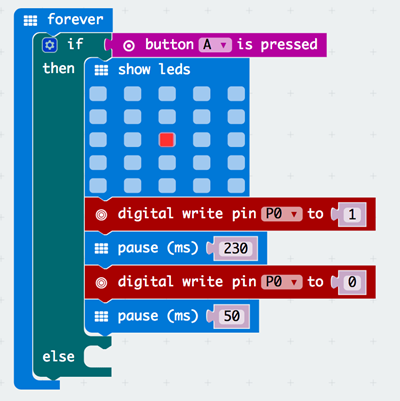
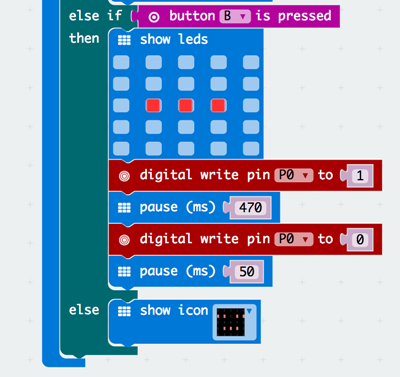
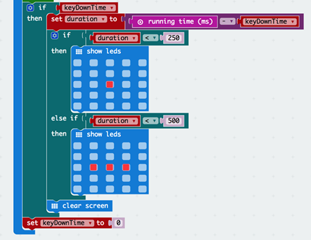

# case 31 morse code transmitter 

## Morse Code Transmitter
---
- Make a simple morse code transmitter using MakeCode, micro:bits, and some crocodile clips!
This tutorial was written by Anahita from the University of California at Berkeley, during her summer internship in Singapore.

### Goals
---

 1. Connect two micro:Bits together.
 2. Send signals from the first micro:Bit to the second micro:Bit by pressing the A and B buttons.
 3. Receive signals from the first micro:Bit.
 4. Learn how to code in MakeCode.

            
    
### Materials
---
- 2 x micro:Bits
- 4 x Crocodile Clips
- 1 x micro USB cable

### Step 0 – Preview
---
- We will be writing two sets of code: one for the sending micro:Bit and another for the receiving micro:Bit
- In order for the receiver to know which signal is being sent, we will adjust the length of time between when the signal turns “on” and “off”
- That way, we can differentiate the two signals by the pause length

### Step 1 – Crocodile Clips
---

We want to send signals from pin 1 of the first micro:Bit to pin 2 of the second micro:Bit (and vice versa)

Connect:

1. GND to GND
2. 3V to 3V
3. Pin 1 to Pin 2
4. Pin 2 to Pin 1

### Step 2 – Sender: button A
---

We want a signal to be sent when the A button is pressed. Let’s make this one the “dot” signal.

1. Open up MakeCode and name this file “Sender”
2. Drag and drop an if-then-else block from the Logic drawer to the Forever block
3. From the Input drawer, attach a button A is pressed block to the if section
4. From the Basic drawer, attach a show led block in the then section to display the “dot” on the sender screen
5. Add a digital write pin block from the Pins drawer (under Advanced) and set it to 1(This means the signal will turn “on”;Make sure to change it to p1 since that’s where we attached the clip)
6. Add a pause block from the Basic drawer and set it to 230 ms(This pause will be associated with the “dot” signal)
7. Add another digital write pin block and set it to 0(This means the signal will turn “off”)
8. Add another pause for 50 ms just to give it some time

### Step 3 – Sender: Button B
---

We want a “dash” signal to be sent when the B button is pressed.

1. Add an else if block to the if-then-else block from earlier
2. Repeat the steps as with Step 2, except (Use button B is pressed,Display a “dash” in the LED,Pause for 470 ms)
3. Add a clear screen block from Basic or an icon to the else statement

### Step 4 – Receiver: detecting the signal
---

We want to record the duration of time between whenever the signal is received and when it stops. We will be using the running time (ms) block for this.

1. Create another project on MakeCode called “Receiver”
2. Drag a while loop from the Loops drawer
3. From the Logic drawer, attach an equals sign block to the while loop
4. Attach a digital read pin block to the equals sign block and set it equal to 1(This means that a signal is being detected;Make sure to change it to p2 since that’s where the crocodile clip is)
5. In the Variables drawer, make a variable called “keyDownTime”
6. Attach an if-then block to the body of the while loop
7. Attach a not block from the Logic drawer to the if statement and then attach the keyDownTime variable to it
8. You can find the running time (ms) block by searching for it in the search bar

 
### Step 5 – Receiver: displaying the signal
---

We want to display the correct signal on the screen.

1. Drag and drop an if-then block underneath the while loop and attach the keyDownTime variable to it(This is so that this block of code will only run if a signal has been detected)
2. Create another variable called “duration” and set it to be the difference between running time and keyDownTime(The minus operation is under the Math drawer,This variable tells us how long it’s been since the program started running and when the signal was detected)
3. Drag an if-then block and attach a less than block from the Logic drawer and make it so that it’s duration < 250(We chose 250 ms since the “dot” takes 230 ms)
4. Display the “dot” led in the body of the if statement
5. Add an else if block to the if-then-else block from earlier and do the same thing as above except the “dash” threshold is 500 since the “dash” takes 470 ms and then show the “dash” led
6. Add a clear screen so that the screen clear after a signal comes in
7. After the first if-then block make sure to set keyDownTime to 0 so that it works every time you send a new signal

### Done!
---

Make sure to flash the code to the respective micro:bits and test it out! It should display the same signal on both screen when you press a button.

For an added challenge, try to translate the morse code on the second micro:bit.

