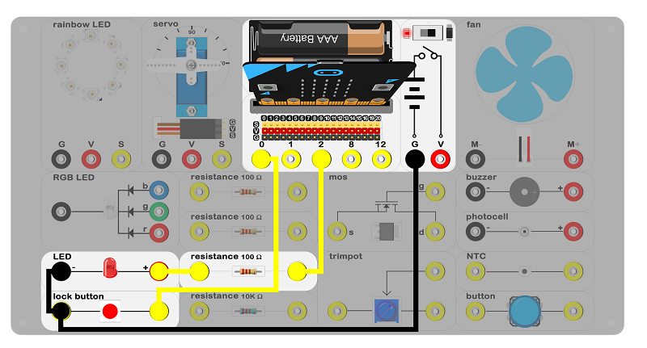

# case 09 self-locking button 

## Introduction ##
---
- The self-locking switch is a common use button switch. When we fisrt press the button and the circuit of switch will be connection, it means self-lock. And when we press the button again, the circuit of switch will be disconnection. In this case, we are going to use the self-locking switch to control on and off of the LED.

## Hardware Connect ##
---

-  Connect circuit as above picture and put 2 AAA batteries into batteries pack.

## Principles of Circuits ##
---

- The GND of slot on micro:bit is into innards of batteries' GND to generate the current loop.

## Introduction of Components ##
---
### Self-locking switch ###
- The self-locking switch is usually a normal switch with a mechanical lock built in. When pressed down and released, it doesn't bounce back automatically. Only after a second press will it unlock and fully release. 
- The experiment box included a self-locking button with a red hat.

***Note:*** Please note the positive and the negative when you are connecting.

## Software
---
### Step 1

- Click [makecode https://makecode.microbit.org/#](https://makecode.microbit.org/#)。

- Click on "New Project" and set a new Project.

### Step 2

- Snap the set pin block into the on start to emit the edge events. Then, set pull pin P0 to up to set a default high level and to detect the edge of the level fluctuation.

- Every time you press the button, the voltage of P0 port P0 changes. From 0V to 3.3 V, we call this RISE. From3.3V to 0V, we call this FALL.

### Step 3

- Set a event to monitor rise and fall of P0 voltage. When the RISE comes, write 1 to P2 port to light up the LED.

### Step 4

- When the FALL comes, write 0 to P2 port to turn off the LED.

### Program

- Program link：[https://makecode.microbit.org/_33tJqiCC8DL0](https://makecode.microbit.org/_33tJqiCC8DL0)

- You also could directly download program by visiting website as below:

<iframe style="position:absolute;top:0;left:0;width:100%;height:100%;" src="https://makecode.microbit.org/#pub:_33tJqiCC8DL0" frameborder="0" sandbox="allow-popups allow-forms allow-scripts allow-same-origin"></iframe>
  

## Result
---
-  Press down self-locking switch, LED turns on; press again, LED turns off.

## Think
---
- How can we control the micro:bit screen with the self-locking switch ?

## Questions
---

## More Information  
---

