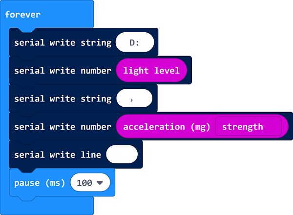
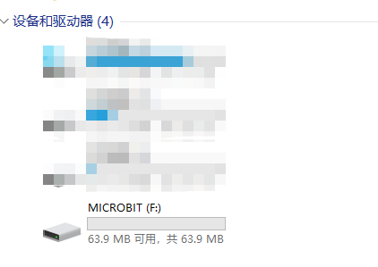
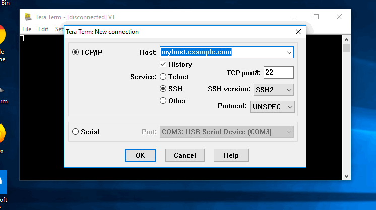
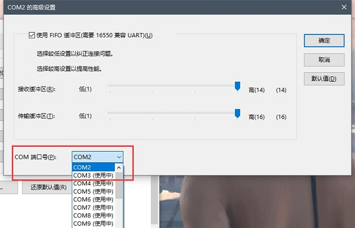

# The third part: Use IoT and Excel to make date visualized.

## Excel and micro:bit - Hacking for fun and creativity!
---
Our goal is to collect some basic data from sensors with the micro:bit and make the data visualized in Excel.

For this purpose, we will do with the below three steps:
1. We will program the controller to collect some sensor data and send it over its’ built in serial  communication port.
2. We will connect the micro:bit to the PC’s serial port.
3. We will write a small program in Excel that reads the data from the serial port into the grid.

### The Experiment-from micro:bit to Excel ##

### The first step: programming the micro:bit

Programming the micro:bit is the easiest thing you’ll ever do. Microsoft actually has a web-based development environment ready for you (Microsoft is one of the founding partners of the micro:bit).

All you have to do is, go to [www.makecode.com](http://www.makecode.com/), select the micro:bit as your device, and write a little program using a visual “Block-based” programming language.

The program we’ll write for this experiment will simply collect data from two sensors that we can easily play with – acceleration and light level, and send a sampling of the sensors over the serial communication port every 100ms.

---

### The second step:download the program to the micro:bit

All you have to do now is load the program into your Micro:Bit. 
To do that, connect your micro:bit to the PC using a USB cable, which will make it appear like a removeable disk drive. 

Then download the HEX file from within the MakeCode environment and save it onto the device. A few seconds later, the program will start running.

You can also download it here:
(https://makecode.microbit.org/_cjvC4RU1CVUD)

### Connecting it to the PC

Now that we have our controller running and sending data, and before we try it out in Excel, it’s a good idea to verify that the PC can indeed see the incoming data stream.
To do that, you’ll need to follow the instructions on [https://www.microbit.co.uk/td/serial-library](https://www.microbit.co.uk/td/serial-library) which basically means you need to do two things:

1. Install a driver, which will make the micro:bit “appear” as a serial port on your PC.Youcan download it here:
[Download drive program](https://github.com/elecfreaks/learn-cn/blob/master/microbitKit/iot_kit/file/teraterm-4.102.rar?raw=true)

2. The serial communication terminal simulator has to be used for the test.
You will need to configure the right COM port. On my environment, it was configured to COM3. The sample code in Excel assumes that, so if yours is different, you’ll need to modify the Excel code later on to reflect the right port.

Once you do that, you should see a stream of data that looks something like this inside your emulator:

 

3.If it passes from the terminal simulator, go to "device manager"-choose "port", find "USB serial device".

Right click the mouse to find propertities to choose the port setting, change the first data to "115200".

Click "Advanced", set the "COM port" to "1" or "2", click to confirm the setting in turns.

**The incoming data flow - light level and acceleration**

### The fourth step: programming in the Excel!

Now that we have a stream of incoming data, lets get it into Excel. 
The spreadsheet comprises of two parts : 
1. First part: some VBA code that is used to communicate with the micro controller
2. Second part: some basic grid data manipulation functions which are used to break the data points and charts it. 

You can find a copy of the working spreadsheet:[https://techcommunity.microsoft.com](https://techcommunity.microsoft.com/gxcuf89792/attachments/gxcuf89792/ExcelBlog/48.6/1/SensorVisualizer_BlogVersion.zip) or find it here: [check here to download](https://github.com/elecfreaks/learn-cn/blob/master/microbitKit/iot_kit/file/SensorVisualizer_BlogVersion.zip?raw=true)

While you open the copy of the Excel, it reminds" The macro is forbidden", clicking "start macro" is important.

Because this is an endless stream of data, for the purpose of this experiment, we will iterate thru the last 30 data samples collected. 

One more point: When reading from the serial communication port in VBA, the most reliable way to do that is to read byte-by-byte and not whole lines. There’s also some chance of losing some data (depending on speed of communications, speed of VBA execution, etc.), which is why I’ve added the “D:” prefix for each line. If the line we read doesn’t start with it, the line gets ignored as garbage data.

With no further ado, here’s a snippet from the main loop in the VBA code:
 

Few things to note in this code snippet:

1. We open the COM3: port at 115,200 baud (the speed at which the Micro:Bit sends data).
2. Reading happens a byte at a time, until end of line (char(13)) is detected.
3. Whenever a line is read, it gets pushed into the grid into the next row in a fixed column. Row 
numbers are fixed between 2-31 to keep this example simpler.
4. There is a flag used to stop reading. It’s triggered by a stop button (from a different Macro).

The best way to understand this code it is to run it in debug mode and step thru it, so go ahead and download the demo workbook and experiment!

Now that we have the data coming into the grid, we’re in the plain old good Excel formula and charting territory. Time to do something with the data we are collecting!

To keep things generic, the VBA scripts reads the data as-is into the grid, so Column “E” contains the actual data, as it arrived over the wire. In our case, it’s two numbers, comma-separated.

So, first thing we want to do is to break it up into two distinct values per row. The light level, and the acceleration value. I did that on purpose in the easy to read way – used the FIND formula to find the location of the “,” separator inside the incoming data, and then used NUMERVALUE and LEFT and RIGHT formulas to break the string apart and convert it into two numeric values.

Here is a bit more about the formulas I used to break down the values from the input data string:

  ` =FIND(",",E2,1)` : Finds the location of the first comma separator inside cell E2 (which contains the raw incoming string of comma-separated values).
  ` =NUMBERVALUE(LEFT(E2,F2-1))` : Takes the left side of the string, up to the comma location, and convert it to a number value. This gives us a number representing the light sensor value. Light values in the Micro:Bit range from 0 to 255.
   `=NUMBERVALUE(RIGHT(E2,LEN(E2)-F2))` : Similar to the previous formula, only taking the right side number, which is the acceleration value. Values can be on the X,Y or Z axis, or combined, and explained [here](https://pxt.microbit.org/reference/input/acceleration).

I also added a fixed “Row” column numbered 1-30, so that we will have an X axis for our charts.

The final piece of the puzzle – create two charts from the values. In both of them, the X axis is the row number, and the Y axis is the data coming in from the sensor (either light or acceleration).
This is what it looks like:

The fifth step: Revise VBA code

Click"view"to choose "macro".

Choose"StartBtn-click" to"edit".

Revise the value of "COM" to the former port value, here the example is "2" in this code.

Clict to save the Excel in the right upper corner and reopen it.

**The end result - incoming data is visualized live!**

All you have to do now is click “Start” and see the data coming in and being charted live! 

