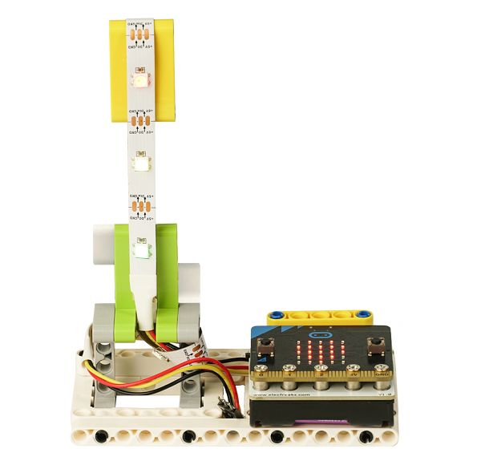
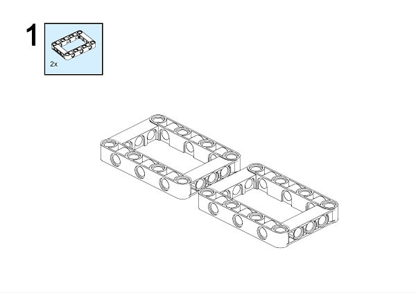
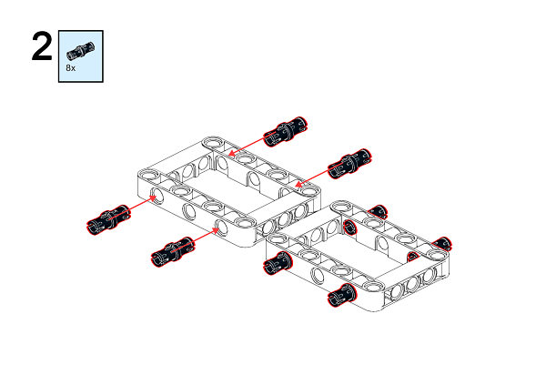
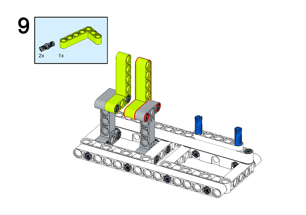
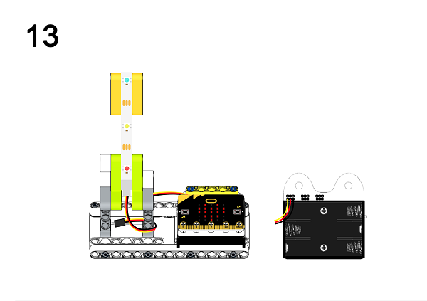
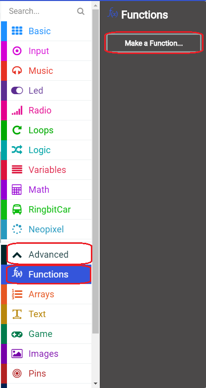
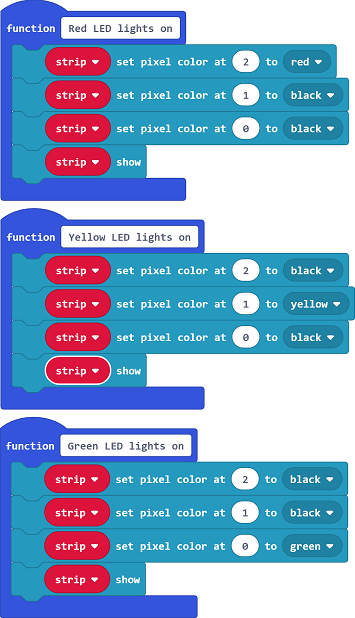

# Case 01: Traffic Lights

## Purpose
---

- To build a traffic light.

## Materials
---

## Background Knowledge
---

## Bricks build-up
---

A detailed assembly instruction can be downloaded via the below links:
[Github download ](https://github.com/elecfreaks/learn-cn/raw/master/microbitKit/ring_bit_bricks_pack/files/Ringbit_Bricks_Pack_step_01_v1.1.pdf)

## Software
---

[MicroSoft makecode](https://makecode.microbit.org/#)

## Programming
---

### Step 1
 Click "Advanced" in the MakeCode drawer to see more choices.

In order to programme for the Ring:bit Bricks Pack, we need to add an extension. Click  "Extensions" at the bottom of the drawer. Search "Ringbit" in the dialogue box to download it. 

Note: If you met a tip indicating codebase will be deleted due to incompatibility, you may continue as the tips tell or build a new project. 

### Step 2

Drag the `set strip to NeoPixel at pin with led as` to `on start`, set the pin at P0 port. Initialize the strip in 3 LEDs and in RGB(GRB format).

### Step 3

Click "Advanced" to choose "Functions" and click "Make a Function" as the picture shows below. 

### Step 4

Enter "Red LED lights on" and click "Done" to create a function, and create another two functions "Yellow LED lights on", "Green LED lights on" in the same way. 

### Step 5

In the function of "Red LED lights on", set the third LED in red and the other two in black;  in "Yellow LED lights on", set the second LED in yellow and the other two in black; in "Green LED lights on", set the first LED in green and the other two in black.

### Step 6

 Set "red led lights on" function in "Forever", and pause 3000ms; Set "yellow led lights on" function and pause 1000ms; set "green led lights on" and pause 3000ms. 

### Code

Link: [https://makecode.microbit.org/_DdAU5d4kMJDh](https://makecode.microbit.org/_DdAU5d4kMJDh)

You can also download it directly below:

<iframe style="position:absolute;top:0;left:0;width:100%;height:100%;" src="https://makecode.microbit.org/#pub:_DdAU5d4kMJDh]" frameborder="0" sandbox="allow-popups allow-forms allow-scripts allow-same-origin"></iframe>
  

### Result

When power on, the red LED lights on for 3 seconds, then the yellow led in 1 second and the green one in 3 seconds at last. 

## Exploration
---

## FAQ
---
## Relevant File
---
On December 10th, 1868, the first signal light was born in the square of the London House of Parliament. It was designed and manufactured by the British mechanic De Hart. The lamp post is 7 meters high with a red and green lantern hanging there --Gas traffic signal light (the color of the light is controlled manually by the police on duty), this is the first signal light in the street. Unfortunately, the gas traffic light suddenly exploded killing a police officer on duty on the lamp's twenty-third birth day. The city's traffic lights have been banned since then.
It was not until 1914 that the city of Cleveland took the lead in restoring traffic lights (electrical signals).
In 1918, The traffic policeman William Potts from Detroit invented the first signal light consisting of red, green and yellow.
