# Case 06: Trebuchet

## Purpose
---

To build a trebuchet.

## Materials
---

## Background Knowledge
---

## Bricks build-up
---

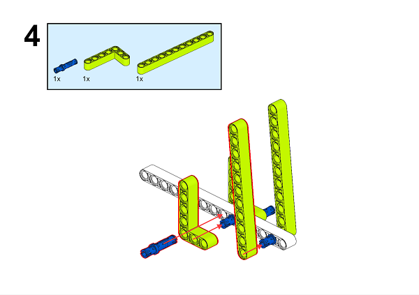

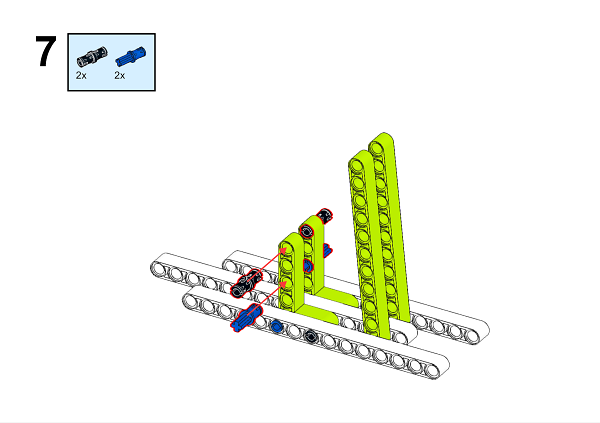

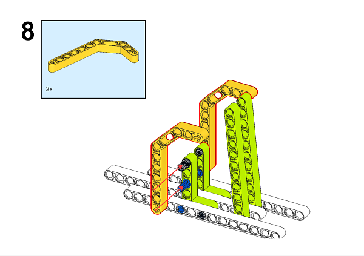

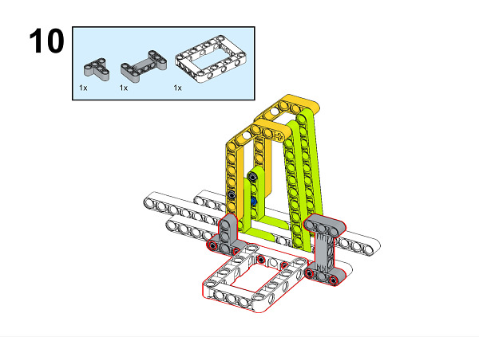

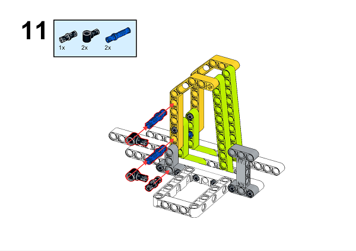

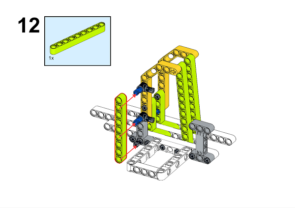

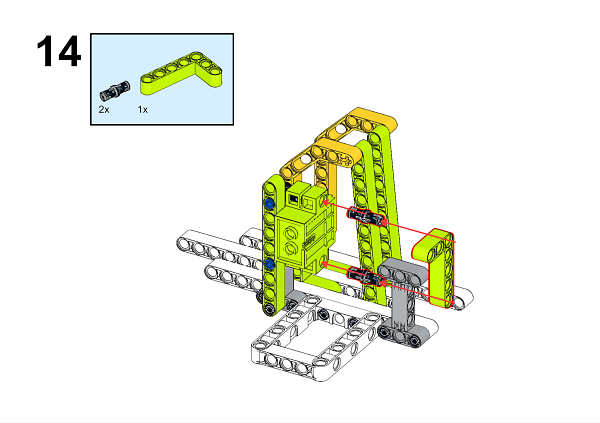

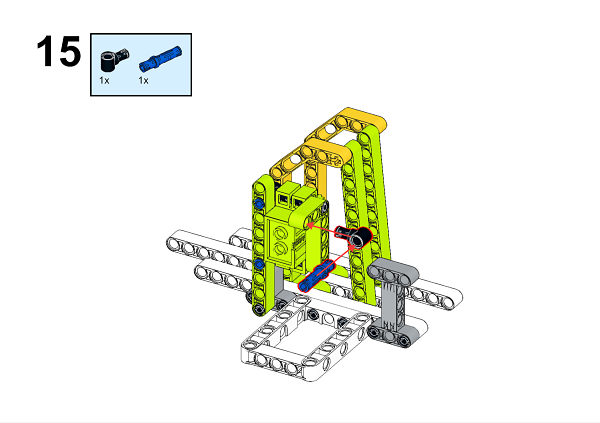

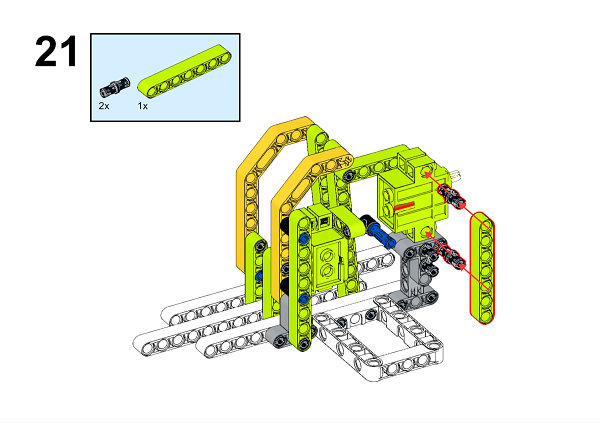

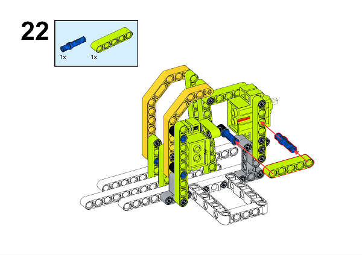

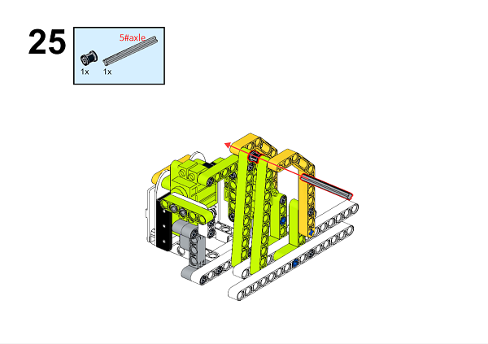

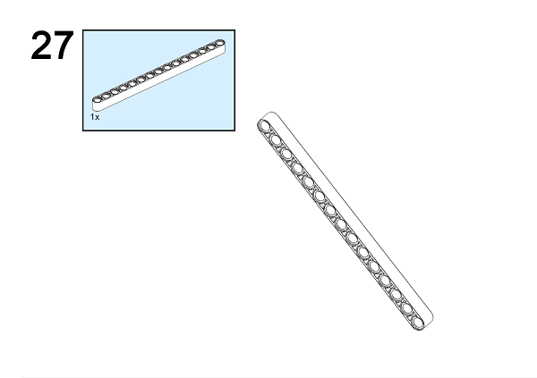

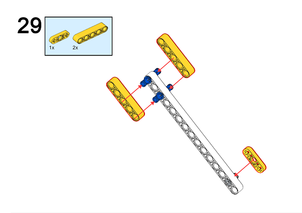

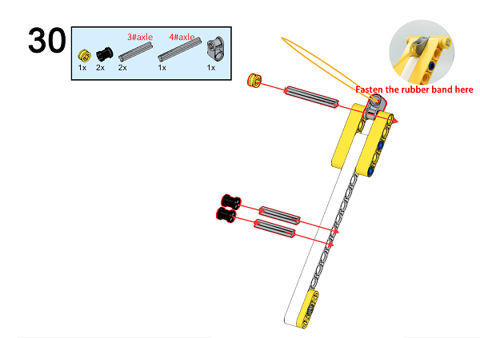

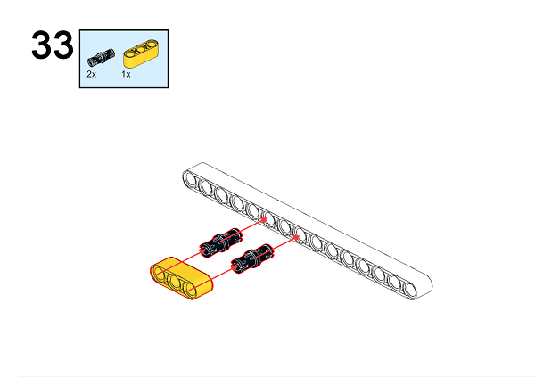

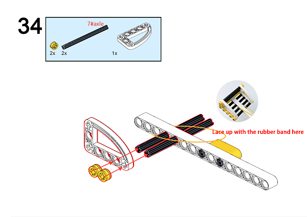

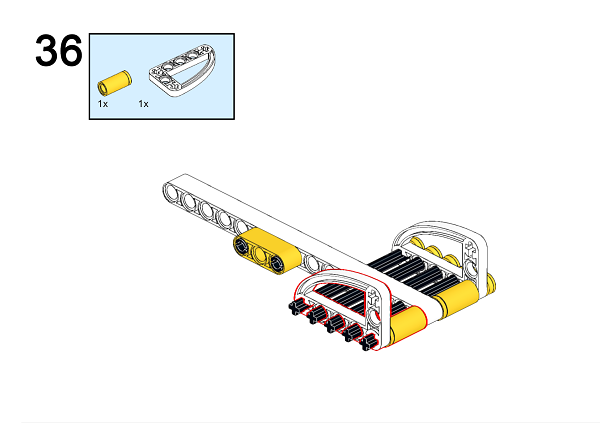

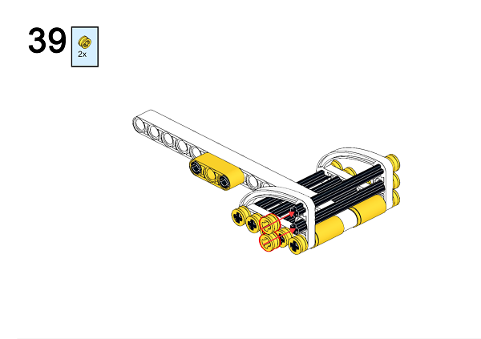

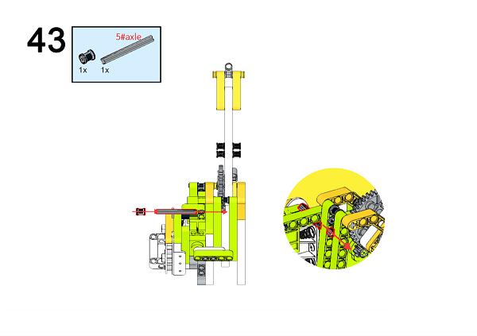

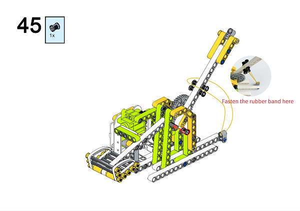

A detailed assembly instruction can be downloaded via the below links:
[Githubdownload ](https://github.com/elecfreaks/learn-cn/raw/master/microbitKit/ring_bit_bricks_pack/files/Ringbit_Bricks_Pack_step_06_v1.1.pdf)

## Software
---

[MicroSoftmakecode](https://makecode.microbit.org/#)

## Code
---

### Step 1
 Click "Advanced" in the MakeCode drawer to see more choices.

In order to programme for the Ring:bit Bricks Pack, we need to add an extension. Click  "Extensions" at the bottom of the drawer. Search "servo" in the dialogue box to download it. 

Note: If you met a tip indicating codebase will be deleted due to incompatibility, you may continue as the tips tell or build a new project.

### Step 2

While button A being pressed, set the servo connected to P1 port turning 180 degrees and pause 300ms;  then set the same port turning 90 degrees and pause 1000ms; set the servo connected to P2 turning 0 degree and pause 1000ms; then the same port turning 90 degrees and pause 1000ms;  P1 turning 0 degree and pause 300ms; then the same port turning 90 degrees and pause 500ms; P2 turning 180 degrees and pause 1000ms and the same port turning 90 degrees and pause 1600ms. 

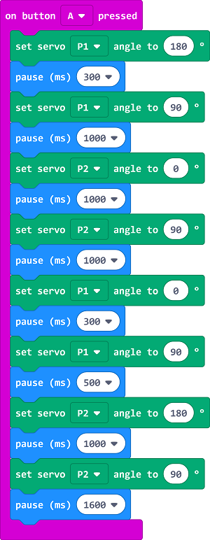

Note: As the servo we used is in 360 degrees, the "servo" extension in MakeCode is suitable for servos in 180 degrees, therefore, setting the turning angle to 0 degree or 180 degrees will lead to the servo turning clockwisely or anti-clockwisely, and 90 degrees means to stop turning.

### Code

Link: [https://makecode.microbit.org/_AM7FejLdJD2m](https://makecode.microbit.org/_AM7FejLdJD2m)

You can also download it directly below:

<iframe style="position:absolute;top:0;left:0;width:100%;height:100%;" src="https://makecode.microbit.org/#pub:_AM7FejLdJD2m]" frameborder="0" sandbox="allow-popups allow-forms allow-scripts allow-same-origin"></iframe>
  
### Result
---
While button A being pressed, the trebuchet executes the launch order and will return to its original launch status automatically. 

## Exploration

---

## FAQ

---

## Relevant File 

---
