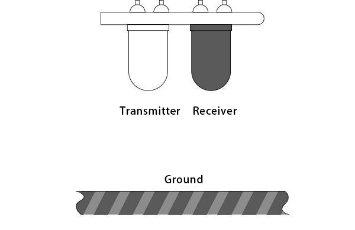
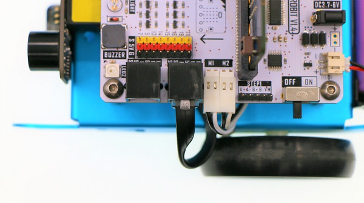
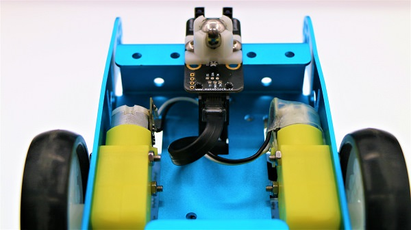
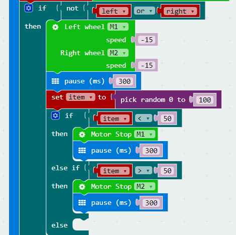
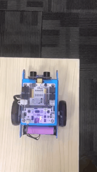

# case 03 Never Fallen Car

## Our Goal   
---  

- Get to know line tracking module.   
- Realize edge detection with the line tracking module on mBot car.   

## Material Needed  
---  

- 1 x Robit
- 1 x Mbot Car  

## Background Knowledge  
---  

### Principle of Line Tracking   

- This line tracking module has an infrared sensor, which consists of a **transmitter** and a **receiver**. The transmitter emits infrared light, while the receiver collects the inrared light reflected by the ground.  
- When encountering black ground or other objects that absorb infrared, the receiver can't receive infrared light, thus line tracking module will return 1.   

## Hardware Assembly    
---  

Like the previous chapter, connect motors to port M1 and M2.  
Using RJ25 wire to connect line tracking module to port J2 on Robit just as pictures below.  

  

  

  

## Software  
---  

[Microsoft Makecode](https://makecode.microbit.org/#)  

## Programming    
---  

### Step 1  

Click **Advanced** in the code drawer of Makecode to see more options.   

  

To program for line tracking module, we have to add a package. Find **Add Package** at the bottom of code drawer and click it. This will pop up a dialogue box. Search **Robit**, and then click to download this package.    

  

**Note:**  
If you get a hint that some packages will be deleted due to the problem of incompatibility, you can either follow the prompts, or create a new project in the project menue.  

### Step 2  

The initial line tracking module port at the beginning of our program is J2(P15,P16). Set the motor speed of M1 and M2 to be 15. 

  

Set the return value of the left and right infrared sensor to be variables: left and right. These variables can read the return parameters of the infrared sensors.  

  

If one of these infrared sensors doesn't receive any feedback(detected edges), the motor speed is negative, and the car will reverse. 
Randomly generate a number from 0 to 100. If it is below 50, the motor M1 stops to complete a right turn. If it is beyond 50, the motor M2 stops to complete a left turn.  

  

If both infrared sensors don't detect edges, set the motor speed to be 15 and the car continue to move forward.  

  

## Programming  
---  

You can refer to the whole program from the link here:[https://makecode.microbit.org/_1mCg9TgVxJ5K](https://makecode.microbit.org/_1mCg9TgVxJ5K)  

Or you can download it directly from the page below.   

<iframe style="position:absolute;top:0;left:0;width:100%;height:100%;" src="https://makecode.microbit.org/#pub:_1mCg9TgVxJ5K" frameborder="0" sandbox="allow-popups allow-forms allow-scripts allow-same-origin"></iframe>
  

**Note:** Objects that can absorb infrared light are considered as black lines.

## Result  
---

Once detected table edges, mBot will move backward to prevent falling down.   

  

## Think   
---  

## FAQ  
---  

