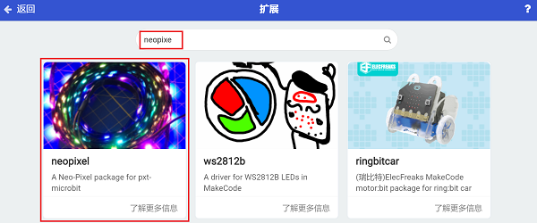
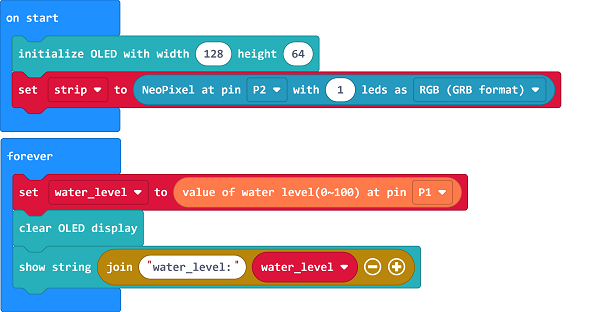
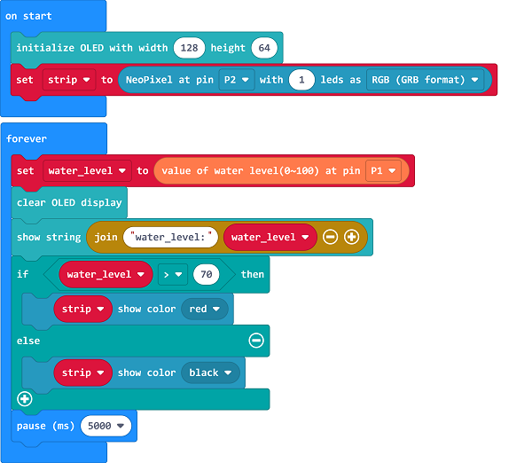

# 鱼塘水位监测装置

##  简介
---
 
- 当遇到暴雨天气，可能会导致鱼塘水位过高，鱼有可能会逃离鱼塘，造成损失。

##  功能
---
- 通过水位传感器检测鱼塘水位，并在OLED显示屏上显示当前水位高度，当水位过高，点亮红灯进行提示。

## 购买链接
---
- 1 x [microbit Smart Agriculture Kit]()

## 产品图片
---

## 硬件链接
---

将水位传感器连接到IOT:bit的P1端口，彩虹灯连接到IOT:bit的P2端口，OLED显示屏连接到IOT:bit的IIC端口。

## 软件编程
---
在MakeCode的代码抽屉中点击“高级”，查看更多代码选项。

为了给microbit Smart City Kit编程，我们需要添加一个扩展库。在代码抽屉底部找到“扩展”，并点击它。这时会弹出一个对话框，搜索”iot-environment-kit“，然后点击下载这个代码库。

为了给彩虹灯编程，我们需要添加一个扩展库。在代码抽屉底部找到“扩展”，并点击它。这时会弹出一个对话框，搜索”neopixel“，然后点击下载这个代码库。

*注意：*如果你得到一个提示说一些代码库因为不兼容的原因将被删除，你可以根据提示继续操作，或者在项目菜单栏里面新建一个项目。

## 程序
---
当开机时，初始化OLED显示屏，设置连接至P2端口的彩虹灯为1颗。

将连接到P1端口的水位传感器的返回值存入变量“water_level”中，并通过OLED显示屏显示当前水位。

判断当前水位是否超过设定阈值，当水位超过设定阈值时，则点亮红灯进行警示。

请参考程序连接：[https://makecode.microbit.org/_dHJDqwUoDDTf](https://makecode.microbit.org/_dHJDqwUoDDTf)

<iframe style="position:absolute;top:0;left:0;width:100%;height:100%;" src="https://makecode.microbit.org/#pub:https://makecode.microbit.org/_dHJDqwUoDDTf" frameborder="0" sandbox="allow-popups allow-forms allow-scripts allow-same-origin">
</iframe>

  

## 结果
---
- OLED显示屏上显示当前水位高度，当水位过高，点亮红灯进行提示。

