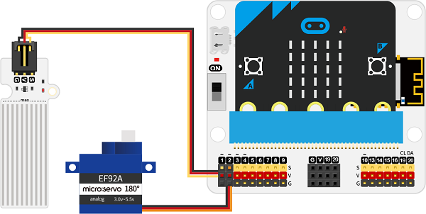
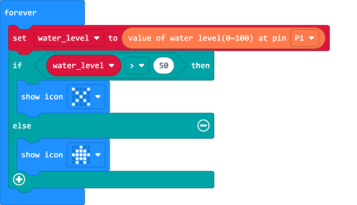
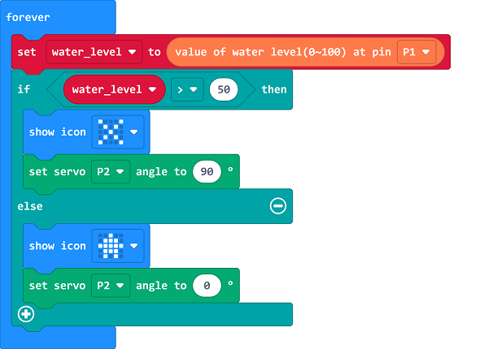

# Case 01: Water Backflow Prevention Device in Subway

##  Introduction
---
There are many ways to travel in cities, and the subway has gradually become the preferred means of transportation for people because of its fast, convenient, and comfortable features. Subway are mostly constructed in the underground. Strong rainstorms are very likely to cause rainwater intrusion accidents at subway entrances and exits, the water accumulation in the stations may trap people, damage the equipment, affect the normal operation of the subway. Therefore, we can design a water backflow prevention device, when it detects the water level exceeds the threshold, the waterproof baffle is automatically raised to prevent rainwater from backflow.

## Function

---

Detect the water level on the export of the subway with the water level sensor, if the value is over the threshold, program to lift the barrier automatically. 

## Products Link
---
- 1 x [microbit Smart City Kit]()

## Picture
---

## Hardware Connection
---

Connect the water level sensor to P1 and the servo to P2 on IoT:bit. 

## Software Programming 
---

Click "Advanced" in the MakeCode to see more choices.

For programming, we need to add a package: click "Extensions" at the bottom of the MakeCode drawer and search with "iot-environment-kit" in the dialogue box to download it. 

For programming, we need to add a package: click "Extensions" at the bottom of the MakeCode drawer and search with "servo" in the dialogue box to download it. 

***Notice:*** If you met a tip indicating that some codebases would be deleted due to incompatibility, you may continue as the tips say or create a new project in the menu. 

## Program 
---
Save the returned water level value as the variable “water_level”. 

Judge if the variable is over the threshold, if yes, set to display "×" or to go ahead. 

If yes, it also indicates that the water level has risen to a risk value, now program to use the servo to lift the barrier in case of the backflow; if the water level returns to normal, the barrier would be put down. 

Link: [https://makecode.microbit.org/_0DFXLye3Ee5j](https://makecode.microbit.org/_0DFXLye3Ee5j)

<iframe style="position:absolute;top:0;left:0;width:100%;height:100%;" src="https://makecode.microbit.org/#pub:https://makecode.microbit.org/_0DFXLye3Ee5j" frameborder="0" sandbox="allow-popups allow-forms allow-scripts allow-same-origin">
</iframe>

  

## Result
---
- If the water level is over the threshold, an icon "x" shall diaply on the micro:bit to remind people of not passing and the barrier gets lifted; if the water level is not over the threshold, the micro:bit shall display the keep-going icon and the barrier is put down. 

