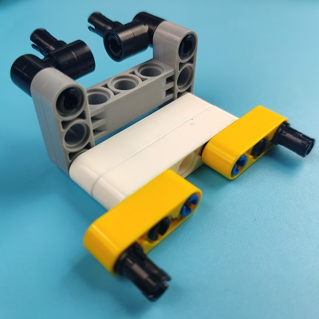
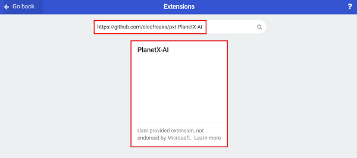
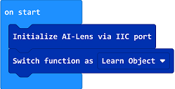
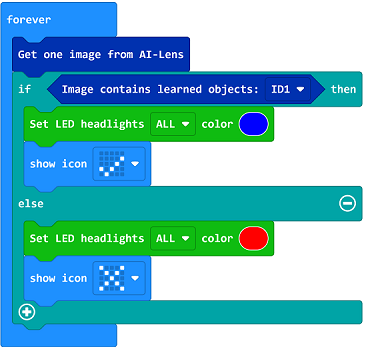
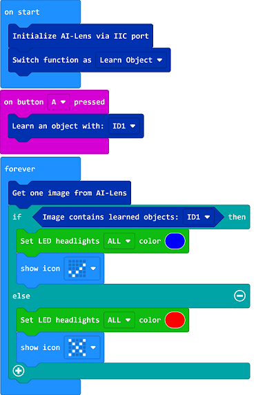

# Cutebot & AI Lens-One Button to Learn

## Purpose 
---
- Use the Cutebot and AI Lens to achieve the one button to learn function. 

## Materials required

---

- 1 × [Cutebot V3.0](https://www.elecfreaks.com/store/cute-bot.html)

- 1 × [Cutebot lithium battery pack](https://www.elecfreaks.com/cutebot-lithium-battery-pack.html)

- 1 × [AI Lens Kit](https://www.elecfreaks.com/elecfreaks-smart-ai-lens-kit.html)

  *Note: The AI Lens kit works with Cutebot V3.0 only(You can see the version number printed on the baseboard).*

## Connections:

---

### Steps to install the lithium battery pack: 

Assembly steps for bricks:

Parts list:

Steps of build-up:

### Connections of the AI Lens: 

Connect the RJ11 cable with the AI Lens and the other end in Dupont connection to the circled place in the below picture (make sure you connect to the right connections).

*Tips: the bricks holder here is flexible to be adjusted, we may manually adjust the angles of the AI lens to meet the requirements of the functions that you want to achieve.*

## Software Platform:

---

[MicroSoft MakeCode](https://makecode.microbit.org/#)

## Programming

---

### Step 1

Click “Advanced” in the drawer to see more choices.

- We need to add a package for programming. Click “Extensions” in the bottom of the drawer and search with “cutebot” in the dialogue box to download it.

We need to add a package for programming the AI lens kit. Click “Extensions” in the bottom of the drawer and search with “https://github.com/elecfreaks/pxt-PlanetX-AI” in the dialogue box to download it.

*Note: If you met a tip indicating that the codebase will be deleted due to incompatibility, you may continue as the tips say or build a new project in the menu.*

###  Step 2

- In the on start brick, initialize the AI Lens and switch to characters acquisition function. 

- While press the button A, set the learnt target as ID1. 

- In the “forever” brick, set to get one image form the AI lens. If the ID1 is in the image, we set the color of the headlights in blue and set a √ to display on the screen. Or set the color of the headlights in red and set a × to display on the screen. 

### Code

Link: [https://makecode.microbit.org/_8Xe7ERhxEgza](https://makecode.microbit.org/_8Xe7ERhxEgza)

You may also download it directly below:

<iframe style="position:absolute;top:0;left:0;width:100%;height:100%;" src="https://makecode.microbit.org/#pub:https://makecode.microbit.org/_8Xe7ERhxEgza" frameborder="0" sandbox="allow-popups allow-forms allow-scripts allow-same-origin">
</iframe>

  
---

## Result
---
- While pressing button A, set the learnt target as ID1, after learning it, the LED headlights light on in blue and the icon √ is displaying on the screen if ID1 is recognized; or set the LED lights on in red and display icon × . 

## Exploration

---

## FAQ

---

## Relevant Files 

---
