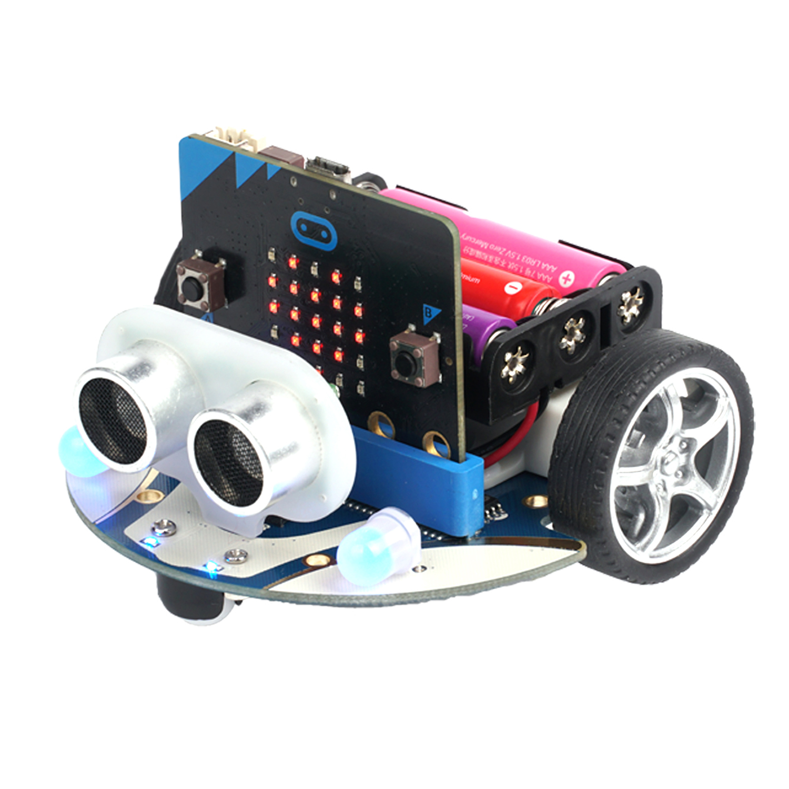
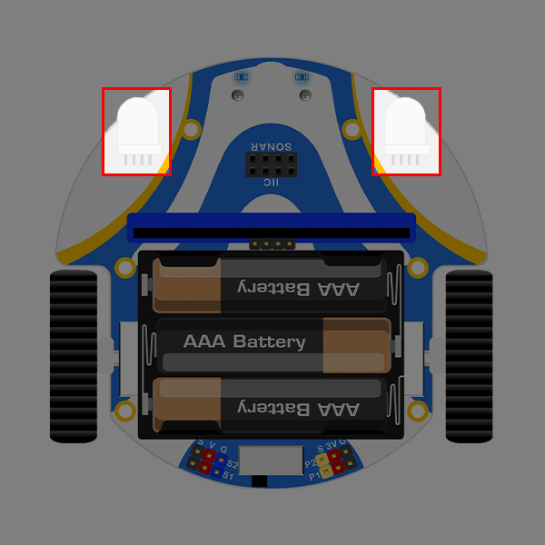
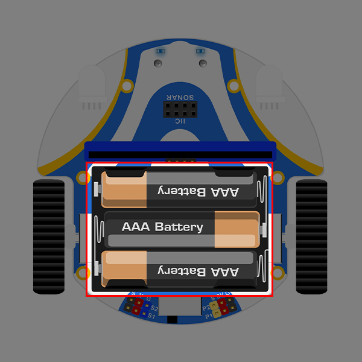
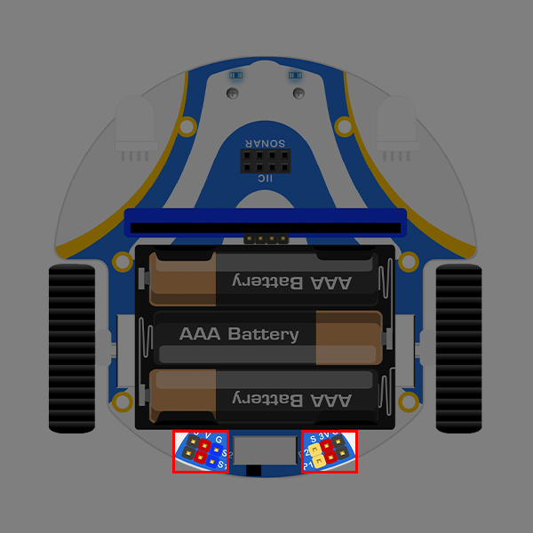
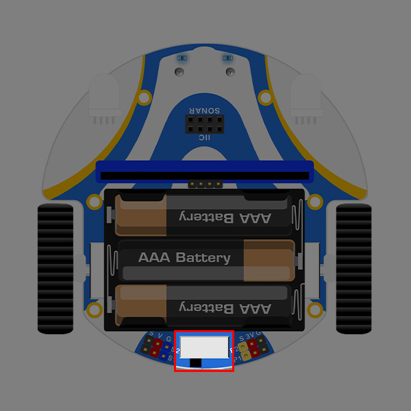
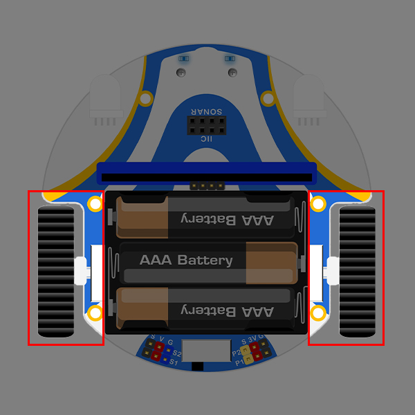
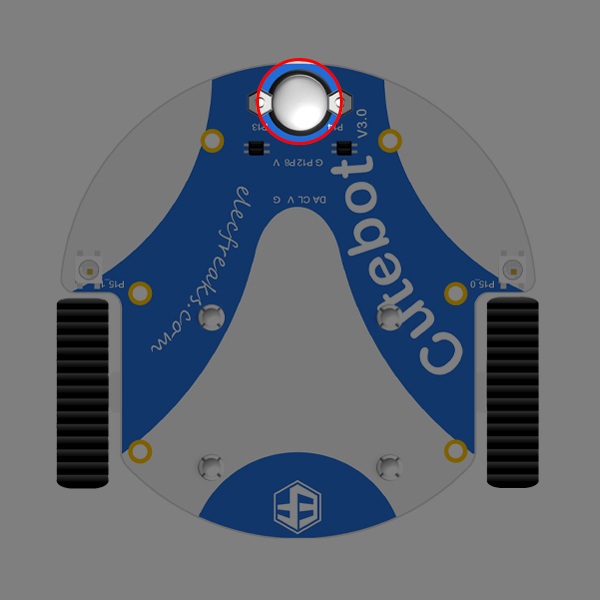
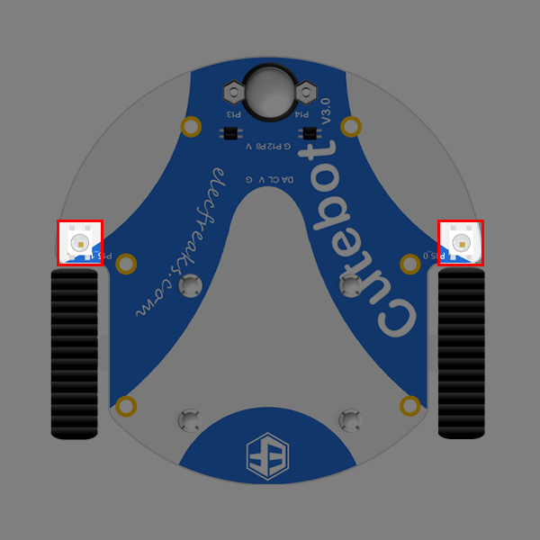

# Introduction to Cutebot

## Introduction
---

ELECFREAKS Cutebot is a rear-drive smart car driven by dual high speed motors. 

There are many on-board equipments on the Cutebot including ultrasonic sensor and distance sensor, two RGB LED headlights and clearance lamps on the bottom, two line-tracking probes, an active buzzer as the horn and so on! Let's drive your first smart car!

### Characteristics
---

- Rear-drive high speed motors featuring strong power.
- Tiny structure with an arc shape featuring crashproof and confortable feel. 
- Only batteries and ultrasonic sensor need to be assembled featuring easy installation.

## Pictures
---

## Parameters
---

|Items |Parameter|
|:-:|:-:|
|Working Voltage| 3.5V — 5V |
| Dimension |85.68mm X 85.34mm X 38.10mm|
|Infrared Control|Connect to P16|
|RGB Headlights|2 x RGB|
|Rainbow LED|2 x Neopixel connect to P15|
| Connection |IIC Port(P19,P20)、Servo Port(S1, S2)、Ultrasonic Port、P1、P2(GVS lead-out)|
| Motor Type |GA12-N20 DC micro gear deceleration motor(300 RPM)|
| Ultrasonic Sensor Type |HC-SR04(2cm-400cm Contactless distance detection, precision ±1.5mm)|

## Main Modules Introduction
---
Ultrasonic connection and micro:bit IIC port are placed in the front part of the Cutebot.

- - - - -

Two full color RGB lights controlled by the expansion board are placed on both side of the front part. 

- - - - -

An expansion board for 3x AA batteries is placed in the right above part of the Cutebot.

- - - - -

The IIC port and Servo Port(S1, S2), P1,P2 IO connections are equipped in the battery expansion board.

- - - - -

The infrared probes connecting to P16 port of the micro:bit are placed on the tail part of the Cutebot.

- - - - -

The master switch are placed besides the infrared probes and with on/off status showing by the LED.

- - - - -

The two wheels on both side are driven by DC micro gear deceleration motors(300 RPM).

- - - - -

The two line-tracking probes connecting to P13&P14 on the micro:bit are used to detect the black line and its edges.

- - - - -

A universal wheel is placed in the front bottom of the Cutebot, an all-direction drive can be realized by the different speed of the left and right wheels. 

- - - - -

The two full color  Rainbow LEDs programmed by  `Neopixel` connecting to P15 on the micro:bit are placed on both bottom side of the Cutebot and can be used as the clearance lamps or others.

## Components list
---

- 1 x Cutebot car
- 1 x Battery Holder
- 1 x HC-SR04 Ultrasonic Sensor
- 1 x Line-tracking Map
- 1 x Brochure

## Files
---

## FAQ
---
