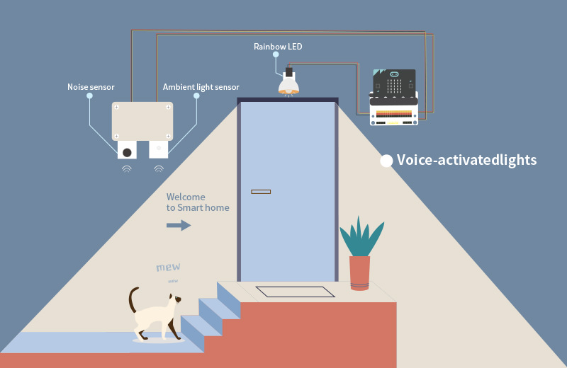
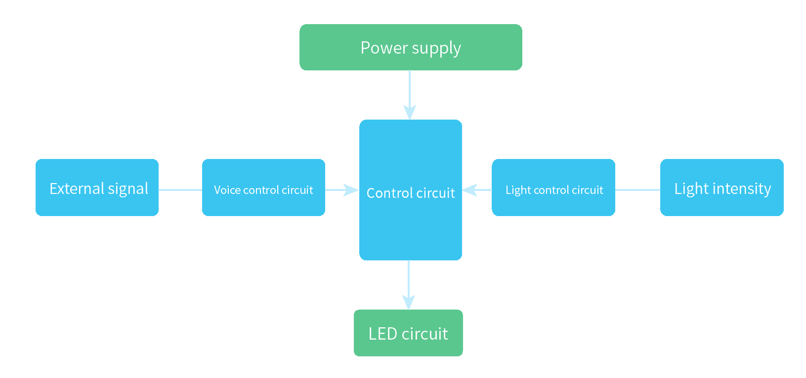
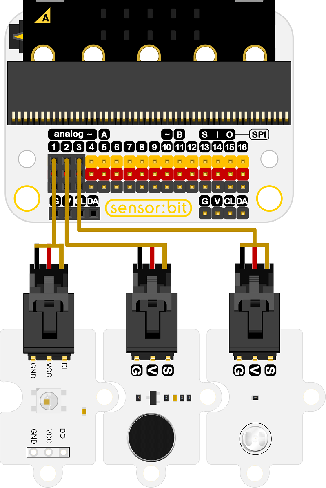
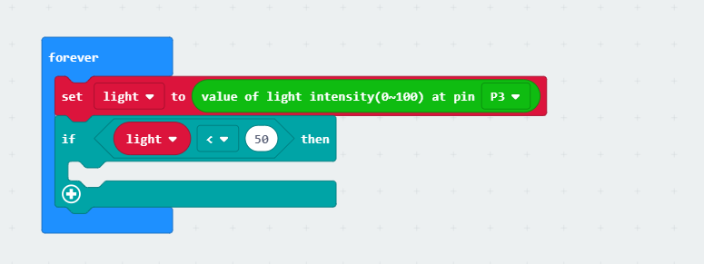
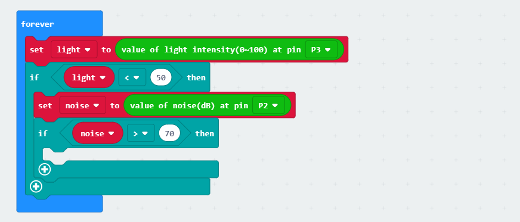

# case 01 Voice-activated Lights

## Goal
---

- Make a Rainbow LED controlled by sound and light.

## Materials
---

- 1 x Smart home Kit
- 1 x corrugated board

## Background
---
### What is voice-activated lights
- Voice-activated lights LED voice-activated lights are controlled by voice, light and time delaying with sound sensor and light sensor.
### Explanation
- The LED will not light up even it sensors sound during the day because of the light sensor lock. The light sensor lock will in standby mode while the light gets low in the evening,and the LED will up when it sensor voice.It will automatically off after a time delay. Life of voice-activated lights is six times more than common lights .It helps people avoid trouble about finding switch as well as save electricty. 

## Practical operation
---
Materials: corrugated board and cutter

Build as below picture：

Paste devices as below piture:

## Hardware connect
---

Connect one Rainbow LED to P1 of sensorbit.

Connect sound detect device to P2.

Connect light sensor to P3.

## Software
---
[makecode](https://makecode.microbit.org/#)

Edge Connector Data Sheet

We will use P3, but firstly we need disable the LED Array because it also use P3.

## Programming
---
### Step 1
Go to MakeCode page, click Advanced in the code block and click on Extensions.

We need to add a new codebase for programming of smart home. Finding “Add Package” in the bottom of code block and click it. Then a message box will show up, search “smart home"， and download this new codebase.

Note：If there is a hint says some codebase will be deleted because of incompatibility. Don't worry. You could go ahead as the hint or build a new item in item menu bar.

### Step 2

Drag forever block from Basic, drag show number block and it snaps into forever.

Drag led enable block from LED ,choose false for disabling the LED Array.

### Step 3

Snap "set light to value of light intensity (0~100) at pin P3" into forever block and change the number after light to 50.

If the value of light intensity more than 50, it is during the day.If the value of light intensity less than 50,it is during the night.

### Step 4

Snap "set noise to vlaue of noise (dB) at pin P2" while the value of light intensity less than 50.
Change the number after noise to 70.

Sensor voice by Judging value of noise greater than 70.

### Step 5

The Rainbow LED shows white light when it sensor value of noise greater than 70 and off after 10 seconds.

### Programming

Make code：[https://makecode.microbit.org/_14sKK4Kyigs3](https://makecode.microbit.org/_14sKK4Kyigs3)

You also could directly download program visit website as below:

<iframe style="position:absolute;top:0;left:0;width:100%;height:100%;" src="https://makecode.microbit.org/#pub:_14sKK4Kyigs3" frameborder="0" sandbox="allow-popups allow-forms allow-scripts allow-same-origin"></iframe>
  

***Note：*** The value of light intensity is base on actual environment.

## Result
---
The light will never up when illumination is adequatea. However,slight noise will cause it light  10 seconds during the night.

## Think
---
How to use micro:bit make rainbow Led rather solid color light? 

## Questions
---

## More information  
---

