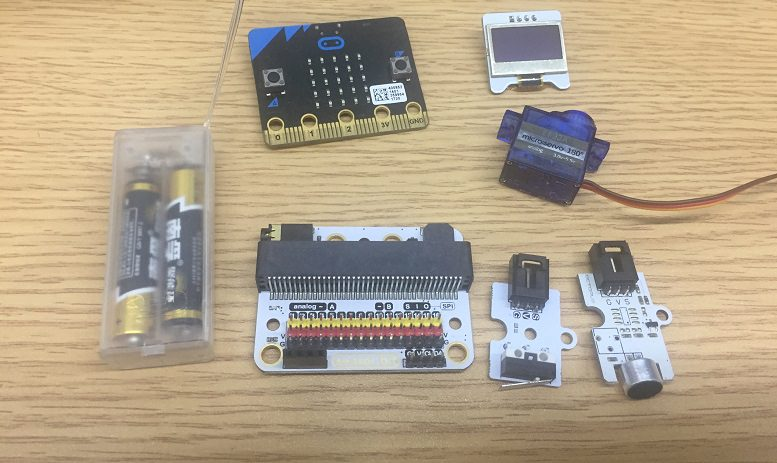
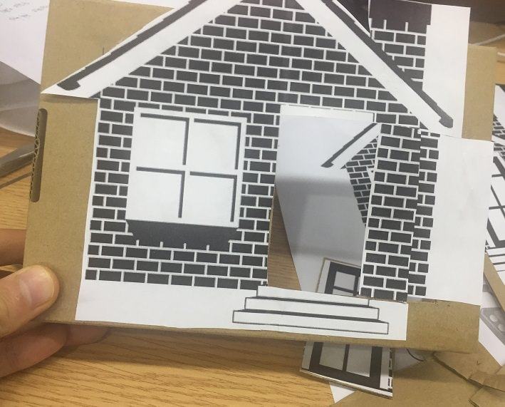
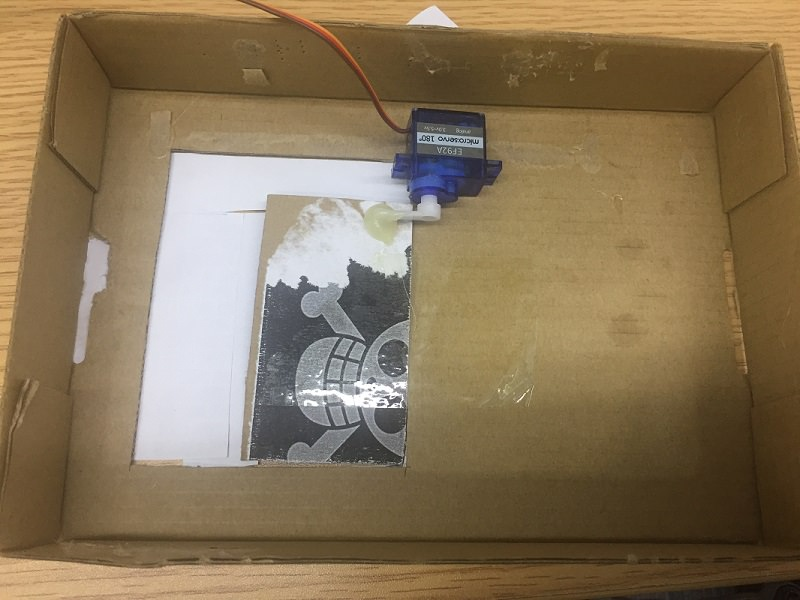
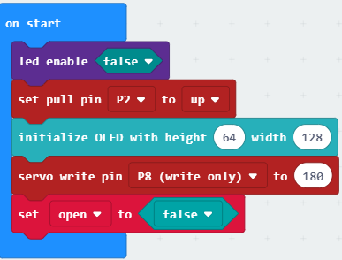
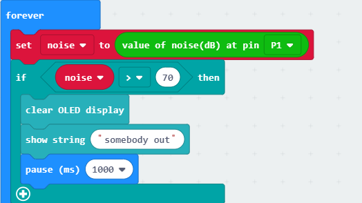
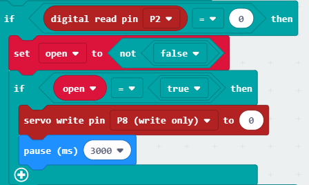
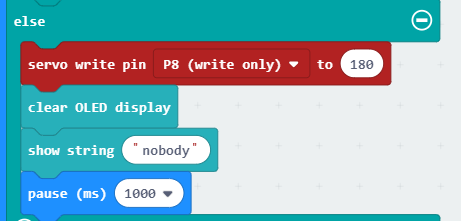

# case 06 smart telecontrol door opener

## Goal
---

- Make a smart telecontrol door opener.

## Materials
---

- 1 X Smart Home Kit
- 1 X scissors
- 1 X glue
- 1 X white paper,
- 1 X cardboard

## Background
---

- The analog noise sensor E-Blocks can sense the outside noise signal. It is also can be used to detect human voice.

### What is a "smart telecontrol door opener".

- Your friends are coming, but you are busy with your own business, or watching highlights of a television program or playing a very interesting computer game. You have no time to open the door. Here, you can make a smart telecontrol door opener.

### Principle of an analog noise sensor

- When the analog noise sensor is detecting the human signal, it will remind you by OLED screen and you can press the button and let the door open.

## Practical operation
---

- Prepare a scissors, a bottle of glue and a piece of cardboard.
- Stick the paper you prepared on the cardboard and clip it as you need.

- Set up as below：

The front side：

The back side：

Set and stick components as below:

## Hardware Connect
---
Connect the analog noise sensor to the P1 port of the expansion board.
Connect the crash sensor to the P2 port of the expansion board.
Conenct the 180 deg servo to the P8 port of the expansion board.
Connect the micro:bit to the batteries pack.

## Software
---
[makecode](https://makecode.microbit.org/#)
 

## Programming
---
### Step 1
- Click "Advanced" in the makecode code drawer for more codes.

- We need to add a new codebase for programming of smart home. Finding “Extensions” at the bottom of code block and click it. Then a message box will show up, search “smart home"， and download this new codebase.

***Note：*** If there is a hint says some codebase will be deleted because of incompatibility. Don't worry. You could go ahead as the hint or build a new item in the item menu bar.

### Step 2

Snap the on start block from the Basic, then snap the led enable block into the on start, set it to “false”. It is to close the LED display of the micro:bit.
Click on the "Advanced", choose the Pins and click the more. Snap the set pull pin block and set the P2 port to high level for providing an stable voltage.
Initialize the OLED.
Snap into the servo write block.Set P8 to 180, it is to set initial state of the servo to close the door.
At last, set the variable to open and set its initialization value to flase for not open the door.

### Step 3
Initialize the variable noise to save the received noise value.
Under the forever loop, transmit the noise value of the P1 port to the noise varaible.
If the noise value is greater than the 70db, it means someone is knocking the door and the OLED is showing “somebody out”.
Snap the clear OLED display block and the show string block to display message.

### Step 4
To judge the value of the crash sensor, using the digital read block to read the value of the crash sensor. That is the value of the P2 port.
Set the value of the pin P2 to 0, and set the open variable to doors open. That is "set open to not false".
Set the varaible open to "true" and snap the servo write pin block, then set the value of the P8 port to 0.
"pause(ms) 3000", which means the opening time is 3 seconds.

### Step 5

Else, set the servo write pin P8 to 180 and show string "nobody", which means it is not need to open the door.

### Program

Program link：[https://makecode.microbit.org/_htqEPX30qYKL](https://makecode.microbit.org/_htqEPX30qYKL)

You also could directly download program by visiting website as below:

<iframe style="position:absolute;top:0;left:0;width:100%;height:100%;" src="https://makecode.microbit.org/#pub:_htqEPX30qYKL" frameborder="0" sandbox="allow-popups allow-forms allow-scripts allow-same-origin"></iframe>
  

## Result
---

- When it is detecting the people signal, the OLED screen will show “somebody out”.
- Press the button, the door will open, after 3 seconds, the door will close.
- When it is not detecting the people signal, the OLED screen will show “Nobody”.

## Think
---

- How can we use the micro:bit to control the fan atumatically turn on and turn off.

## Questions
---

## More Information  
---

