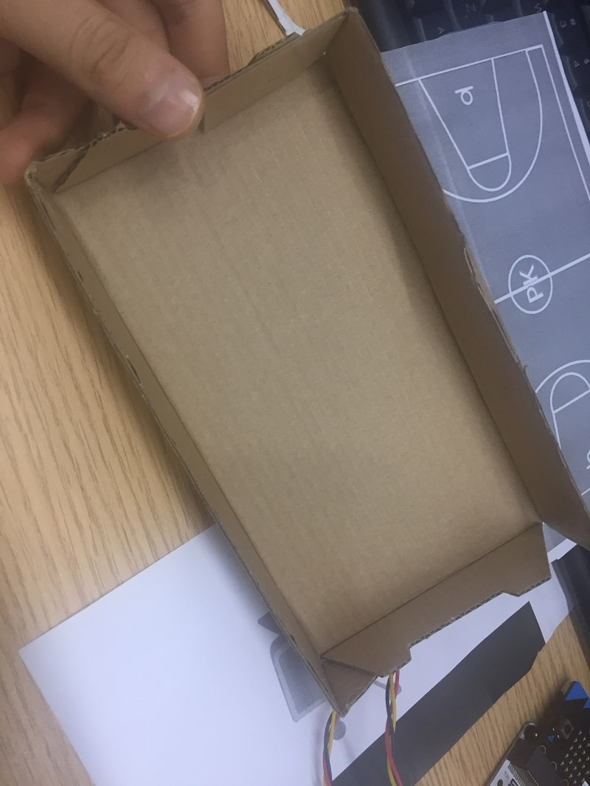

# case 07 smart decibel tester

## Goal
---

- Make a smart decibel tester.

## Materials
---

- 1 X Smart Home Kit
- 1 X scissors
- 1 X glue
- 1 X white paper
- 1 X cardboard

## Background
---

- The analog noise sensor E-Blocks can sense the outside noise signal. It is also used to sense the intensity of the DB.
- The rainbow LED E-Blocks can change many colors. In this case, we are going to show 9 colors.

### What is a "smart decibel tester". 

- The rainbow LED will change its light colors according to different voice db.

### Principle of a smart decibel tester

- When the analog noise sensor is receiving human voice, it will send the signal to the micro:bit. The micro:bit will judge the voice intensity and the LED will show different light colors. 

---

Colors | Paremeters 
:-: | :-: 
Red|30db
Orange|40db
Yellow|50db
Green|60db
Blue|70db
Indigo|80db
Purplish blue|90db
Purple|100db
White|110db
Blue|120db

## Practical Operation
---

- Prepare a scissors, a bottle of glue and a piece of cardboard.
- Stick the paper you prepared on the cardboard and clip it as you need.

- Set up as below：

The front side：

The back side：

Set and stick components as below:

## Hardware Connect
---
Connect the analog noise sensor to the P1 port of the expansion board.
Connect the Rainbow LED to the P2 port of the expansion board.

## Software
---
[makecode](https://makecode.microbit.org/#)
 

## Programming
---
### Step 1

- Click "Advanced" in the makecode code drawer for more codes.

- We need to add a new codebase for programming of smart home. Finding “Extensions” at the bottom of code block and click it. Then a message box will show up, search “smart home"， and download this new codebase.

***Note：*** If there is a hint says some codebase will be deleted because of incompatibility. Don't worry. You could go ahead as the hint or build a new item in the item menu bar.

### Step 2

Snap the on start block from the Basic, then snap the set to RainbowLED at pin with leds as from the RainbowLED. Initialize the rainbow LED to RGB of the P2 port.

### Step 3

Snap the show icon in the forever, it means the smart decibel tester in proper functioning.
Then snap an if statement to judge the value the analog noise sensor at P1 port.
When the value is greater than 30(in quiet situation), snap the strip show color block and set the color to red.
Duplicate the above code and change the value to 40,50,60..., set different color to each value.

### Program

Program link：[https://makecode.microbit.org/_EseVwohUtCKo](https://makecode.microbit.org/_EseVwohUtCKo)

You also could directly download program by visiting website as below:

<iframe style="position:absolute;top:0;left:0;width:100%;height:100%;" src="https://makecode.microbit.org/#pub:_EseVwohUtCKo" frameborder="0" sandbox="allow-popups allow-forms allow-scripts allow-same-origin"></iframe>
  

## Result
---

- Different decibel makes rainbow LED in different colors.

## Think
---

## Questions
---

## More Information 
---

