# How to Make A micro:bit Manipulator with Straws

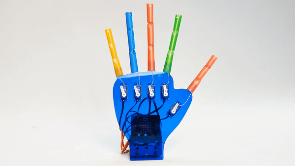

## Introduction
---
Hands are one of our most important and mostly used parts in daliy life, there are many artworks coming from the idea of simulating hands because of its skillful characteristic and good appearance, this blog also simulates the hands. 

The materials we used in this blog are [micro:bit](https://www.microbit.org) and [Wukong Breakout board](https://www.elecfreaks.com/learn-en/microbitExtensionModule/wukong.html), the fingers are able to stretch with 180 degrees servos. 

## Wukong Breakout board
---
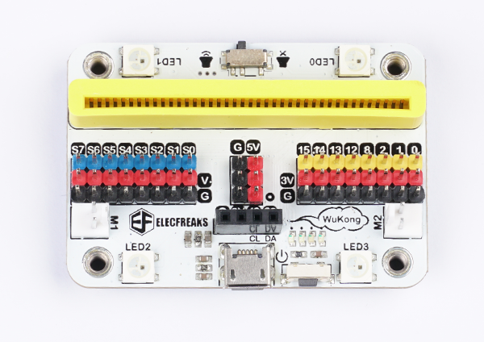

Wukong is a high integrated breakout board with multiple functions based on micro:bit, which has a similar size with the micro:bit with buzzer, servo and motor drivers on board.With a built-in 400mAh Li-ion battery pack and the on-board power controlling system, it supports fast charge with only 20 minutes for full filling that can operate for more than 40 minutes a time.The base board designs with standard 7x5 square bricks that can adapt perfectly to Lego.

For more info, please visit: [Wukong Breakout board](https://www.elecfreaks.com/learn-en/microbitExtensionModule/wukong.html)

## Materials Required
---

Materials List

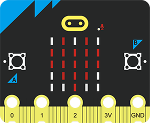

BBC micro:bit × 1

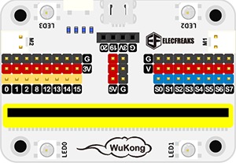

Wukong Breakout board × 1

180 degrees servos × 5

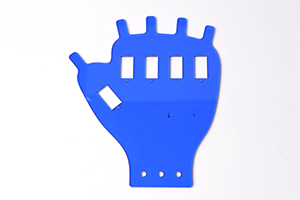

The acrylic board × 1

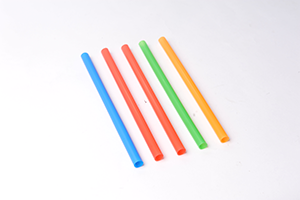

Straws × 5

##  Assembly 
---

### Step 1

Fix the servos(note the direction of the cable end should be put downward) with the acrylic board with the screws as the picture indicates:

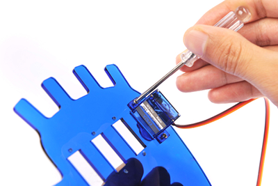

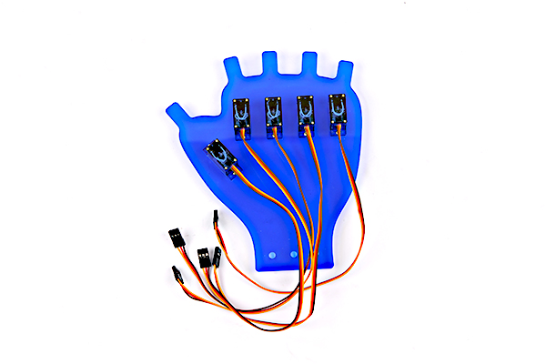

### Step 2

Fix Wukong breakout board with the acrylic board at the bottom with shafts as the picture indicates, connect the cables of the servos with the breakout board, note to connect in the correct way(Brown cable for black pin, red cable for red pin and the yellow cable for blue pin). You can also connect any five of the servos connections, only note to program them in the correct sequence(The corespondent sequece from S0 to S7 are counter to the fingers as the chart indicates below).

| Connections | Fingers       |
| :---------- | ------------- |
| S0          | Thumb         |
| S1          | Forefinger    |
| S3          | Middle finger |
| S5          | Ring finger   |
| S7          | Little finger |

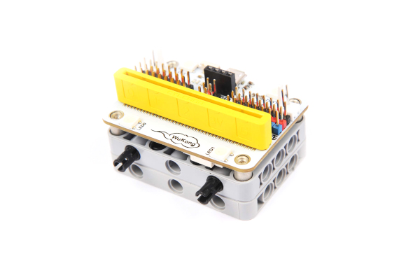

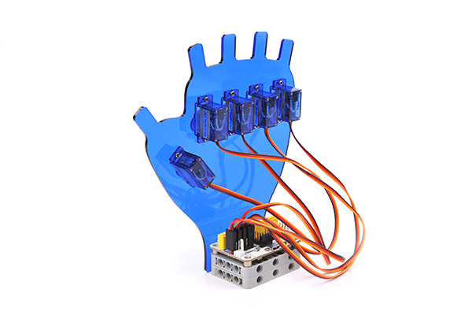

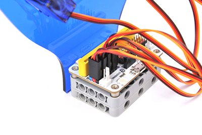

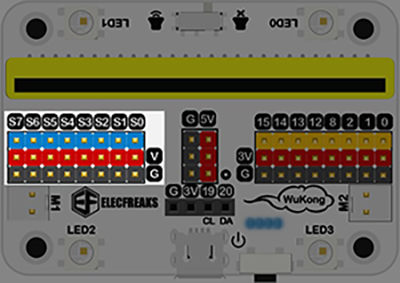

### Step 3

Connect the micro:bit with the breakout board

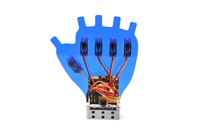

### Step 4

Install the white plates on the servos and adjust the directions of them as the same with the fingers. 

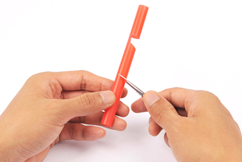

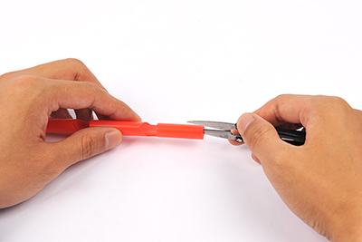

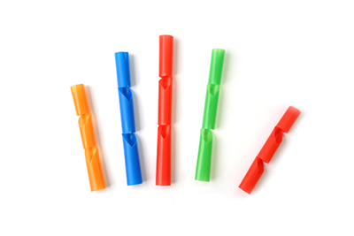

### Step 5

Fasten the thread with the top hole on the white plate and get it though the tube, then fasten ond of the ends of the straw with the equivalent "fingers" positions on the acrylic board. Fix the white plates with the servos and fasten the top end of the thread with the crack on the top part of the straws as the pictures describe below: 

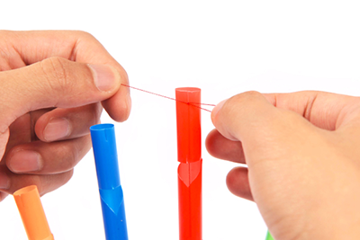

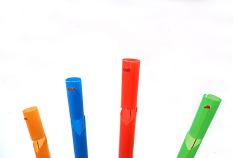

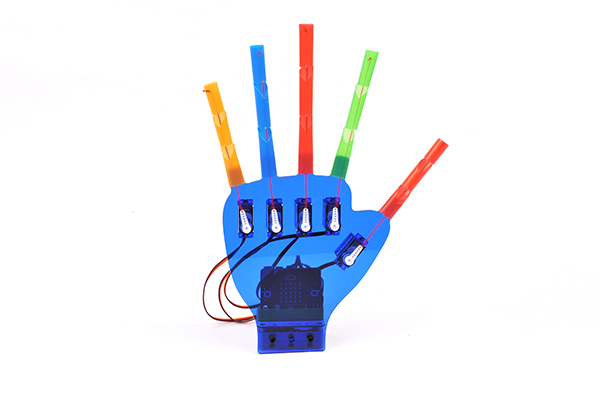

***Notice:*** the end connecting to the plates are all tied with the fist hole on the plates and the other ends are all fastened as a knot to be fixed in the cracks*.

### Step 6

Connect the micro:bit with the computer. 

## Program
---
Program in [Makecode](https://makecode.microbit.org) and for more details about Wukong, please see them below:

### Step 1

Create New Project and name it, click "Create" to enter the program page. 

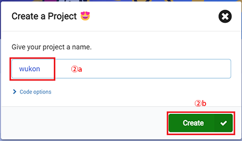

### Step 2

Click "Advanced" to see more choices, then click "Extensions" and seach with "wukong" to add it. 

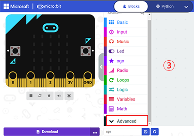

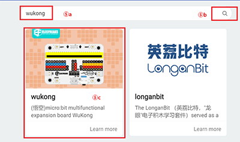

## Initialization 
---
The intialization status applied in this blog is: 0 degree means the the full stretching straight of the fingers and 180 degrees means the flexing of the fingers. Thus, before programming, please set the angle of the servos to 0 degree. Take off the white plates and download the program after completing the code in [MakeCode](https://makecode.microbit.org) .

Program

<iframe style="position:absolute;top:0;left:0;width:100%;height:100%;" src="https://makecode.microbit.org/#pub:_azoXDPMYE35F" frameborder="0" sandbox="allow-popups allow-forms allow-scripts allow-same-origin"></iframe>
 

Fix the white plates after adjusting the servos and excute the programs, and of course, it is possible if you'd like to create your own projects! 

## Sample
---

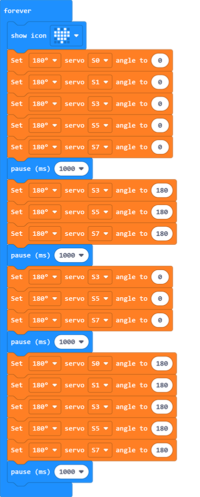

Link: [wukong](https://makecode.microbit.org/_H41XojcdMRo8)

You can also download it directly below:

<iframe style="position:absolute;top:0;left:0;width:100%;height:100%;" src="https://makecode.microbit.org/#pub:_H41XojcdMRo8" frameborder="0" sandbox="allow-popups allow-forms allow-scripts allow-same-origin"></iframe>
 

## FAQ
---

As we are using 180 degrees servos, thus the scopes value given to the programming blocks is among 0~180, after downloading the program, turn on the wukong breakout board, for more info about it please visit: [wukong breakout board](https://www.elecfreaks.com/learn-en/microbitExtensionModule/wukong.html)
