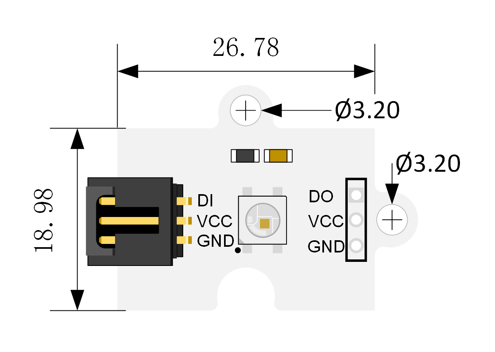

# Octopus Single RGB Rainbow LED(EF04091)

## Introduction
---
Octopus Single RGB Rainbow LED is one of the single rainbow LED electronic bricks in OCTOPUS series. The basic design is upon the OCTOPUS electronic bricks series with the identical design on the outlook, PCB fixed orifices and the connectors of the electronic bricks. The on-board LED is a smart LED and an integration of control circuit and light-emitting circuit, it can be operated under a low voltage with a high luminance and large angle scattering.

## Introduction
---

- With data transmitting in single line and with unlimited concatenation.
- With circuit adjusted by gray level(256 level gray can be adjusted )
- With built-in power on reset and power down reset circuit, the LED doesn't turn on when power off.
- The red led is set through special processing to make the color more balanced.
- The data transmission frequency can reach to 800Kbps. When the refresh rate is 30 frames/second, the number of cascades is over 1024 points.

## Parameter
---

Item | Parameter 
:-: | :-: 
Name|Octopus Single RGB Rainbow LED
Version|V1.2
SKU|EF04091
Working Voltage|DC 3.3~5.5V
Working Temperature|-40~+85摄氏度
Size|27x19mm
NW|2.4g

### Outlook and Dimensions

## Quick Start
---
### Hardware Connection

Connection note: Connect this to the P1 port in OCTOPUS:BIT, and insert the micro:bit into it.

### Software Programming
Click "Advanced"in the choice of the MakeCode to find more choices.

We need to add a package for programming. Click "Add Package" on the bottom of the page, and search "neopixel" in the dialogue box, the package is pointed by the red arrow below.

Programme to use accelerometer to control the color of LED. 
Links: [[https://makecode.microbit.org/_Fu0g597xD85g](https://makecode.microbit.org/_Fu0g597xD85g)](https://makecode.microbit.org/40248-92205-21488-21926)

You can also download the links below:

<iframe style="position:absolute;top:0;left:0;width:100%;height:100%;" src="https://makecode.microbit.org/#pub:40248-92205-21488-21926" frameborder="0" sandbox="allow-popups allow-forms allow-scripts allow-same-origin"></iframe>

### Result

The led begins with white light and then the color begins to change gradually with the shaking of the micro:bit.

## FAQ
---
