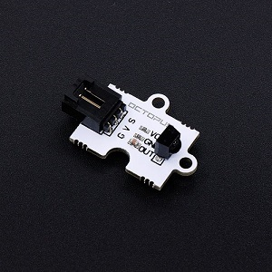
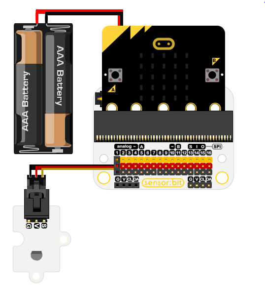
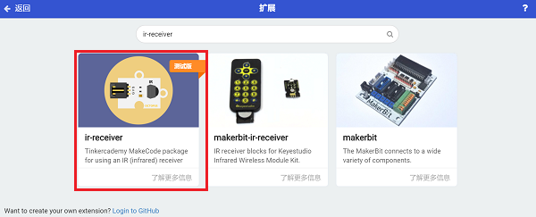
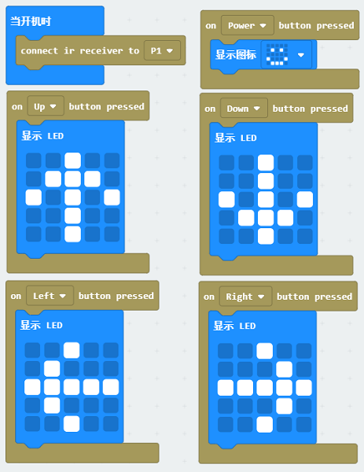

# OCTOPUS Infrared Receiver Sensor

## Introduction
This is a simple infrared receiver sensor,and mainly receives infrared signal through HS0038 infrared diode. HS0038 is particularly sensitive to the infrared signal, and it can receive the infrared signal very swiftly. 

## Characteristics 
---
- Standard 3-pin GVS port is easy to plug. 
## Specification
---

Item | Parameter 
:-: | :-: 
SKU|EF04009
Pins Definition|S-Sigal V-VCC G-GND
Working Voltage|3V
Size|38.9 x 23.5 mm

Size:

## Outlook and Dimension
---

## Quick to Start 
---

### Materials required and connections diagram 
---

- Connect to P1 port as the picture shows.

***Take sensor：bit for examples***

## Programming
---

### Step 1
Click "Advanced" in the drawer of the MakeCode to see more choices.

We need to add a package for programming, click "Extensions" on the bottom of the drawer and search with "ir-receiver“ in the dialogue box to download it. 

Note: If you met a tip indicating codebase will be deleted due to incompatibility, you may continue as the tips tell or build a new project. 
### Step 2
### Programming as the picture shows

### Reference
Link：[https://makecode.microbit.org/_FUzeJvaord75](https://makecode.microbit.org/_FUzeJvaord75)

You can also download it directly:

<iframe style="position:absolute;top:0;left:0;width:100%;height:100%;" src="https://makecode.microbit.org/#pub:_FUzeJvaord75" frameborder="0" sandbox="allow-popups allow-forms allow-scripts allow-same-origin"></iframe>
  
---

### Result
- If pushing the switch button on the controller,  the micro:bit shows a "smile" face; if pushing the four direction keys, the micro:bit shows it accordingly.  
## Relevant Cases
---

## Technical Files
---
