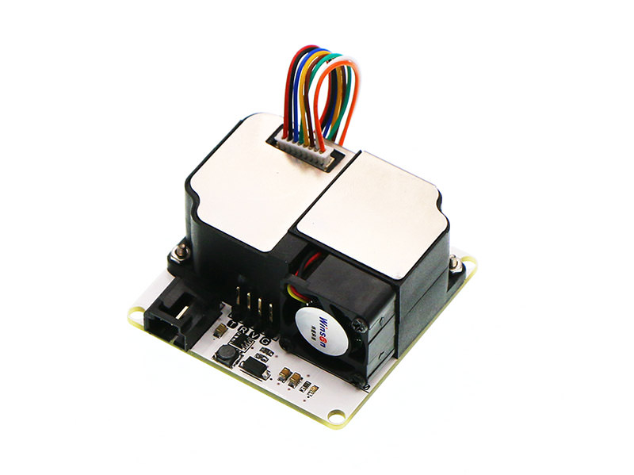
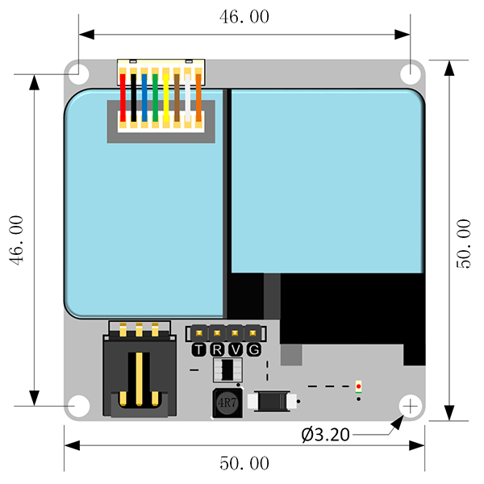
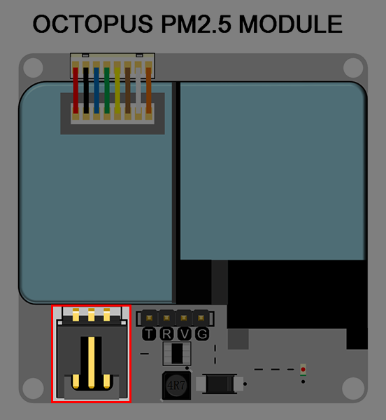
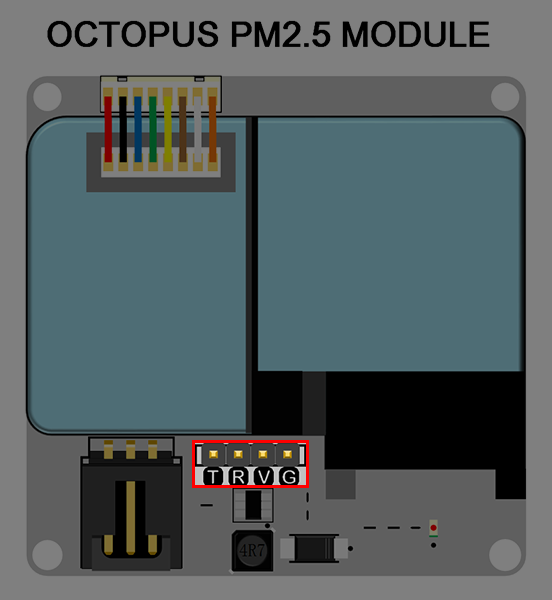
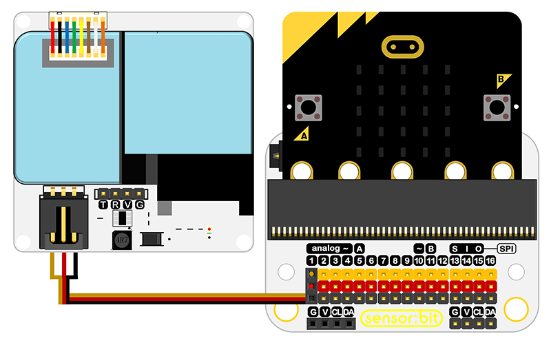
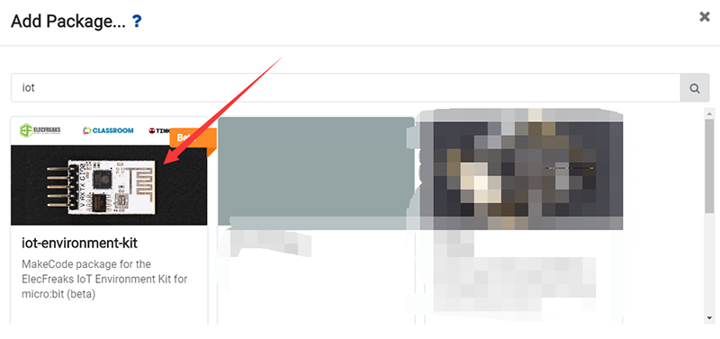

# Octopus PM2.5 module(EF04090)

## Introduction
---
PM2.5 Electronic brick is one of the modules in OCTOPUS series to test the PM2.5 concentration . Based on ZH03 laser dust sensors, it can test the dust particle in the air with high consistency and stability. The PWM output and serial port design also make it easily to operate.

## Characteristic
---
-  It is compatible to both 3V/5V devices.
- It is compatible to micro:bit or Arduino products.
- It is equipped with standard 3 wires GVS interface.
- It is of high consistency and accuracy with a real time response, the 0.3 μm diameter particle can be recognized.
- With PWM output and serial port supported.

## Parameter
---

|         Item          |       Parameter        |
| :-------------------: | :--------------------: |
|         Name          | PM2.5 Electronic brick |
|          SKU          |        EF04090         |
|        Version        |          V1.2          |
|   Operating Voltage   |         DC3~5V         |
|    Working Current    |         <120mA         |
|     Sleep Current     |         <10mA          |
| Operating Temperature |        -10~50℃         |
|     Detective Gas     |         PM2.5          |
|       Dimension       |   50.00mm X 50.00mm    |
|      Net Weight       |         46.30g         |

## Outlook and Dimension for Installment
---

## Diagram for Pins Connector
---

## Introduction to Main Function Modules
---
### ZH03B Sensor

ZH03B sensor is used to test the PM2.5 concentration in the air.

### 3PIN Standard GVS Electronic Brick Interfaces

With standard 3PIN electronic brick interfaces, "S" is the output pin for 3.3V PWM signal.

### 4PIN Serial Output Interfaces

The output interfaces are used for 3.3V serial signal.

## Quick Start
---
### Hardware Connection
 Connect PM2.5 electronic brick module to P1 port on micro:bit with a micro:bit expansion board.

### Software Programming
####  Step 1  Start with Makecode

 Open the on-line  programming page for makecode.

####  Step 2  Add Package
 Search the key word with "iot", and add the software package called "iot-environment-kit".

#### Step 3  Programming

####  Step 4  Download
The complete program is below: [https://makecode.microbit.org/_4TvKWEihahzh](https://makecode.microbit.org/_4TvKWEihahzh)

  You can also download it directly from below:

<iframe style="position:absolute;top:0;left:0;width:100%;height:100%;" src="https://makecode.microbit.org/#pub:_4TvKWEihahzh" frameborder="0" sandbox="allow-popups allow-forms allow-scripts allow-same-origin"></iframe>

#### Result
 The value of PM2.5 is scrolling displaying on the 5x5 screen with μg/m3 as a unit.

## FAQ
---
