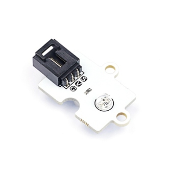
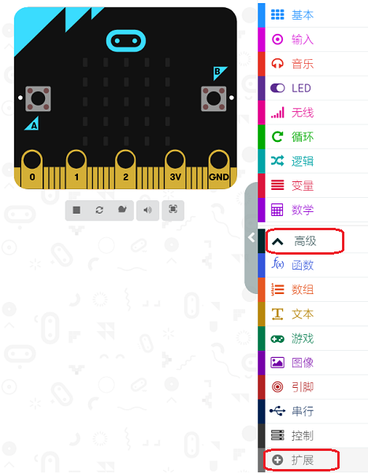

# Octopus Light Sensor

## Introduction
---
- Octopus Light Sensor Brick can detect the light value of the current environment. It is in a small volume with a low power consumption and it is very easy to operate with good performance.

## Characteristics
---

## Specification
---

Item | Parameter 
:-: | :-: 
SKU|EF04092
Power Supply|3V-5.5V
Connection Type|Analog
Pins Definition|1-Signal 2-VCC 3-GND
Response|Quick response
Circuit|Simple drive circuit
Stability|Stable and durable

## Outlook and Dimension
---

 

## Quick to Start
---

### Materials required and connections diagram 
- Connect to P1 port as the picture shows. 

### Program as the picture shows 
---
Click "Advanced" in the drawer of the MakeCode to see more choices.

We need to add a package for programming, click "Extensions" on the bottom of the drawer and search with "smarthomer“ in the dialogue box to download it. 

Note: If you met a tip indicating codebase will be deleted due to incompatibility, you may continue as the tips tell or build a new project. 

### Reference

Link：[https://makecode.microbit.org/_iMH0jK6quc2j](https://makecode.microbit.org/_iMH0jK6quc2j)

You can also download it directly:

<iframe style="position:absolute;top:0;left:0;width:100%;height:100%;" src="https://makecode.microbit.org/#pub:_iMH0jK6q" frameborder="0" sandbox="allow-popups allow-forms allow-scripts allow-same-origin"></iframe>
  
---

### Result
- If the light intensity is below 50, it shows the specified icons or it shows a "smile" face.
## Relevant Cases

---

## Technical Files

---
