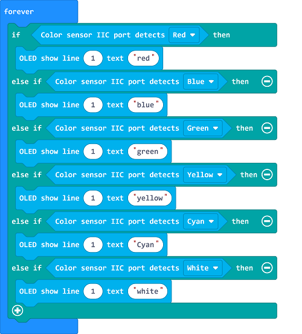

# Color Sensor(EF05006)

## Introduction
---
Color sensor aims to read the HUE values of the detected objects.  


## Characteristic
---
- Designed in RJ11 connections, easy to plug.

## Specification
---

Item | Parameter 
:-: | :-: 
SKU|EF05006
Connection|RJ11
Type of Connection|IIC
Working Voltage|3.3V
Size|55.8 x 23.8 mm

## Outlook
---


## Quick to Start
---

### Materials Required and Diagram

- Connect the Color sensor to IIC port and the OLED module to another IIC port in the Nezha expansion board as the picture shows. 


## MakeCode Programming
---

### Step 1

Click "Advanced" in the MakeCode drawer to see more choices. 


We need to add a package for programming, . Click "Extensions" in the bottom of the drawer and search with "PlanetX" in the dialogue box to download it. 


***Note:*** If you met a tip indicating that the codebase will be deleted due to incompatibility, you may continue as the tips say or build a new project in the menu. 

### Step 2

### Code as below:




### Link
Link: [https://makecode.microbit.org/_1559o4XKEftb](https://makecode.microbit.org/_1559o4XKEftb)

You may also download it directly below: 

<div style="position:relative;height:0;padding-bottom:70%;overflow:hidden;"><iframe style="position:absolute;top:0;left:0;width:100%;height:100%;" src="https://makecode.microbit.org/#pub:_1559o4XKEftb" frameborder="0" sandbox="allow-popups allow-forms allow-scripts allow-same-origin"></iframe></div>  


### Result
- The color of the detected object displays on the OLED module.

## Python Programming 
---


### Step 1
Download the package and unzip it: [PlanetX_MicroPython](https://github.com/lionyhw/PlanetX_MicroPython/archive/master.zip)

Go to   [Python editor](https://python.microbit.org/v/2.0)


We need to add color.py for programming. Click "Load/Save" and then click "Show Files (1)" to see more choices, click "Add file" to add color.py from the unzipped package of PlanetX_MicroPython. 


### Step 2
### Reference
```
from microbit import *
from color import *
color = COLOR()
while True:
    display.scroll(color.get_hue())
```


### Result
- The HUE value displays on the micro:bit.

## Relevant File
---

## Technique File
---
