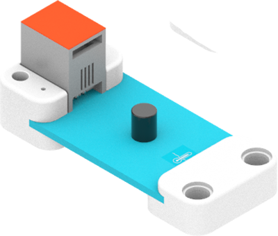
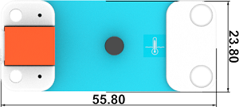
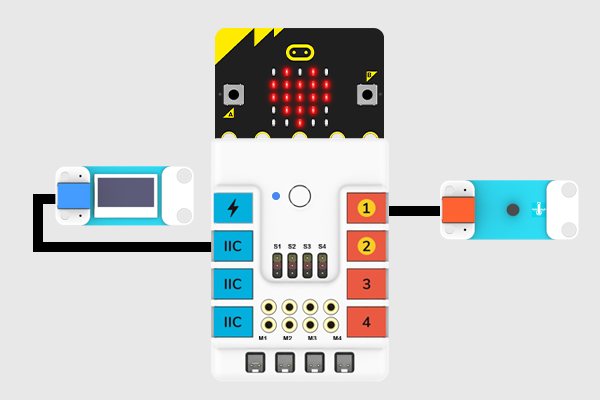
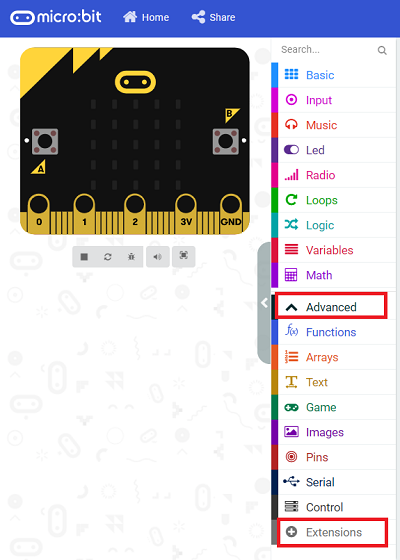

# 18B20 Temperature Sensor(EF05041) 

## Introduction
---
It is a digital tempeterature sensor based on 1Maxim IC DS18B20 1-Wire.

## Characteristic
---

- Designed in RJ11 connections, easy to plug.

## Specification
---

Item | Parameter 
:-: | :-: 
SKU|EF05041
Connection|RJ11
Type of Connection|Digital output
Working Voltage|3.3V

## Outlook
---

## Quick to Start

---

### Materials Required and Diagram

- Connect the 18B20 Temperature sensor to J1 port and the OLED to the IIC port in the Nezha expansion board as the picture shows.

## MakeCode Programming
---

### Step 1

Click "Advanced" in the MakeCode drawer to see more choices.

We need to add a package for programming, . Click "Extensions" in the bottom of the drawer and search with "PlanetX" in the dialogue box to download it. 

***Note:*** If you met a tip indicating that the codebase will be deleted due to incompatibility, you may continue as the tips say or build a new project in the menu. 

### Step 2

### Code as below:

### Link
Link: [https://makecode.microbit.org/_WdtFC03dq59y](https://makecode.microbit.org/_WdtFC03dq59y)

You may also download it directly below:

<iframe style="position:absolute;top:0;left:0;width:100%;height:100%;" src="https://makecode.microbit.org/#pub:_WdtFC03dq59y" frameborder="0" sandbox="allow-popups allow-forms allow-scripts allow-same-origin"></iframe>
  

### Result
- The value detected by 18B20 temperature sensor displays on the OLED screen.

## Relevant File
---

## Technique File
---
