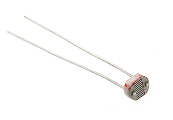
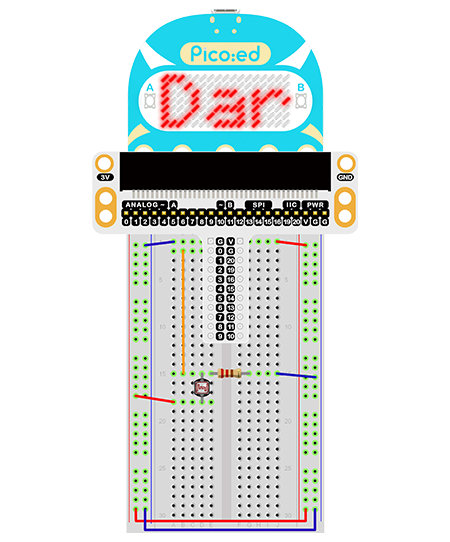

# Case 04: Photodiode


## Introduction

A photodiode is a resistor made of a semiconductor material whose conductivity varies with the intensity of light. This property is used to make photodiodes of different shapes and light-receiving areas. The stronger the light is, the lower the resistance will be. Light-controlled switches usually use a photodiode as the core component. Photodiodes are used in a wide range of industries such as toys, lamps and cameras. In this lesson we are going to display different information on Pico:ed according to the intensity of light received by the photodiode.

## Components List

### Hardware

1 × Pico:ed

1 × USB Cable

1 × Breadboard Adapter 

1 ×  83×55mm Breadboard

1x Photodiode

1 × 10kΩ Resistors

N* Dupont Cables

## Main Components

### Photodiode

Photodiodes are special resistors made of semiconductor materials such as CdS or CdSe, whose working principle is based on the internal photoelectric effect. The stronger the light is, the lower the resistance value will be. As the light intensity rises, the resistance value decreases rapidly and the bright resistance value can be as small as 1KΩ or less. Photodiodes are very sensitive to light, and when they are not illuminated, they are highly resistive, with a dark resistance of up to 1.5MΩ in general.



## Steps

### Hardware Connection

Connect the components as the pictures suggest: 

1. Connect the photodiode with P0. 
2. Connect a 10Ω resistor in series with a photodiode



This is the picture after finishing the connections: 

## Programming

Program Preparation: [Prpgramming environment](https://www.yuque.com/elecfreaks-learn/picoed/er7nuh)

### Sample Code:

```python
# Import the modules that we need: 
import board
import picoed
import analogio
import time

# Set the pin connected to the photodiode and read the analog voltage as the reference value of the brightness.
light = analogio.AnalogIn(board.P0_A0)
light_value = light.value

# Determine whether the analog voltage value of the real-time photodiode is less than the reference value, and display "Bright" or "Dark" according to the judgment result.
while True:
    light_new = light.value
    if light_new < light_value:
        picoed.display.scroll("Dark")
    else:
        picoed.display.scroll("Bright")
```
### Details of the Code: 

1. Import the modules that we need. `board` is the common container, and you can connect the pins you'd like to use through it. `picoed` module is able to set the LED effect on Pico:ed. The `digitalio`module contains classes to provide access to basic digital IO. `time` is the module contains the fuction of time setting. 
```python
import board
import picoed
import analogio
import time
```

2. Set the pin connected to the photodiode and read the analog voltage as the reference value of the brightness.
```python
light = analogio.AnalogIn(board.P0_A0)
light_value = light.value
```

3. Determine whether the analog voltage value of the real-time photodiode is less than the reference value, and display "Bright" or "Dark" according to the judgment result.
```python
while True:
    light_new = light.value
    if light_new < light_value:
        picoed.display.scroll("Dark")
    else:
        picoed.display.scroll("Bright")
```
## Result
When the lights are on, the LED screen on Pico:ed shows "Bright", and when the lights are off, "Dark" is displayed on the screen.

## Exploration
If we want to use a photodiode to control the on and off of an LED, how do we design the circuit and program it
## FAQ

## For more information, please visit: 

[ELECFREAKS WIKI](https://www.elecfreaks.com/learn-en/)
