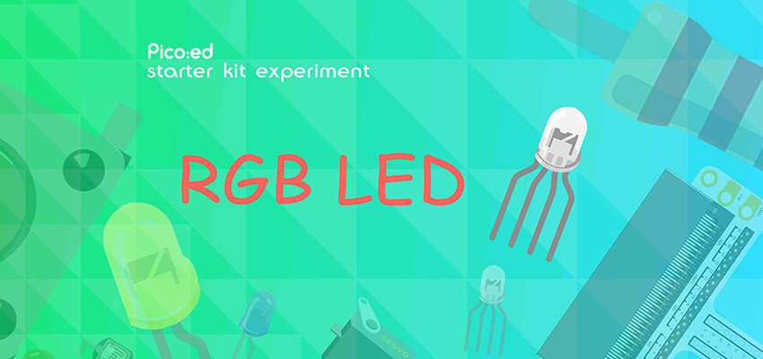
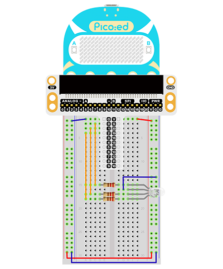

# Case 05: RGB LED



## Introduction
---
The RGB LED is a type of LED light, It is capable of emitting light in three different colours - red, green and blue. We are going to program the RGB LED to change among red, green and blue gradually in this lesson. 

## Components List
---
### Hardware

1 × Pico:ed

1 × USB Cable

1 × Breadboard Adapter 

1 × 83×55mm Breadboard

1× RGB LED

3 × 100Ω Resistors

N* Dupont Cables

## Main Components
---
### RGB LED

As we all know, the three primary colours of light are red, green and blue, and by combining these three colours in different combinations, all the colours can be synthesised. Similarly, RGB LEDs can be used in different combinations of brightness to create a myriad of colours.


There are two types of tri-colour LEDs, common cathode and common anode: common cathode RGB LEDs are connected to GND; common anode RGB LEDs are connected to VCC; In this lesson, we use common cathode tri-colour LEDs.

## Steps
---
### Hardware Connection

1. Connect the RGB signal pins of the leds to the P0, P1 and P2 ports of the breakout board correspondingly, and connect a 100Ω resistor.

2. Connect GND to the breakout board GND through the breadboard.



This is the picture after finishing the connections: 

## Programming
---
Program Preparation: [Prpgramming environment](https://www.yuque.com/elecfreaks-learn/picoed/er7nuh)

### Sample Code:

```python
# Import the modules that we need: 
import board
import digitalio
import time
from picoed import button_a, button_b

# Set the connected pins and directions of the LEDs. 
led_0 = digitalio.DigitalInOut(board.P0)
led_1 = digitalio.DigitalInOut(board.P1)
led_2 = digitalio.DigitalInOut(board.P2)
led_0.direction = digitalio.Direction.OUTPUT
led_1.direction = digitalio.Direction.OUTPUT
led_2.direction = digitalio.Direction.OUTPUT

# Judge if the button A/B is pressed with the equivalent operations.
while True:
    if button_a.is_pressed() and button_b.is_pressed():
        led_0.value = False
        led_1.value = False
        led_2.value = True
    elif button_a.is_pressed():
        led_0.value = True
        led_1.value = False
        led_2.value = False
    elif button_b.is_pressed():
        led_0.value = False
        led_1.value = True
        led_2.value = False
    else:
        led_0.value = True
        led_1.value = True
        led_2.value = True
    time.sleep(0.1)
```
### Details of the Code: 

1. Import the modules that we need. `board` is the common container, and you can connect the pins you'd like to use through it. The `digitalio`module contains classes to provide access to basic digital IO. `time` is the module contains the fuction of time setting. 
```python
import board
import digitalio
import time
from picoed import button_a, button_b
```

2. Set the pins and directions of the breadboard adapter connecting to the LEDs
```python
led_0 = digitalio.DigitalInOut(board.P0)
led_1 = digitalio.DigitalInOut(board.P1)
led_2 = digitalio.DigitalInOut(board.P2)
led_0.direction = digitalio.Direction.OUTPUT
led_1.direction = digitalio.Direction.OUTPUT
led_2.direction = digitalio.Direction.OUTPUT
```
If the pins you are using are not P0_A0 and P1_A1, the other pin numbers can be viewed by entering the following code in the shell window below the Thonny editor. 
```python
>>> import board
>>> help(board)
object <module 'board'> is of type module
  __name__ -- board
  board_id -- elecfreaks_picoed
  BUZZER_GP0 -- board.BUZZER_GP0
  I2C0_SDA -- board.BUZZER_GP0
  I2C0_SCL -- board.I2C0_SCL
  BUZZER -- board.BUZZER
  BUZZER_GP3 -- board.BUZZER
  P4 -- board.P4
  P5 -- board.P5
  P6 -- board.P6
  P7 -- board.P7
  P8 -- board.P8
  P9 -- board.P9
  P10 -- board.P10
  P11 -- board.P11
  P12 -- board.P12
  P13 -- board.P13
  P14 -- board.P14
  P15 -- board.P15
  P16 -- board.P16
  SDA -- board.SDA
  P20 -- board.SDA
  SCL -- board.SCL
  P19 -- board.SCL
  BUTTON_A -- board.BUTTON_A
  BUTTON_B -- board.BUTTON_B
  SMPS_MODE -- board.SMPS_MODE
  VBUS_SENSE -- board.VBUS_SENSE
  LED -- board.LED
  P0_A0 -- board.P0_A0
  P0 -- board.P0_A0
  A0 -- board.P0_A0
  P1_A1 -- board.P1_A1
  P1 -- board.P1_A1
  A1 -- board.P1_A1
  P2_A2 -- board.P2_A2
  P2 -- board.P2_A2
  A2 -- board.P2_A2
  P3_A3 -- board.P3_A3
  P3 -- board.P3_A3
  A3 -- board.P3_A3
```

3. Judge if the button A/B is pressed with the equivalent operations. While button A being pressed, set the value of led_0 as true, the led_1 and led_2 as false. In the same way, program when button B being pressed and when button A+B being pressed
```python
while True:
    if button_a.is_pressed() and button_b.is_pressed():
        led_0.value = False
        led_1.value = False
        led_2.value = True
    elif button_a.is_pressed():
        led_0.value = True
        led_1.value = False
        led_2.value = False
    elif button_b.is_pressed():
        led_0.value = False
        led_1.value = True
        led_2.value = False
    else:
        led_0.value = True
        led_1.value = True
        led_2.value = True
    time.sleep(0.1)
```
## Result
---
Press button A, the LED turns red; B for green; A+B for blue.

## Exploration
---
If we want it to light in cyan, magenta, and yellow, how to design and program?

## FAQ
---
## For more information, please visit: 
---
[ELECFREAKS WIKI](https://www.elecfreaks.com/learn-en/)
