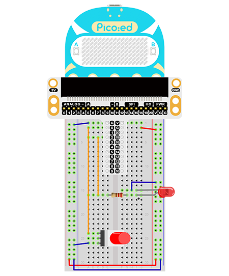

# Case 06: Self-lock Switch


## Introduction

A self-locking switch is a common type of push button switch. When we press the switch button for the first time, the switch circuit is connected and remains in this state, i.e. self-locking. When the switch button is pressed again, the switch is disconnected and the switch button pops out at the same time. In this lesson, we will use a self-lock switch to control the lighting and turning off of an LED.

## Components List

### Hardware

1 × Pico:ed

1 × USB Cable

1 × Breadboard Adapter 

1 × 83×55mm Breadboard

1x Self-lock Switch

1× LED

3 × 100Ω Resistors

N* Dupont Cables

## Main Components

### Self-lock Switch

A self-lock switch generally means that the switch comes with a mechanical locking function, so that when you press it, the button will not fully jump up after you release it, it is in a locked state and needs to be pressed again before it is unlocked to fully jump up. It is then called a self-lock switch. This is the type of switch used in the early days of direct powering televisions and monitors.


Note: This self-lock switch contains two sets of knife double-throw switches, only one of which was used in this test, the common pin of one of the sets was cut off.

## Steps

### Hardware Connection

Connect the components as the pictures suggest: 

1. Connect the self-lock switch to the P0 port of the breakout board
2. Connect the led to the P2 port of the breakout board via a 100Ω resistor



This is the picture after finishing the connections: 

## Programming

Program Preparation: [Prpgramming environment](https://www.yuque.com/elecfreaks-learn/picoed/er7nuh)

### Sample Code:

```python
# Import the modules that we need: 
import board
import digitalio

# Set the connected pins and directions of the LED. 
led = digitalio.DigitalInOut(board.P2_A2)
led.direction = digitalio.Direction.OUTPUT

# Set the connected pins and directions of the self lock switch. 
locking = digitalio.DigitalInOut(board.P0_A0)
locking.direction = digitalio.Direction.INPUT

# Control the LED with the self lock switch. 
while True:
    led.value = locking.value
```
### Details of the Code:

1. Import the modules that we need. `board` is the common container, and you can connect the pins you'd like to use through it. The `digitalio`module contains classes to provide access to basic digital IO. 
```python
import board
import digitalio
```

2. Set the pins and directions of the breadboard adapter connecting to the LEDs
```python
led = digitalio.DigitalInOut(board.P2_A2)
led.direction = digitalio.Direction.OUTPUT
```

3. Set the pins of the adapter for connecting self-lock switch
```python
locking = digitalio.DigitalInOut(board.P0_A0)
locking.direction = digitalio.Direction.INPUT
```
If the pins you are using are not P0_A0 and P1_A1, the other pin numbers can be viewed by entering the following code in the shell window below the Thonny editor.
```python
>>> import board
>>> help(board)
object <module 'board'> is of type module
  __name__ -- board
  board_id -- elecfreaks_picoed
  BUZZER_GP0 -- board.BUZZER_GP0
  I2C0_SDA -- board.BUZZER_GP0
  I2C0_SCL -- board.I2C0_SCL
  BUZZER -- board.BUZZER
  BUZZER_GP3 -- board.BUZZER
  P4 -- board.P4
  P5 -- board.P5
  P6 -- board.P6
  P7 -- board.P7
  P8 -- board.P8
  P9 -- board.P9
  P10 -- board.P10
  P11 -- board.P11
  P12 -- board.P12
  P13 -- board.P13
  P14 -- board.P14
  P15 -- board.P15
  P16 -- board.P16
  SDA -- board.SDA
  P20 -- board.SDA
  SCL -- board.SCL
  P19 -- board.SCL
  BUTTON_A -- board.BUTTON_A
  BUTTON_B -- board.BUTTON_B
  SMPS_MODE -- board.SMPS_MODE
  VBUS_SENSE -- board.VBUS_SENSE
  LED -- board.LED
  P0_A0 -- board.P0_A0
  P0 -- board.P0_A0
  A0 -- board.P0_A0
  P1_A1 -- board.P1_A1
  P1 -- board.P1_A1
  A1 -- board.P1_A1
  P2_A2 -- board.P2_A2
  P2 -- board.P2_A2
  A2 -- board.P2_A2
  P3_A3 -- board.P3_A3
  P3 -- board.P3_A3
  A3 -- board.P3_A3
```

4. While true, set the state of the LED light to the state of the self-lock push button switch.
```python
while True:
    led.value = locking.value
```
## Result

Press the button once to light the LED on and press again to light it off. 

## Exploration

How to use two self-lock switches to realize the function of the stair light?

## FAQ

## For more information, please visit: 

[ELECFREAKS WIKI](https://www.elecfreaks.com/learn-en/)
