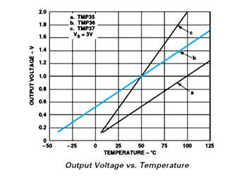

# Case 07: Temperature Sensor


## Introduction

A temperature sensor is a sensor that senses temperature and converts it into a usable output signal. Temperature sensors are a central part of temperature measuring instruments and there is a wide variety of them. In this lesson we will learn about the analog temperature sensor TMP36 and read out its value and display it on the LED screen of the Pico:ed.

## Components List

### Hardware

1 × Pico:ed

1 × USB Cable

1 × Breadboard Adapter 

1 × 83×55mm Breadboard

1× TMP36 Temperature Sensor

N* Dupont Cables

## Main Components

### TMP36

The TMP36 is an analog temperature sensor whose output voltage is linearly related to temperature, the higher the temperature is, the higher the output voltage will be.


Note: 

When we see TMP36 chip with the text side, the leftmost pin of the chip is VCC, the middle pin is Vout and the rightmost pin is GND. Never connect the chip backwards, otherwise it could cause damage to the device.


The curve of the TMP36 output voltage with temperature is as follows:




From the above diagram, the temperature can be calculated by the formula:
Temperature (°C) = (output voltage (mV) - 500 ) / 10

## Steps

### Hardware Connection

Connect the components as the pictures suggest: 

1. Connect the temperature sensor with P0 port. 


This is the picture after finishing the connections: 

## Programming

Program Preparation: [Prpgramming environment](https://www.yuque.com/elecfreaks-learn/picoed/er7nuh)

### Sample Code:

```python
# Import the modules that we need: 
import board
import digitalio
import analogio
import picoed

# Set the connected pins of the temperature sensor
temperature = analogio.AnalogIn(board.P0_A0)

# Dispaly the temperature value
while True:
   # Covert to volage (0-3.3v) from the analog value (0-65535)
   voltage = temperature.value * (3.3 / 65535)
   temperature_value = (voltage - 500) / 10
   picoed.display.scroll(temperature_value)
```
### Details of the Code:

1. Import the modules that we need. `board` is the common container, and you can connect the pins you'd like to use through it. The `digitalio`module contains classes to provide access to basic digital IO. `picoed` module is able to set the LED effect on Pico:ed, `analogio`module contains classes to provide access to analog IO.
```python
import board
import digitalio
import analogio
import picoed
```

2. Set the connected pins of the temperature sensor
```python
temperature = analogio.AnalogIn(board.P0_A0)
```
If the pins you are using are not P0_A0 and P1_A1, the other pin numbers can be viewed by entering the following code in the shell window below the Thonny editor.
```python
>>> import board
>>> help(board)
object <module 'board'> is of type module
  __name__ -- board
  board_id -- elecfreaks_picoed
  BUZZER_GP0 -- board.BUZZER_GP0
  I2C0_SDA -- board.BUZZER_GP0
  I2C0_SCL -- board.I2C0_SCL
  BUZZER -- board.BUZZER
  BUZZER_GP3 -- board.BUZZER
  P4 -- board.P4
  P5 -- board.P5
  P6 -- board.P6
  P7 -- board.P7
  P8 -- board.P8
  P9 -- board.P9
  P10 -- board.P10
  P11 -- board.P11
  P12 -- board.P12
  P13 -- board.P13
  P14 -- board.P14
  P15 -- board.P15
  P16 -- board.P16
  SDA -- board.SDA
  P20 -- board.SDA
  SCL -- board.SCL
  P19 -- board.SCL
  BUTTON_A -- board.BUTTON_A
  BUTTON_B -- board.BUTTON_B
  SMPS_MODE -- board.SMPS_MODE
  VBUS_SENSE -- board.VBUS_SENSE
  LED -- board.LED
  P0_A0 -- board.P0_A0
  P0 -- board.P0_A0
  A0 -- board.P0_A0
  P1_A1 -- board.P1_A1
  P1 -- board.P1_A1
  A1 -- board.P1_A1
  P2_A2 -- board.P2_A2
  P2 -- board.P2_A2
  A2 -- board.P2_A2
  P3_A3 -- board.P3_A3
  P3 -- board.P3_A3
  A3 -- board.P3_A3
```

3. While true , display the value detected by the TMP36 sensor on the Pico:ed
```python
while True:
   voltage = temperature.value * (3300 / 65535)
   temperature_value = (voltage - 500) / 10
   picoed.display.scroll(temperature_value)
```
## Result

The current temperature value displays on the Pico:ed. 

## Exploration

How to display the value of the temperature in Fahrenheit degree?

## FAQ

## For more information, please visit: 

[ELECFREAKS WIKI](https://www.elecfreaks.com/learn-en/)
