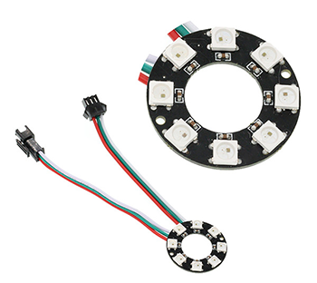
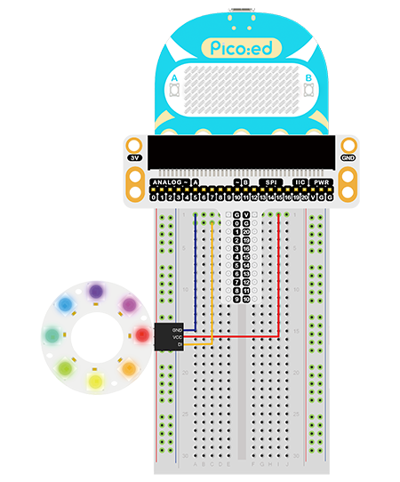

# Case 11: Rainbow LED


## Introduction
---
The Rainbow LED is based on the ws2812b bead. Its obvious feature is the single IO control with infinite cascade. In this lesson, we will use Pico:ed to drive the it to achieve a colourful effect.

## Components List
---
### Hardware

1 × Pico:ed

1 × USB Cable

1 × Breadboard Adapter 

1 × 83×55mm Breadboard

1× Rainbow LED

N* Dupont Cables

## Main Components
---
### Rainbow LED



8 RGB Rainbow LED Ring is an LED ring made of 8 ws2812b beads in cascade connection. Ws2812b is an intelligent outer control LED source, which has integrated control circuit and light emitting circuit. It has same appearance with 5050LED bead.

The digital protocol adopts communication method of single line goes to zero. After pixel point restoration, DIN will receive the data sent from the controller. Once the first 24-bit data received was extracted by the first pixel point, it will be sent to the internal digital lock storage device of pixel point and the rest data amplified through the inner transformation processing circuit will be sent to the next pixel point from DO port. Every time it passes through a pixel point transmission, the signal will decrease 24bit. The pixel point uses automatic transformation forwarding technique, thus the pixel cascade connection quantity do not limited by signal transmission but the speed of transmission only.

LED has advantages of low voltage drive, energy-saving and environment protect, wide scattering angle, good consistency, ultra-long life, etc.. To integrate control circuit onto LED, the circuit will become more simple, easier to install and have smaller volume.

## Steps
---
### Hardware Connection

Connect the components as the pictures suggest: 

1.Connect the signal wire of the rainbow LED to the P0 port of the expansion board



***Note:*** The light leads to two sets of wires, one for DI, the other for DO, and here we should connect the DI.


This is the picture after finishing the connections: 

## Programming
---
Program Preparation: [Prpgramming environment](https://www.yuque.com/elecfreaks-learn/picoed/er7nuh)

### Sample Code:

```python
# Import the modules that we need: 
import board
import random
import neopixel_write
import digitalio
import time

# Set the pins and directions of the Rainbow LED
pin = digitalio.DigitalInOut(board.P0_A0)
pin.direction = digitalio.Direction.OUTPUT

# Initialize the list to save the value of the RGB
rings = [0, 0, 0, 0, 0, 0, 0, 0, 0, 0, 0, 0, 0, 0, 0, 0, 0, 0, 0, 0, 0, 0, 0, 0]

# While true, loop the RGB value for each bead
while True:
    for i in range(len(rings)):
        rings[i] = random.randint(0,255)
    pixel_off = bytearray(rings)
    neopixel_write.neopixel_write(pin, pixel_off)
    time.sleep(0.1)
```
### Details of the Code:

1. Import the modules that we need. `board` is the common container, and you can connect the pins you'd like to use through it.   the `digitalio` module contains classes that provide access to basic digital IO. The `time` module contains functions for setting the time, the `random` module contains functions that provide for creating random numbers and the `neopixel_write` module contains a helper method for writing out bytes in the 800khz neopixel protocol.

```python
import board
import random
import neopixel_write
import digitalio
import time
```

2. Set the pins and directions of the Rainbow LED
```python
pin = digitalio.DigitalInOut(board.P0_A0)
pin.direction = digitalio.Direction.OUTPUT
```
If the pins you are using are not P0_A0 and P1_A1, the other pin numbers can be viewed by entering the following code in the shell window below the Thonny editor.
```python
>>> import board
>>> help(board)
object <module 'board'> is of type module
  __name__ -- board
  board_id -- elecfreaks_picoed
  BUZZER_GP0 -- board.BUZZER_GP0
  I2C0_SDA -- board.BUZZER_GP0
  I2C0_SCL -- board.I2C0_SCL
  BUZZER -- board.BUZZER
  BUZZER_GP3 -- board.BUZZER
  P4 -- board.P4
  P5 -- board.P5
  P6 -- board.P6
  P7 -- board.P7
  P8 -- board.P8
  P9 -- board.P9
  P10 -- board.P10
  P11 -- board.P11
  P12 -- board.P12
  P13 -- board.P13
  P14 -- board.P14
  P15 -- board.P15
  P16 -- board.P16
  SDA -- board.SDA
  P20 -- board.SDA
  SCL -- board.SCL
  P19 -- board.SCL
  BUTTON_A -- board.BUTTON_A
  BUTTON_B -- board.BUTTON_B
  SMPS_MODE -- board.SMPS_MODE
  VBUS_SENSE -- board.VBUS_SENSE
  LED -- board.LED
  P0_A0 -- board.P0_A0
  P0 -- board.P0_A0
  A0 -- board.P0_A0
  P1_A1 -- board.P1_A1
  P1 -- board.P1_A1
  A1 -- board.P1_A1
  P2_A2 -- board.P2_A2
  P2 -- board.P2_A2
  A2 -- board.P2_A2
  P3_A3 -- board.P3_A3
  P3 -- board.P3_A3
  A3 -- board.P3_A3
```

3. Initialize the list to save the value of the RGB
```python
rings = [0, 0, 0, 0, 0, 0, 0, 0, 0, 0, 0, 0, 0, 0, 0, 0, 0, 0, 0, 0, 0, 0, 0, 0]
```

4. While true, loop the RGB value for each bead
```python
while True:
    for i in range(len(rings)):
        rings[i] = random.randint(0,255)
    pixel_off = bytearray(rings)
    neopixel_write.neopixel_write(pin, pixel_off)
    time.sleep(0.1)
```
## Result
---
The Rainbow LED lights on in a colorful way. 

## Exploration
---
How to make a blink rainbow LED just like a blinking eye? 

## FAQ
---
## For more information, please visit: 
---
[ELECFREAKS WIKI](https://www.elecfreaks.com/learn-en/)
