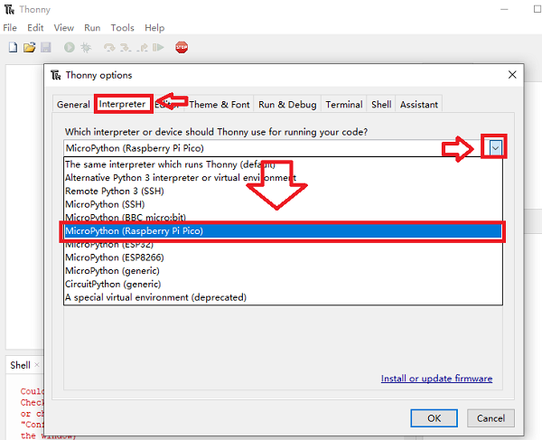
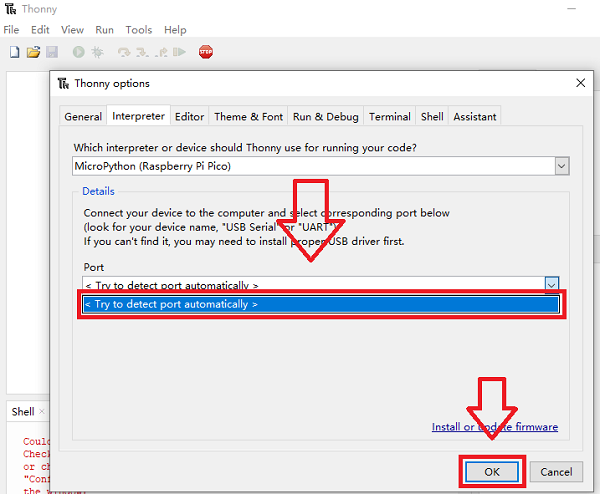
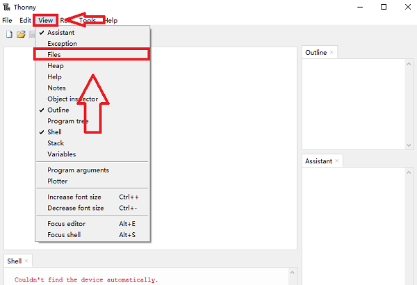
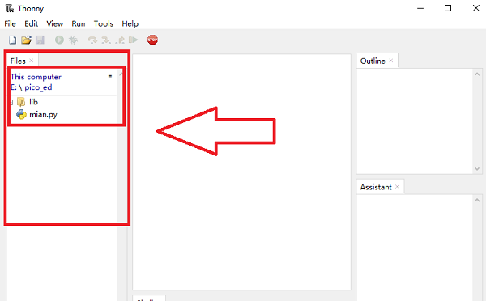
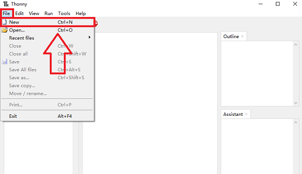
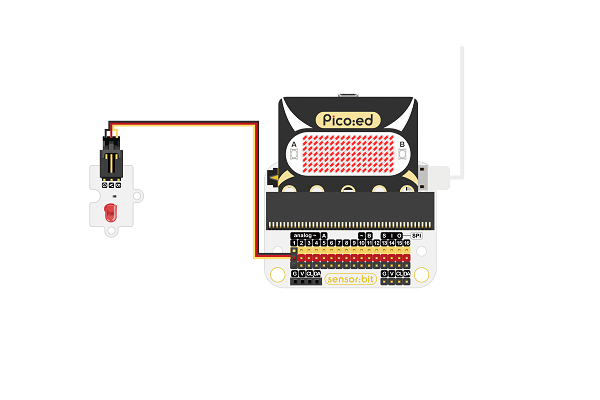

# Pico:ed-Python Samples


## Add Python Package 
---

Download and unzip the package: [lib.zip](https://github.com/elecfreaks/pico_ed/archive/refs/heads/master.zip)
Install and open it: [thonny](https://github.com/thonny/thonny/releases/download/v3.3.13/thonny-3.3.13.exe)

Click "Tools" to see more "Options..." 


Click "Interpreter" to see more choices by clicking the arrow, and choose Rasperry Pi Pico. 



Click the arrow and select "Try to detect port automatically" and click "ok" to confirm. 



Cnnect the USB with pico_ed and click "View" to choose "Files".



Getting in the "Files" folder, open the downloaded and unzipped folder of pico_ed. 



Click the right mouse button on the "lib" folder and select "Move to Recyle Bin" to upload the data to pico_ed. After the operation, click "stop" button.


After adding the file, start programming. 

Click "File"-"New"



Program and save it in pico_ed.


Enter the name 'main.py" to the jumped-out column and click "OK" for confirmation. 


## Sample Projects
---

### Project 01: Control the on/off of onboard LEDs with buttons.    
```
from Pico_ed import *     #import file
from machine import Pin

while True:   
    if ButtonA.is_pressed():   #Detect if button A is pressed, if yes, return 1. 
        led.on()    #Use this method to light on the LEDs. 
    if ButtonB.is_pressed():  #Detect if button B is pressed, if yes, return 1. 
        led.off()   #Use this method to turn off the LEDs.

```
### Result
Press button A to light on the LED and button B to turn it off. 

### Project 02: Control to display numbers or letters on the LEDs screen with buttons. 
```
from Pico_ed import *     #import file
from machine import Pin

while True:   
    if ButtonA.is_pressed():   #Detect if button A is pressed, if yes, return 1. 
        display.show(1234567890)   #Use this method to scroll display the nummbers on the LEDs screen. 
       # Use method: display.show(numbers)
    if ButtonB.is_pressed():  #Detect if button B is pressed, if yes, return 1. 
        display.show("abcdefghijklmnopqrstuvwxyz")   #Use this method to scroll display the letters on the LEDs screen. 
        #Use method: display.show("letters")
```
### Result
Press button A to display  1234567890 on the LEDs screen and button B to display abcdefghijklmnopqrstuvwxyz. 

### Project 03: The Music Player 
```
from Pico_ed import *     #import file
from machine import Pin

while True:   
    if ButtonA.is_pressed():   #Detect if button A is pressed, if yes, return 1. 
        music.phonate("1155665-4433221-5544332-5544332-1155665-4433221")   #Use this method to play music and the numbers are equivalent to different tones. 
        #Use method   music.phonate("numbered musical notation")
```
### Result
Press button A to play music. 

### Project 04: Light on the LED connecting to P1. 

Hardware Connections



Program

```
from Pico_ed import *     #Program as this way
from machine import Pin

p1 = Pin(pin.P1, Pin.OUT)   #  Set the pins in output mode, enter with the number of pin.P. 
while True:   
    if ButtonA.is_pressed():   #Detect if button A is pressed, if yes, return 1.
        p1.value(1) #P1 pin up 
    if ButtonB.is_pressed():  #Detect if button B is pressed, if yes, return 1. 
        p1.value(0)  #P1 pin down
```

### Result 
Press button A to light on the LED and button B to turn it off. 

## Technical Files
---
[https://docs.micropython.org/en/latest/library/rp2.html](https://docs.micropython.org/en/latest/library/rp2.html)
